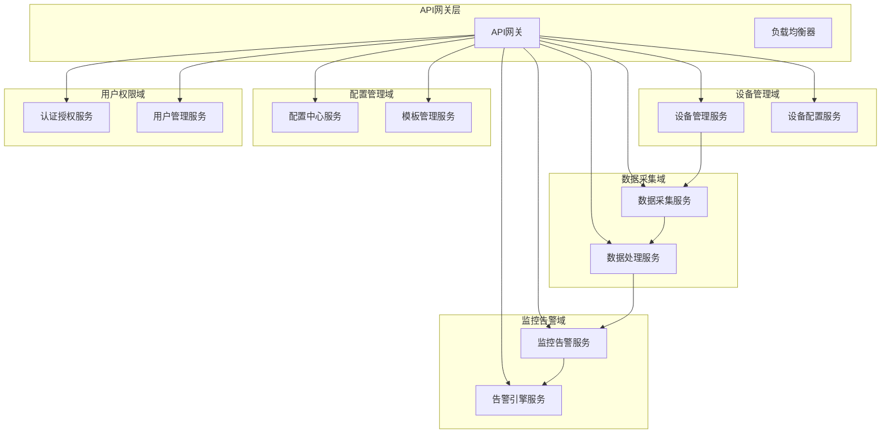

# API接口设计和微服务拆分方案

## 概述

基于3000+设备运维需求，设计完整的RESTful API接口和微服务架构，确保系统可扩展性、高可用性和高性能。

## 微服务架构设计

### 1. 微服务拆分原则

#### 领域驱动设计 (DDD)



### 2. 微服务详细设计

#### 设备管理服务 (Device Management Service)

```yaml
服务规格:
  技术栈: Spring Boot 3.x + Spring Cloud
  数据库: PostgreSQL + Redis
  目标: 管理设备生命周期、状态同步、设备分组
  并发支持: 1000+ QPS
  SLA: 99.9% 可用性，响应时间 < 200ms
```

```java
@RestController
@RequestMapping("/api/v1/devices")
@Validated
public class DeviceController {
    
    @Autowired
    private DeviceService deviceService;
    
    @Autowired
    private DeviceQueryService deviceQueryService;
    
    // 获取设备列表（支持分页和过滤）
    @GetMapping
    public ResponseEntity<Page<DeviceSummary>> getDevices(
            @PageableDefault(size = 20) Pageable pageable,
            @RequestParam(required = false) String deviceType,
            @RequestParam(required = false) String location,
            @RequestParam(required = false) String status,
            @RequestParam(required = false) String keyword) {
        
        DeviceFilter filter = DeviceFilter.builder()
            .deviceType(deviceType)
            .location(location)
            .status(status)
            .keyword(keyword)
            .build();
            
        return ResponseEntity.ok(deviceQueryService.searchDevices(filter, pageable));
    }
    
    // 获取设备详细信息
    @GetMapping("/{deviceId}")
    public ResponseEntity<DeviceDetail> getDeviceDetail(@PathVariable String deviceId) {
        return ResponseEntity.ok(deviceService.getDeviceDetail(deviceId));
    }
    
    // 批量导入设备
    @PostMapping("/batch-import")
    public ResponseEntity<ImportResult> batchImportDevices(
            @Valid @RequestBody DeviceImportRequest request) {
        ImportResult result = deviceService.batchImportDevices(request);
        return ResponseEntity.accepted().body(result);
    }
    
    // 设备控制命令
    @PostMapping("/{deviceId}/commands")
    public ResponseEntity<CommandResponse> sendDeviceCommand(
            @PathVariable String deviceId,
            @Valid @RequestBody DeviceCommand command) {
        CommandResponse response = deviceService.sendCommand(deviceId, command);
        return ResponseEntity.ok(response);
    }
    
    // 批量设备操作
    @PostMapping("/batch-operation")
    public ResponseEntity<BatchOperationResult> batchOperation(
            @Valid @RequestBody BatchOperationRequest request) {
        BatchOperationResult result = deviceService.executeBatchOperation(request);
        return ResponseEntity.accepted().body(result);
    }
    
    // 设备性能数据查询
    @GetMapping("/{deviceId}/metrics")
    public ResponseEntity<List<DeviceMetric>> getDeviceMetrics(
            @PathVariable String deviceId,
            @RequestParam @DateTimeFormat(iso = DateTimeFormat.ISO.DATE_TIME) Instant startTime,
            @RequestParam @DateTimeFormat(iso = DateTimeFormat.ISO.DATE_TIME) Instant endTime,
            @RequestParam(defaultValue = "60s") String interval) {
        
        return ResponseEntity.ok(deviceQueryService.getDeviceMetrics(
            deviceId, startTime, endTime, Duration.parse(interval)));
    }
    
    // 设备在线状态更新（由设备接入服务调用）
    @PutMapping("/{deviceId}/online-status")
    @PreAuthorize("hasRole('DEVICE')")
    public ResponseEntity<Void> updateOnlineStatus(
            @PathVariable String deviceId,
            @RequestBody OnlineStatusUpdate update) {
        deviceService.updateOnlineStatus(deviceId, update);
        return ResponseEntity.ok().build();
    }
}
```

#### 数据采集服务 (Data Collection Service)

```java
@RestController
@RequestMapping("/api/v1/collection")
public class DataCollectionController {
    
    @Autowired
    private DataCollectionService dataCollectionService;
    
    @Autowired
    private WebSocketDeviceHandler webSocketHandler;
    
    // 实时数据推送 (WebSocket)
    @MessageMapping("/device-data")
    public void handleDeviceData(DeviceDataMessage message) {
        // 设备数据上报处理
        dataCollectionService.processDeviceData(message);
        
        // 实时推送到监控大屏
        webSocketHandler.broadcastDeviceData(message);
    }
    
    // 设备配置下发
    @PostMapping("/{deviceId}/config")
    public ResponseEntity<Void> pushConfig(
            @PathVariable String deviceId,
            @RequestBody DeviceConfig config) {
        dataCollectionService.pushConfig(deviceId, config);
        return ResponseEntity.accepted().build();
    }
    
    // 数据采集任务管理
    @PostMapping("/tasks")
    public ResponseEntity<CollectionTask> createCollectionTask(
            @Valid @RequestBody CollectionTaskRequest request) {
        return ResponseEntity.ok(dataCollectionService.createTask(request));
    }
    
    // 采集状态查询
    @GetMapping("/tasks/{taskId}/status")
    public ResponseEntity<CollectionTaskStatus> getTaskStatus(@PathVariable String taskId) {
        return ResponseEntity.ok(dataCollectionService.getTaskStatus(taskId));
    }
}
```

#### 监控告警服务 (Monitoring Alert Service)

```java
@RestController
@RequestMapping("/api/v1/monitoring")
public class MonitoringController {
    
    @Autowired
    private MonitoringService monitoringService;
    
    @Autowired
    private AlertService alertService;
    
    // 获取监控大屏数据
    @GetMapping("/dashboard/overview")
    public ResponseEntity<DashboardOverview> getDashboardOverview() {
        return ResponseEntity.ok(monitoringService.getDashboardOverview());
    }
    
    // 实时设备状态监控
    @GetMapping("/devices/status")
    public ResponseEntity<List<DeviceStatus>> getDeviceStatus() {
        return ResponseEntity.ok(monitoringService.getCurrentDeviceStatus());
    }
    
    // 告警规则管理
    @PostMapping("/alert-rules")
    public ResponseEntity<AlertRule> createAlertRule(
            @Valid @RequestBody AlertRuleRequest request) {
        return ResponseEntity.ok(alertService.createRule(request));
    }
    
    // 告警列表查询
    @GetMapping("/alerts")
    public ResponseEntity<Page<AlertSummary>> getAlerts(
            @PageableDefault(size = 20) Pageable pageable,
            @RequestParam(required = false) String severity,
            @RequestParam(required = false) String status,
            @RequestParam(required = false) String deviceType) {
        
        AlertFilter filter = AlertFilter.builder()
            .severity(severity)
            .status(status)
            .deviceType(deviceType)
            .build();
            
        return ResponseEntity.ok(alertService.getAlerts(filter, pageable));
    }
    
    // 告警确认和处理
    @PostMapping("/alerts/{alertId}/acknowledge")
    public ResponseEntity<Void> acknowledgeAlert(
            @PathVariable String alertId,
            @RequestBody AlertAcknowledgeRequest request) {
        alertService.acknowledgeAlert(alertId, request);
        return ResponseEntity.ok().build();
    }
}
```

#### 认证授权服务 (Auth Service)

```java
@RestController
@RequestMapping("/api/v1/auth")
public class AuthController {
    
    @Autowired
    private AuthService authService;
    
    @Autowired
    private UserService userService;
    
    // 用户登录
    @PostMapping("/login")
    public ResponseEntity<LoginResponse> login(@Valid @RequestBody LoginRequest request) {
        LoginResponse response = authService.login(request);
        return ResponseEntity.ok(response);
    }
    
    // 用户注册
    @PostMapping("/register")
    public ResponseEntity<User> register(@Valid @RequestBody RegisterRequest request) {
        User user = userService.createUser(request);
        return ResponseEntity.status(HttpStatus.CREATED).body(user);
    }
    
    // 令牌刷新
    @PostMapping("/refresh")
    public ResponseEntity<TokenResponse> refreshToken(@RequestBody RefreshTokenRequest request) {
        TokenResponse response = authService.refreshToken(request);
        return ResponseEntity.ok(response);
    }
    
    // 获取当前用户信息
    @GetMapping("/me")
    public ResponseEntity<UserInfo> getCurrentUser(Authentication authentication) {
        return ResponseEntity.ok(userService.getUserInfo(authentication.getName()));
    }
    
    // 设备认证（JWT令牌验证）
    @PostMapping("/device/verify")
    public ResponseEntity<DeviceAuthResult> verifyDeviceToken(@RequestBody DeviceAuthRequest request) {
        DeviceAuthResult result = authService.verifyDeviceToken(request);
        return ResponseEntity.ok(result);
    }
}
```

#### 配置中心服务 (Config Center)

```java
@RestController
@RequestMapping("/api/v1/config")
public class ConfigController {
    
    @Autowired
    private ConfigService configService;
    
    // 获取全局配置
    @GetMapping("/global")
    public ResponseEntity<Map<String, Object>> getGlobalConfig() {
        return ResponseEntity.ok(configService.getGlobalConfig());
    }
    
    // 更新全局配置
    @PutMapping("/global")
    public ResponseEntity<Void> updateGlobalConfig(
            @RequestBody Map<String, Object> config,
            Authentication authentication) {
        configService.updateGlobalConfig(config, authentication.getName());
        return ResponseEntity.ok().build();
    }
    
    // 获取设备模板
    @GetMapping("/templates/{templateId}")
    public ResponseEntity<DeviceTemplate> getDeviceTemplate(@PathVariable String templateId) {
        return ResponseResponse.ok(configService.getDeviceTemplate(templateId));
    }
    
    // 批量设备配置下发
    @PostMapping("/devices/batch-push")
    public ResponseEntity<ConfigPushResult> batchPushConfig(
            @Valid @RequestBody BatchConfigPushRequest request) {
        return ResponseEntity.accepted().body(configService.batchPushConfig(request));
    }
}
```

## API接口规范

### 1. RESTful API设计原则

#### URL设计规范

```yaml
# URL命名规范
设备管理: /api/v1/devices
  GET    /devices                 # 获取设备列表
  GET    /devices/{id}           # 获取设备详情
  POST   /devices                # 创建设备
  PUT    /devices/{id}           # 更新设备信息
  DELETE /devices/{id}           # 删除设备
  POST   /devices/batch-import   # 批量导入设备
  POST   /devices/batch-delete   # 批量删除设备

数据监控: /api/v1/monitoring
  GET    /dashboard/overview     # 大屏概览数据
  GET    /devices/status         # 实时设备状态
  GET    /devices/{id}/metrics   # 设备性能数据
  GET    /alerts                 # 告警列表
  POST   /alerts/{id}/acknowledge # 确认告警

配置管理: /api/v1/config
  GET    /templates              # 获取配置模板
  POST   /templates              # 创建配置模板
  GET    /global                 # 全局配置
  PUT    /global                 # 更新全局配置

用户认证: /api/v1/auth
  POST   /login                  # 用户登录
  POST   /refresh                # 刷新令牌
  GET    /me                     # 获取当前用户信息
```

#### 响应格式标准

```json
{
  "code": 200,
  "message": "Success",
  "data": {},
  "timestamp": "2024-01-20T10:30:00.000Z",
  "traceId": "abc123def456"
}

# 分页响应格式
{
  "code": 200,
  "message": "Success",
  "data": {
    "content": [],
    "pageable": {
      "page": 0,
      "size": 20,
      "totalElements": 100,
      "totalPages": 5
    }
  },
  "timestamp": "2024-01-20T10:30:00.000Z"
}

# 错误响应格式
{
  "code": 400,
  "message": "设备ID不存在",
  "data": null,
  "errors": [
    {
      "field": "deviceId",
      "message": "设备ID格式不正确",
      "code": "INVALID_FORMAT"
    }
  ],
  "timestamp": "2024-01-20T10:30:00.000Z"
}
```

### 2. 核心API接口详细定义

#### 设备管理接口

```java
// DTO定义
@Data
@Builder
@NoArgsConstructor
@AllArgsConstructor
public class DeviceDetail {
    private String deviceId;
    private String name;
    private String type;
    private String model;
    private String ipAddress;
    private String macAddress;
    private String location;
    private DeviceStatus status;
    private LocalDateTime lastSeen;
    private LocalDateTime createdAt;
    private LocalDateTime updatedAt;
    private Map<String, Object> metadata;
    private List<DeviceMetric> recentMetrics;
}

@Data
@Builder
@NoArgsConstructor
@AllArgsConstructor
public class DeviceCommand {
    private String commandType;
    private Map<String, Object> parameters;
    private String description;
    private Integer timeoutSeconds;
}

@Data
@Builder
@NoArgsConstructor
@AllArgsConstructor
public class CommandResponse {
    private String commandId;
    private String deviceId;
    private CommandStatus status;
    private String message;
    private LocalDateTime createdAt;
    private LocalDateTime executedAt;
}
```

#### 监控数据接口

```java
@Data
@Builder
@NoArgsConstructor
@AllArgsConstructor
public class DashboardOverview {
    private int totalDevices;
    private int onlineDevices;
    private int offlineDevices;
    private int alertCount;
    private List<DeviceTypeSummary> deviceTypeSummary;
    private List<LocationSummary> locationSummary;
    private List<AlertSummary> recentAlerts;
    private SystemMetrics systemMetrics;
}

@Data
@Builder
@NoArgsConstructor
@AllArgsConstructor
public class DeviceMetric {
    private String deviceId;
    private Instant timestamp;
    private double cpuUsage;
    private double memoryUsage;
    private double diskUsage;
    private long networkIn;
    private long networkOut;
    private double temperature;
}
```

#### 告警管理接口

```java
@Data
@Builder
@NoArgsConstructor
@AllArgsConstructor
public class AlertRule {
    private String ruleId;
    private String name;
    private String description;
    private AlertSeverity severity;
    private String conditionExpression;
    private List<String> notificationChannels;
    private boolean enabled;
    private LocalDateTime createdAt;
    private LocalDateTime updatedAt;
}

@Data
@Builder
@NoArgsConstructor
@AllArgsConstructor
public class AlertSummary {
    private String alertId;
    private String ruleName;
    private String deviceId;
    private String deviceName;
    private AlertSeverity severity;
    private AlertStatus status;
    private String message;
    private LocalDateTime occurrenceTime;
    private LocalDateTime acknowledgedAt;
}
```

### 3. 实时通信接口

#### WebSocket接口

```java
@Configuration
@EnableWebSocket
public class WebSocketConfig implements WebSocketConfigurer {
    
    @Override
    public void registerWebSocketHandlers(WebSocketHandlerRegistry registry) {
        registry.addHandler(new DeviceDataWebSocketHandler(), "/ws/device-data")
                .setAllowedOrigins("*")
                .withSockJS();
                
        registry.addHandler(new AlertWebSocketHandler(), "/ws/alerts")
                .setAllowedOrigins("*")
                .withSockJS();
    }
}

@Component
public class DeviceDataWebSocketHandler extends TextWebSocketHandler {
    
    private final SimpMessagingTemplate messagingTemplate;
    
    @Override
    public void afterConnectionEstablished(WebSocketSession session) {
        String deviceId = getDeviceIdFromSession(session);
        if (deviceId != null) {
            // 注册设备连接
            deviceConnectionManager.registerConnection(deviceId, session);
        }
    }
    
    @Override
    protected void handleTextMessage(WebSocketSession session, TextMessage message) {
        try {
            DeviceDataMessage deviceMessage = JSON.parseObject(message.getPayload(), DeviceDataMessage.class);
            
            // 实时处理设备数据
            deviceDataProcessor.processRealtimeData(deviceMessage);
            
            // 推送给监控大屏
            messagingTemplate.convertAndSend("/topic/device-data", deviceMessage);
            
        } catch (Exception e) {
            log.error("处理设备数据消息失败", e);
        }
    }
}
```

#### Server-Sent Events (SSE)

```java
@RestController
@RequestMapping("/api/v1/stream")
public class EventStreamController {
    
    @GetMapping(value = "/metrics/{deviceId}", produces = MediaType.TEXT_EVENT_STREAM_VALUE)
    public SseEmitter streamDeviceMetrics(@PathVariable String deviceId) {
        SseEmitter emitter = new SseEmitter(30000L); // 30秒超时
        
        // 订阅设备指标数据
        deviceMetricsService.subscribeDeviceMetrics(deviceId, new DeviceMetricsListener() {
            @Override
            public void onMetricUpdate(DeviceMetric metric) {
                try {
                    emitter.send(SseEmitter.event()
                        .name("metric-update")
                        .data(metric));
                } catch (IOException e) {
                    emitter.complete();
                }
            }
        });
        
        emitter.onTimeout(() -> deviceMetricsService.unsubscribeDeviceMetrics(deviceId));
        emitter.onCompletion(() -> deviceMetricsService.unsubscribeDeviceMetrics(deviceId));
        
        return emitter;
    }
}
```

## API网关设计

### 1. Spring Cloud Gateway配置

```yaml
# application.yml
spring:
  cloud:
    gateway:
      routes:
        # 设备管理服务路由
        - id: device-management-service
          uri: lb://device-management-service
          predicates:
            - Path=/api/v1/devices/**
          filters:
            - StripPrefix=2
            - name: RequestRateLimiter
              args:
                redis-rate-limiter.replenishRate: 100
                redis-rate-limiter.burstCapacity: 200
            - name: Retry
              args:
                retries: 3
                statuses: 502,503,504
                methods: GET,POST
                backoff:
                  firstBackoff: 100ms
                  maxBackoff: 1000ms
                  factor: 2
        
        # 监控服务路由
        - id: monitoring-service
          uri: lb://monitoring-service
          predicates:
            - Path=/api/v1/monitoring/**
          filters:
            - StripPrefix=2
            - name: RequestRateLimiter
              args:
                redis-rate-limiter.replenishRate: 50
                redis-rate-limiter.burstCapacity: 100
        
        # 数据采集服务路由
        - id: data-collection-service
          uri: lb://data-collection-service
          predicates:
            - Path=/api/v1/collection/**
          filters:
            - StripPrefix=2
            - name: CircuitBreaker
              args:
                name: data-collection-circuit-breaker
                fallbackUri: forward:/fallback/data-collection
        
        # 认证服务路由
        - id: auth-service
          uri: lb://auth-service
          predicates:
            - Path=/api/v1/auth/**
          filters:
            - StripPrefix=2
            
        # WebSocket路由
        - id: websocket-routes
          uri: lb://data-collection-service
          predicates:
            - Path=/ws/**
          filters:
            - StripPrefix=1
```

### 2. 全局过滤器

```java
@Component
public class GlobalFilter implements GlobalFilter {
    
    @Override
    public Mono<Void> filter(ServerWebExchange exchange, GatewayFilterChain chain) {
        ServerHttpRequest request = exchange.getRequest();
        
        // 请求日志记录
        logRequest(request);
        
        // 添加追踪ID
        String traceId = generateTraceId();
        ServerHttpRequest modifiedRequest = request.mutate()
            .header("X-Trace-Id", traceId)
            .build();
            
        ServerWebExchange modifiedExchange = exchange.mutate()
            .request(modifiedRequest)
            .build();
            
        return chain.filter(modifiedExchange)
                   .doOnSuccess(response -> logResponse(response, traceId));
    }
    
    private void logRequest(ServerHttpRequest request) {
        log.info("收到请求 - IP: {}, Method: {}, Path: {}, User-Agent: {}", 
                getClientIp(request), 
                request.getMethod(), 
                request.getURI().getPath(),
                request.getHeaders().getFirst("User-Agent"));
    }
}

@Component
public class AuthenticationFilter implements GlobalFilter {
    
    @Override
    public Mono<Void> filter(ServerWebExchange exchange, GatewayFilterChain chain) {
        String path = exchange.getRequest().getURI().getPath();
        
        // 公开路径跳过认证
        if (isPublicPath(path)) {
            return chain.filter(exchange);
        }
        
        String token = extractToken(exchange.getRequest());
        if (StringUtils.isEmpty(token)) {
            return Mono.error(new UnauthorizedException("缺少认证令牌"));
        }
        
        return authService.validateToken(token)
                          .doOnSuccess(userInfo -> {
                              // 添加用户信息到请求头
                              ServerHttpRequest modifiedRequest = exchange.getRequest()
                                  .mutate()
                                  .header("X-User-Id", userInfo.getUserId())
                                  .header("X-User-Name", userInfo.getUserName())
                                  .header("X-Roles", String.join(",", userInfo.getRoles()))
                                  .build();
                              exchange.mutate().request(modifiedRequest);
                          })
                          .then(chain.filter(exchange));
    }
}
```

### 3. 负载均衡和熔断

```java
@Configuration
public class CircuitBreakerConfig {
    
    @Bean
    public Customizer<Resilience4JCircuitBreakerFactory> circuitBreakerFactoryCustomizer() {
        return factory -> factory.configureDefault(id -> {
            CircuitBreakerConfig.SlidingWindowConfig slidingWindowConfig = 
                CircuitBreakerConfig.SlidingWindowConfig.ofSlidingWindow(10, 100, SlidingWindowType.COUNT_BASED);
            CircuitBreakerConfig.FailureRateThresholdConfig failureRateThresholdConfig = 
                CircuitBreakerConfig.FailureRateThresholdConfig.of(50f);
            
            return new Resilience4JCircuitBreakerConfig()
                    .slidingWindow(slidingWindowConfig)
                    .failureRateThreshold(failureRateThresholdConfig)
                    .waitDurationInOpenState(Duration.ofSeconds(30))
                    .slidingWindowSize(100)
                    .minimumNumberOfCalls(5)
                    .build();
        });
    }
}

@Component
public class ResilienceConfig {
    
    @CircuitBreaker(name = "deviceService", fallbackMethod = "fallbackGetDevices")
    @TimeLimiter(name = "deviceService")
    public CompletableFuture<Page<DeviceSummary>> getDevicesWithResilience(
            DeviceFilter filter, Pageable pageable) {
        return CompletableFuture.supplyAsync(() -> 
            deviceService.getDevices(filter, pageable));
    }
    
    public CompletableFuture<Page<DeviceSummary>> fallbackGetDevices(
            DeviceFilter filter, Pageable pageable, Exception ex) {
        log.warn("设备服务调用失败，返回缓存数据", ex);
        return CompletableFuture.supplyAsync(() -> 
            deviceCacheService.getCachedDevices(filter, pageable));
    }
}
```

## 服务间通信

### 1. 同步通信 - OpenFeign

```java
@FeignClient(name = "device-management-service", configuration = FeignConfig.class)
public interface DeviceServiceClient {
    
    @GetMapping("/api/v1/devices/{deviceId}")
    DeviceDetail getDeviceDetail(@PathVariable("deviceId") String deviceId);
    
    @PostMapping("/api/v1/devices/batch-operation")
    BatchOperationResult batchOperation(@RequestBody BatchOperationRequest request);
    
    @GetMapping("/api/v1/devices/{deviceId}/status")
    DeviceStatus getDeviceStatus(@PathVariable("deviceId") String deviceId);
}

@Configuration
public class FeignConfig {
    
    @Bean
    public RequestInterceptor requestInterceptor() {
        return requestTemplate -> {
            // 添加认证头
            Authentication auth = SecurityContextHolder.getContext().getAuthentication();
            if (auth != null && auth.getCredentials() != null) {
                requestTemplate.header("Authorization", 
                    "Bearer " + auth.getCredentials());
            }
            
            // 添加追踪头
            String traceId = MDC.get("traceId");
            if (traceId != null) {
                requestTemplate.header("X-Trace-Id", traceId);
            }
        };
    }
    
    @Bean
    public ErrorDecoder errorDecoder() {
        return new FeignErrorDecoder();
    }
}
```

### 2. 异步通信 - Spring Cloud Stream

```java
// 消息生产者
@Component
public class DeviceEventProducer {
    
    private final StreamBridge streamBridge;
    
    public void publishDeviceOnlineEvent(String deviceId) {
        DeviceOnlineEvent event = DeviceOnlineEvent.builder()
            .deviceId(deviceId)
            .eventTime(Instant.now())
            .build();
            
        streamBridge.send("device-events-out-0", event);
    }
    
    public void publishAlertEvent(AlertEvent alertEvent) {
        streamBridge.send("alert-events-out-0", alertEvent);
    }
}

// 消息消费者
@Component
public class DeviceEventConsumer {
    
    @Autowired
    private MonitoringService monitoringService;
    
    @StreamListener("device-events-in")
    public void handleDeviceEvent(DeviceOnlineEvent event) {
        try {
            // 处理设备上下线事件
            monitoringService.handleDeviceStatusChange(event);
            
        } catch (Exception e) {
            log.error("处理设备事件失败", e);
            // 重试或发送到死信队列
        }
    }
    
    @StreamListener("alert-events-in")
    public void handleAlertEvent(AlertEvent alertEvent) {
        alertService.handleAlertEvent(alertEvent);
    }
}

// Spring Cloud Stream配置
spring:
  cloud:
    stream:
      bindings:
        device-events-out-0:
          destination: device-events
          producer:
            required-groups: monitoring-service
        device-events-in-0:
          destination: device-events
          group: monitoring-service
        alert-events-out-0:
          destination: alert-events
        alert-events-in-0:
          destination: alert-events
          group: alert-service
```

## 服务发现和配置

### 1. Eureka服务注册

```java
@Configuration
@EnableEurekaClient
public class EurekaClientConfig {
    
    @Bean
    @ConditionalOnProperty(name = "spring.cloud.service-registry.auto-registration.enabled", havingValue = "true")
    public EurekaInstanceConfigBean eurekaInstanceConfigBean() {
        EurekaInstanceConfigBean instance = new EurekaInstanceConfigBean();
        instance.setInstanceId("${spring.application.name}:${server.port}");
        instance.setAppname("${spring.application.name}");
        instance.setNonSecurePortEnabled(true);
        instance.setSecurePortEnabled(false);
        instance.setHealthCheckUrl("http://${eureka.hostname}:${server.port}/actuator/health");
        instance.setHomePageUrl("http://${eureka.hostname}:${server.port}/");
        
        return instance;
    }
}

# application.yml
eureka:
  client:
    service-url:
      defaultZone: http://eureka-server:8761/eureka
    healthcheck:
      enabled: true
  instance:
    prefer-ip-address: true
    lease-renewal-interval-in-seconds: 30
    lease-expiration-duration-in-seconds: 90
```

### 2. Spring Cloud Config配置中心

```java
@Configuration
@EnableConfigServer
@SpringBootApplication
public class ConfigServerApplication {
    public static void main(String[] args) {
        SpringApplication.run(ConfigServerApplication.class, args);
    }
}

# config-server application.yml
spring:
  application:
    name: config-server
  cloud:
    config:
      server:
        git:
          uri: https://github.com/company/device-config-repo
          default-label: main
          search-paths: 'device-management,monitoring-service,data-collection'
        bootstrap: true
  security:
    basic:
      enabled: true
      user:
        name: config-user
        password: ${CONFIG_PASSWORD:config-password}

server:
  port: 8888

# 客户端配置
spring:
  cloud:
    config:
      uri: http://config-server:8888
      label: main
      profile: dev
      name: ${spring.application.name}
```

## 服务监控和治理

### 1. Actuator健康检查

```java
@Component
public class DeviceServiceHealthIndicator implements HealthIndicator {
    
    @Autowired
    private DeviceRepository deviceRepository;
    
    @Autowired
    private DataCollectionService dataCollectionService;
    
    @Override
    public Health health() {
        try {
            // 检查数据库连接
            long deviceCount = deviceRepository.count();
            
            // 检查数据采集服务状态
            boolean collectionServiceUp = dataCollectionService.isHealthy();
            
            // 检查设备连接数
            int activeConnections = dataCollectionService.getActiveConnectionCount();
            
            Health.Builder healthBuilder = Health.up();
            
            if (deviceCount > 0 && collectionServiceUp && activeConnections >= 0) {
                healthBuilder
                    .withDetail("database", "healthy")
                    .withDetail("dataCollectionService", "healthy")
                    .withDetail("activeConnections", activeConnections)
                    .withDetail("deviceCount", deviceCount);
            } else {
                healthBuilder
                    .withDetail("database", deviceCount > 0 ? "healthy" : "degraded")
                    .withDetail("dataCollectionService", collectionServiceUp ? "healthy" : "down")
                    .withDetail("activeConnections", activeConnections)
                    .down()
                    .withDetail("reason", "服务组件检查失败");
            }
            
            return healthBuilder.build();
            
        } catch (Exception e) {
            return Health.down()
                        .withDetail("error", e.getMessage())
                        .build();
        }
    }
}
```

### 2. 分布式链路追踪

```java
@Configuration
public class TracingConfig {
    
    @Bean
    public RestTemplate restTemplate() {
        RestTemplate restTemplate = new RestTemplate();
        restTemplate.setInterceptors(Collections.singletonList(new TracingInterceptor()));
        return restTemplate;
    }
}

@Component
public class TracingInterceptor implements ClientHttpRequestInterceptor {
    
    private static final Logger log = LoggerFactory.getLogger(TracingInterceptor.class);
    
    @Override
    public ClientHttpResponse intercept(HttpRequest request, byte[] body, 
                                      ClientHttpRequestExecution execution) throws IOException {
        
        // 从上下文中获取追踪信息
        String traceId = getCurrentTraceId();
        String spanId = getCurrentSpanId();
        
        if (traceId != null) {
            request.getHeaders().add("X-Trace-Id", traceId);
        }
        if (spanId != null) {
            request.getHeaders().add("X-Span-Id", spanId);
        }
        
        ClientHttpResponse response = execution.execute(request, body);
        
        // 记录调用信息
        log.info("Service call: {} -> {} [traceId: {}, spanId: {}]", 
                request.getURI(), 
                response.getStatusCode(),
                traceId, spanId);
        
        return response;
    }
}
```

## API版本管理

### 1. 版本控制策略

```java
@RestController
@RequestMapping("/api")
@Validated
public class DeviceApiController {
    
    // v1 API (兼容性保证)
    @GetMapping("/v1/devices")
    public ResponseEntity<LegacyDeviceList> getDevicesV1(
            @RequestParam(defaultValue = "0") int page,
            @RequestParam(defaultValue = "20") int size) {
        return ResponseEntity.ok(deviceService.getDevicesV1(page, size));
    }
    
    // v2 API (新功能特性)
    @GetMapping("/v2/devices")
    public ResponseEntity<DeviceListResponse> getDevicesV2(
            @RequestParam(defaultValue = "0") int page,
            @RequestParam(defaultValue = "20") int size,
            @RequestParam(required = false) String sort) {
        return ResponseEntity.ok(deviceService.getDevicesV2(page, size, sort));
    }
    
    // 智能版本路由
    @GetMapping("/devices")
    public ResponseEntity<?> getDevicesSmart(
            HttpServletRequest request,
            @RequestParam(defaultValue = "0") int page,
            @RequestParam(defaultValue = "20") int size) {
        
        String apiVersion = getClientApiVersion(request);
        
        if (apiVersion.startsWith("1.")) {
            return getDevicesV1(page, size);
        } else {
            return getDevicesV2(page, size, null);
        }
    }
}

@Component
public class ApiVersionInterceptor implements HandlerInterceptor {
    
    @Override
    public boolean preHandle(HttpServletRequest request, HttpServletResponse response, 
                           Object handler) throws Exception {
        
        String clientVersion = request.getHeader("X-API-Version");
        if (clientVersion != null) {
            request.setAttribute("clientApiVersion", clientVersion);
        }
        
        return true;
    }
}
```

## API文档生成

### 1. Swagger/OpenAPI配置

```java
@Configuration
@EnableOpenApi
public class OpenApiConfig {
    
    @Bean
    public OpenAPI deviceManagementApi() {
        return new OpenAPI()
            .info(new Info()
                .title("设备管理系统API")
                .description("支持3000+设备接入的高性能设备管理系统API文档")
                .version("v1.0.0")
                .contact(new Contact()
                    .name("开发团队")
                    .email("dev@company.com"))
                .license(new License().name("Apache 2.0")))
            .servers(List.of(
                new Server().url("https://api.device-mgmt.com").description("生产环境"),
                new Server().url("https://staging-api.device-mgmt.com").description("测试环境"),
                new Server().url("http://localhost:8080").description("开发环境")))
            .externalDocs(new ExternalDocumentation()
                .description("设备管理文档")
                .url("https://docs.device-mgmt.com"));
    }
}

@Operation(summary = "获取设备列表", description = "支持分页和过滤查询")
@ApiResponses(value = {
    @ApiResponse(responseCode = "200", description = "成功返回设备列表"),
    @ApiResponse(responseCode = "400", description = "参数错误"),
    @ApiResponse(responseCode = "500", description = "服务器内部错误")
})
@GetMapping("/devices")
@PreAuthorize("hasRole('DEVICE_VIEWER')")
public ResponseEntity<Page<DeviceSummary>> getDevices(
        @Parameter(description = "页码，从0开始", example = "0") 
        @RequestParam(defaultValue = "0") int page,
        
        @Parameter(description = "每页大小", example = "20") 
        @RequestParam(defaultValue = "20") int size,
        
        @Parameter(description = "设备类型过滤", example = "ROUTER") 
        @RequestParam(required = false) String deviceType,
        
        @Parameter(description = "位置过滤", example = "BEIJING_DC") 
        @RequestParam(required = false) String location) {
    
    return ResponseEntity.ok(deviceService.getDevices(page, size, deviceType, location));
}
```

## 性能优化

### 1. API响应缓存

```java
@Configuration
@EnableCaching
public class CacheConfig {
    
    @Bean
    public CacheManager cacheManager() {
        RedisCacheManager.Builder builder = RedisCacheManager
            .RedisCacheManagerBuilder
            .fromConnectionFactory(redisConnectionFactory())
            .cacheDefaults(getCacheConfiguration(Duration.ofMinutes(5)));
            
        // 为不同数据类型设置不同的过期时间
        Map<String, RedisCacheConfiguration> cacheConfigurations = new HashMap<>();
        cacheConfigurations.put("device-detail", 
            getCacheConfiguration(Duration.ofMinutes(10)));
        cacheConfigurations.put("device-metrics", 
            getCacheConfiguration(Duration.ofMinutes(2)));
        cacheConfigurations.put("dashboard-data", 
            getCacheConfiguration(Duration.ofMinutes(1)));
            
        builder.withInitialCacheConfigurations(cacheConfigurations);
        
        return builder.build();
    }
}

@RestController
@CacheConfig(cacheNames = "device-detail", key = "#deviceId")
public class DeviceCacheController {
    
    @Cacheable(key = "#deviceId")
    public ResponseEntity<DeviceDetail> getCachedDeviceDetail(String deviceId) {
        return ResponseEntity.ok(deviceService.getDeviceDetail(deviceId));
    }
    
    @CacheEvict(key = "#deviceId")
    public ResponseEntity<Void> evictDeviceCache(String deviceId) {
        return ResponseEntity.ok().build();
    }
    
    @Caching(evict = {
        @CacheEvict(key = "#deviceId"),
        @CacheEvict(value = "dashboard-data", allEntries = true)
    })
    public ResponseEntity<Void> updateDeviceWithCacheEviction(
            String deviceId, DeviceUpdateRequest request) {
        deviceService.updateDevice(deviceId, request);
        return ResponseEntity.ok().build();
    }
}
```

### 2. 数据分页优化

```java
@RestController
public class OptimizedPaginationController {
    
    @GetMapping("/devices/cursor")
    public ResponseEntity<CursorPageResponse<DeviceSummary>> getDevicesCursorPaged(
            @RequestParam(required = false) String cursor,
            @RequestParam(defaultValue = "50") int size) {
        
        CursorPageResponse<DeviceSummary> result = deviceService
            .getDevicesCursorPaged(cursor, size);
            
        return ResponseEntity.ok(result);
    }
    
    @GetMapping("/devices/infinite-scroll")
    public ResponseEntity<InfiniteScrollResponse<DeviceSummary>> getDevicesInfiniteScroll(
            @RequestParam String lastCursor,
            @RequestParam(defaultValue = "30") int size) {
        
        InfiniteScrollResponse<DeviceSummary> result = deviceService
            .getDevicesInfiniteScroll(lastCursor, size);
            
        return ResponseEntity.ok(result);
    }
}

@Service
public class OptimizedPaginationService {
    
    @Transactional(readOnly = true)
    public CursorPageResponse<DeviceSummary> getDevicesCursorPaged(String cursor, int size) {
        String currentCursor = cursor != null ? cursor : UUID.randomUUID().toString();
        
        // 使用基于光标的分页，避免OFFSET性能问题
        List<DeviceSummary> devices = deviceRepository
            .findByCursor(currentCursor, size);
            
        String nextCursor = devices.size() == size ? 
            devices.get(devices.size() - 1).getCursor() : null;
            
        return CursorPageResponse.<DeviceSummary>builder()
            .data(devices)
            .nextCursor(nextCursor)
            .hasMore(nextCursor != null)
            .size(devices.size())
            .build();
    }
}
```

## 总结

本API接口设计和微服务拆分方案提供了：

1. **完整的微服务架构**: 6个核心微服务，职责清晰，独立部署
2. **标准化的RESTful API**: 统一的URL设计、响应格式和错误处理
3. **实时通信能力**: WebSocket和SSE支持实时数据推送
4. **API网关治理**: 统一入口、认证授权、限流熔断
5. **服务间通信**: 同步Feign + 异步消息队列
6. **可观测性**: 健康检查、链路追踪、监控告警
7. **性能优化**: 多级缓存、智能分页、数据压缩
8. **版本管理**: 向后兼容的API版本策略

该架构设计能够支撑3000+设备的高并发接入和管理需求，确保系统在规模化部署时的稳定性、可扩展性和高性能。