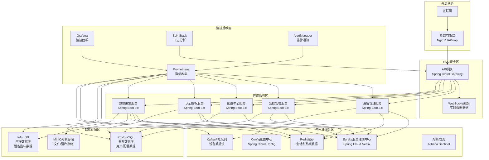
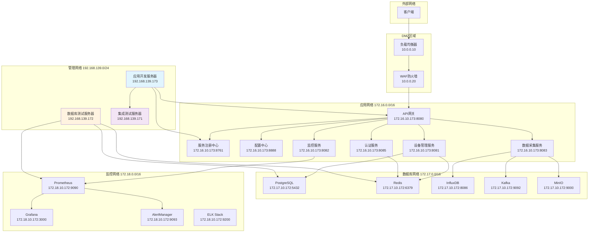

# 可视化大屏数据展示系统 - 后端架构实施文档

## 文档概述

本文档详细描述了支持3000+设备接入的可视化大屏数据展示系统后端架构的完整实施方案，包括技术架构部署、Linux服务器环境配置、系统集成步骤和运维指南。

## 目录

1. [架构总览](#架构总览)
2. [技术栈选型](#技术栈选型)
3. [环境准备](#环境准备)
4. [部署架构](#部署架构)
5. [核心服务部署](#核心服务部署)
6. [数据存储部署](#数据存储部署)
7. [监控运维部署](#监控运维部署)
8. [系统集成测试](#系统集成测试)
9. [性能调优](#性能调优)
10. [故障排查](#故障排查)
11. [扩展升级](#扩展升级)

---

## 架构总览

### 整体架构图



### 核心功能模块

| 服务名称 | 功能职责 | 技术栈 | 端口 | 部署节点 |
|---------|---------|--------|------|---------|
| API网关 | 统一入口、认证、限流 | Spring Cloud Gateway | 8080 | 2节点 |
| 设备管理服务 | 设备生命周期管理 | Spring Boot 3.x | 8081 | 3节点 |
| 监控告警服务 | 实时监控、告警处理 | Spring Boot 3.x | 8082 | 3节点 |
| 数据采集服务 | 设备数据采集处理 | Spring Boot 3.x | 8083 | 4节点 |
| 配置中心服务 | 系统配置管理 | Spring Boot 3.x | 8084 | 2节点 |
| 认证授权服务 | 用户认证授权 | Spring Boot 3.x | 8085 | 2节点 |
| 服务注册中心 | 服务发现配置 | Eureka | 8761 | 2节点 |
| 配置服务器 | 配置管理 | Spring Cloud Config | 8888 | 2节点 |

### 技术指标要求

- **设备接入能力**: 支持3000+设备并发接入
- **实时数据处理**: 10000+ 数据点/秒
- **API响应时间**: P99 < 200ms
- **系统可用性**: 99.9%+
- **数据处理延迟**: < 1秒
- **存储容量**: 支持TB级时序数据
- **并发用户**: 支持500+并发操作

---

## 技术栈选型

### 后端技术栈

| 技术领域 | 选用技术 | 版本 | 用途说明 |
|---------|---------|------|---------|
| 开发框架 | Spring Boot | 3.2.0 | 应用开发框架 |
| 微服务治理 | Spring Cloud | 2023.0.0 | 微服务架构治理 |
| 服务注册 | Eureka | - | 服务注册发现 |
| 配置中心 | Spring Cloud Config | - | 配置管理 |
| API网关 | Spring Cloud Gateway | - | API网关服务 |
| 数据库ORM | MyBatis Plus | 3.5.4 | 数据访问层 |
| 缓存 | Redis | 7.2 | 缓存和会话 |
| 消息队列 | Apache Kafka | 3.6 | 异步消息处理 |
| 时序数据库 | InfluxDB | 2.7 | 时序数据存储 |
| 关系数据库 | PostgreSQL | 15 | 业务数据存储 |
| 对象存储 | MinIO | 2023.12 | 文件对象存储 |
| 连接池 | HikariCP | - | 数据库连接池 |
| 熔断降级 | Alibaba Sentinel | - | 流量控制熔断 |
| 链路追踪 | Spring Cloud Sleuth | - | 分布式链路追踪 |
| API文档 | SpringDoc | 2.2.0 | API文档生成 |
| 认证 | JWT | - | 无状态认证 |
| 日志 | Logback + ELK | - | 日志管理 |
| 监控 | Prometheus + Grafana | - | 系统监控 |

### 开发工具链

| 工具类型 | 选用工具 | 用途 |
|---------|---------|------|
| 构建工具 | Maven 3.9 | 项目构建 |
| Java版本 | OpenJDK 17 | 开发运行环境 |
| Docker | Docker 24+ | 容器化部署 |
| 容器编排 | Docker Compose | 本地开发环境 |
| 代码质量 | SonarQube | 代码质量检查 |
| API测试 | Postman/Newman | API接口测试 |
| 性能测试 | JMeter | 压力性能测试 |
| 版本控制 | Git + GitLab | 代码版本管理 |

---

## 环境准备

### Linux服务器要求

#### 生产环境硬件配置

| 服务器角色 | 数量 | CPU | 内存 | 存储 | 网络 | 操作系统 |
|-----------|------|-----|------|------|------|---------|
| 应用服务器 | 6台 | 16核 | 32GB | 500GB SSD | 10Gbps | CentOS 8/RHEL 8 |
| 数据库服务器 | 3台 | 16核 | 64GB | 2TB SSD | 10Gbps | CentOS 8/RHEL 8 |
| 缓存服务器 | 2台 | 8核 | 32GB | 500GB SSD | 10Gbps | CentOS 8/RHEL 8 |
| 消息队列服务器 | 3台 | 16核 | 32GB | 1TB SSD | 10Gbps | CentOS 8/RHEL 8 |
| 监控服务器 | 2台 | 8核 | 16GB | 1TB | 1Gbps | CentOS 8/RHEL 8 |

#### 开发测试环境配置

| 服务器角色 | IP地址 | 数量 | CPU | 内存 | 存储 | 操作系统 | 用途说明 |
|-----------|--------|------|-----|------|------|---------|---------|
| 应用开发服务器 | 192.168.139.173 | 1台 | 8核 | 16GB | 500GB | Ubuntu 22.04 | 微服务应用开发、构建、部署 |
| 数据库测试服务器 | 192.168.139.172 | 1台 | 8核 | 32GB | 1TB | Ubuntu 22.04 | 开发测试数据库集群 |
| 集成测试服务器 | 192.168.139.171 | 1台 | 4核 | 8GB | 200GB | Ubuntu 22.04 | 系统集成测试、端到端测试 |

### 系统初始化

#### 1. 操作系统优化

```bash
#!/bin/bash
# 系统初始化脚本 - server-init.sh

# 更新系统包
sudo yum update -y

# 安装基础工具
sudo yum install -y wget curl vim net-tools htop iotop lsof git unzip

# 配置防火墙
sudo firewall-cmd --permanent --add-port=8080-8090/tcp
sudo firewall-cmd --permanent --add-port=5432/tcp
sudo firewall-cmd --permanent --add-port=6379/tcp
sudo firewall-cmd --permanent --add-port=9092/tcp
sudo firewall-cmd --permanent --add-port=3000/tcp
sudo firewall-cmd --reload

# 优化系统参数
cat << EOF | sudo tee -a /etc/sysctl.conf
# 网络优化
net.core.rmem_default = 262144
net.core.rmem_max = 16777216
net.core.wmem_default = 262144
net.core.wmem_max = 16777216
net.ipv4.tcp_rmem = 4096 87380 16777216
net.ipv4.tcp_wmem = 4096 65536 16777216
net.core.netdev_max_backlog = 5000
net.ipv4.tcp_congestion_control = bbr
vm.swappiness = 10
fs.file-max = 655360
EOF

# 应用系统参数
sudo sysctl -p

# 设置时区
sudo timedatectl set-timezone Asia/Shanghai

# 创建应用用户
sudo useradd -m -s /bin/bash appuser
sudo usermod -aG wheel appuser

echo "系统初始化完成"
```

#### 2. Java环境安装

```bash
#!/bin/bash
# Java环境安装脚本 - install-java.sh

# 下载OpenJDK 17
cd /tmp
wget https://download.java.net/java/GA/jdk17.0.2/dfd4a8d0985749f896bed50d7138ee7f/8/GPL/openjdk-17.0.2_linux-x64_bin.tar.gz

# 解压并安装
sudo tar -xzf openjdk-17.0.2_linux-x64_bin.tar.gz -C /opt/
sudo mv /opt/jdk-17.0.2 /opt/java17

# 配置环境变量
cat << EOF | sudo tee -a /etc/profile.d/java.sh
export JAVA_HOME=/opt/java17
export PATH=\$JAVA_HOME/bin:\$PATH
export CLASSPATH=.:\$JAVA_HOME/lib/dt.jar:\$JAVA_HOME/lib/tools.jar
EOF

# 刷新环境变量
source /etc/profile.d/java.sh

# 验证安装
java -version
javac -version

echo "Java 17 安装完成"
```

#### 3. Maven安装

```bash
#!/bin/bash
# Maven安装脚本 - install-maven.sh

# 下载Maven 3.9.5
cd /tmp
wget https://archive.apache.org/dist/maven/maven-3/3.9.5/binaries/apache-maven-3.9.5-bin.tar.gz

# 解压并安装
sudo tar -xzf apache-maven-3.9.5-bin.tar.gz -C /opt/
sudo mv /opt/apache-maven-3.9.5 /opt/maven

# 配置环境变量
cat << EOF | sudo tee -a /etc/profile.d/maven.sh
export MAVEN_HOME=/opt/maven
export PATH=\$MAVEN_HOME/bin:\$PATH
EOF

# 刷新环境变量
source /etc/profile.d/maven.sh

# 验证安装
mvn -version

echo "Maven 安装完成"
```

### Docker环境部署

#### 1. Docker安装

```bash
#!/bin/bash
# Docker安装脚本 - install-docker.sh

# 安装Docker
sudo yum install -y yum-utils
sudo yum-config-manager --add-repo https://download.docker.com/linux/centos/docker-ce.repo
sudo yum install -y docker-ce docker-ce-cli containerd.io docker-compose-plugin

# 启动Docker服务
sudo systemctl start docker
sudo systemctl enable docker

# 添加用户到docker组
sudo usermod -aG docker appuser

# 配置Docker镜像加速
sudo mkdir -p /etc/docker
cat << EOF | sudo tee /etc/docker/daemon.json
{
  "registry-mirrors": [
    "https://hub-mirror.c.163.com",
    "https://mirror.baidubce.com"
  ],
  "log-driver": "json-file",
  "log-opts": {
    "max-size": "10m",
    "max-file": "3"
  },
  "default-ulimits": {
    "nofile": {
      "Hard": 64000,
      "Name": "nofile",
      "Soft": 64000
    }
  }
}
EOF

# 重启Docker服务
sudo systemctl restart docker

echo "Docker 安装完成"
```

#### 2. Docker Compose安装

```bash
#!/bin/bash
# Docker Compose安装脚本 - install-docker-compose.sh

# 下载Docker Compose
sudo curl -L "https://github.com/docker/compose/releases/download/2.21.0/docker-compose-$(uname -s)-$(uname -m)" -o /usr/local/bin/docker-compose

# 给予执行权限
sudo chmod +x /usr/local/bin/docker-compose

# 创建软链接
sudo ln -s /usr/local/bin/docker-compose /usr/bin/docker-compose

# 验证安装
docker-compose --version

echo "Docker Compose 安装完成"
```

## 网络拓扑规划

### 网络架构设计

基于指定的服务器IP地址规划，采用三层网络架构设计，确保各服务间安全隔离和高效通信。

#### 网络分段策略

| 网络段 | CIDR | 用途 | 网关 | VLAN ID | 安全级别 |
|--------|------|------|------|---------|----------|
| 管理网络 | 192.168.139.0/24 | 服务器管理、SSH | 192.168.139.1 | 100 | 高 |
| 应用网络 | 172.16.0.0/16 | 微服务应用间通信 | 172.16.0.1 | 200 | 中 |
| 数据库网络 | 172.17.0.0/16 | 数据库访问专用 | 172.17.0.1 | 300 | 高 |
| 监控网络 | 172.18.0.0/16 | 系统监控、日志 | 172.18.0.1 | 400 | 中 |
| 外部访问 | 10.0.0.0/16 | 客户端访问入口 | 10.0.0.1 | 500 | 中 |

#### 服务器IP地址分配

##### 应用开发服务器 (192.168.139.173)

```bash
# /etc/netplan/01-network-manager-all.yaml
network:
  version: 2
  renderer: networkd
  ethernets:
    ens160:  # 管理网络接口
      dhcp4: false
      addresses:
        - 192.168.139.173/24
      routes:
        - to: 0.0.0.0/0
          via: 192.168.139.1
      nameservers:
        addresses: [192.168.139.1]
    ens192:  # 应用网络接口
      dhcp4: false
      addresses:
        - 172.16.10.173/16
```

##### 数据库测试服务器 (192.168.139.172)

```bash
# /etc/netplan/01-network-manager-all.yaml
network:
  version: 2
  renderer: networkd
  ethernets:
    ens160:  # 管理网络接口
      dhcp4: false
      addresses:
        - 192.168.139.172/24
      routes:
        - to: 0.0.0.0/0
          via: 192.168.139.1
      nameservers:
        addresses: [192.168.139.1]
    ens192:  # 数据库网络接口
      dhcp4: false
      addresses:
        - 172.17.10.172/16
    ens224:  # 监控网络接口
      dhcp4: false
      addresses:
        - 172.18.10.172/16
```

##### 集成测试服务器 (192.168.139.171)

```bash
# /etc/netplan/01-network-manager-all.yaml
network:
  version: 2
  renderer: networkd
  ethernets:
    ens160:  # 管理网络接口
      dhcp4: false
      addresses:
        - 192.168.139.171/24
      routes:
        - to: 0.0.0.0/0
          via: 192.168.139.1
      nameservers:
        addresses: [192.168.139.1]
    ens192:  # 应用网络接口
      dhcp4: false
      addresses:
        - 172.16.10.171/16
```

#### 网络安全配置

##### 防火墙规则配置

**应用开发服务器防火墙配置：**

```bash
#!/bin/bash
# configure-firewall-app.sh

# 重置防火墙规则
iptables -F
iptables -X
iptables -t nat -F
iptables -t nat -X
iptables -t mangle -F
iptables -t mangle -X

# 设置默认策略
iptables -P INPUT DROP
iptables -P FORWARD DROP
iptables -P OUTPUT ACCEPT

# 允许本地回环
iptables -A INPUT -i lo -j ACCEPT

# 允许已建立连接
iptables -A INPUT -m conntrack --ctstate ESTABLISHED,RELATED -j ACCEPT

# 允许管理网络SSH访问
iptables -A INPUT -s 192.168.139.0/24 -p tcp --dport 22 -j ACCEPT

# 允许应用网络服务端口
iptables -A INPUT -s 172.16.0.0/16 -p tcp --dport 8080:8090 -j ACCEPT  # 微服务端口
iptables -A INPUT -s 172.16.0.0/16 -p tcp --dport 8761 -j ACCEPT      # Eureka端口
iptables -A INPUT -s 172.16.0.0/16 -p tcp --dport 8888 -j ACCEPT      # Config端口

# 允许监控网络访问
iptables -A INPUT -s 172.18.0.0/16 -p tcp --dport 9090 -j ACCEPT      # Prometheus
iptables -A INPUT -s 172.18.0.0/16 -p tcp --dport 3000 -j ACCEPT      # Grafana

# 记录DROP规则
iptables -A INPUT -j LOG --log-prefix "INPUT-DROP: "
iptables -A FORWARD -j LOG --log-prefix "FORWARD-DROP: "

# 保存规则
iptables-save > /etc/iptables/rules.v4

echo "应用服务器防火墙配置完成"
```

**数据库测试服务器防火墙配置：**

```bash
#!/bin/bash
# configure-firewall-db.sh

# 重置防火墙规则
iptables -F
iptables -X

# 设置默认策略
iptables -P INPUT DROP
iptables -P FORWARD DROP
iptables -P OUTPUT ACCEPT

# 允许本地回环
iptables -A INPUT -i lo -j ACCEPT

# 允许已建立连接
iptables -A INPUT -m conntrack --ctstate ESTABLISHED,RELATED -j ACCEPT

# 允许管理网络SSH访问
iptables -A INPUT -s 192.168.139.0/24 -p tcp --dport 22 -j ACCEPT

# 允许应用网络数据库访问
iptables -A INPUT -s 172.16.0.0/16 -p tcp --dport 5432 -j ACCEPT      # PostgreSQL
iptables -A INPUT -s 172.16.0.0/16 -p tcp --dport 6379 -j ACCEPT      # Redis
iptables -A INPUT -s 172.16.0.0/16 -p tcp --dport 8086 -j ACCEPT      # InfluxDB
iptables -A INPUT -s 172.16.0.0/16 -p tcp --dport 9092 -j ACCEPT      # Kafka
iptables -A INPUT -s 172.16.0.0/16 -p tcp --dport 9000 -j ACCEPT      # MinIO

# 允许监控网络访问
iptables -A INPUT -s 172.18.0.0/16 -p tcp --dport 5432 -j ACCEPT      # 数据库监控

# 保存规则
iptables-save > /etc/iptables/rules.v4

echo "数据库服务器防火墙配置完成"
```

#### 网络性能优化

```bash
#!/bin/bash
# network-optimization.sh

# 启用BBR拥塞控制算法
cat << EOF >> /etc/sysctl.conf
# 网络性能优化
net.core.default_qdisc = fq
net.ipv4.tcp_congestion_control = bbr
net.core.rmem_default = 262144
net.core.rmem_max = 16777216
net.core.wmem_default = 262144
net.core.wmem_max = 16777216
net.ipv4.tcp_rmem = 4096 87380 16777216
net.ipv4.tcp_wmem = 4096 65536 16777216
net.core.netdev_max_backlog = 5000
net.core.somaxconn = 32768
net.ipv4.tcp_max_syn_backlog = 32768
net.ipv4.tcp_keepalive_time = 600
net.ipv4.tcp_keepalive_intvl = 60
net.ipv4.tcp_keepalive_probes = 3
EOF

# 应用配置
sysctl -p

echo "网络性能优化配置完成"
```

#### 网络连通性测试脚本

```bash
#!/bin/bash
# network-test.sh

echo "=== 网络连通性测试 ==="

# 测试各服务器间连通性
declare -A servers=(
    ["192.168.139.173"]="应用开发服务器"
    ["192.168.139.172"]="数据库测试服务器" 
    ["192.168.139.171"]="集成测试服务器"
)

for ip in "${!servers[@]}"; do
    echo -n "测试到${servers[$ip]} ($ip) 的连通性: "
    if ping -c 3 -W 3 $ip > /dev/null 2>&1; then
        echo "✅ 通"
    else
        echo "❌ 不通"
    fi
done

# 测试网络端口连通性
echo -e "\n=== 端口连通性测试 ==="
test_port() {
    local ip=$1
    local port=$2
    local service=$3
    
    if timeout 5 bash -c "echo > /dev/tcp/$ip/$port" > /dev/null 2>&1; then
        echo "✅ $service ($ip:$port) 可达"
    else
        echo "❌ $service ($ip:$port) 不可达"
    fi
}

# 测试关键服务端口
test_port "192.168.139.173" "22" "应用服务器SSH"
test_port "192.168.139.173" "8080" "API网关"
test_port "192.168.139.172" "22" "数据库服务器SSH"
test_port "192.168.139.172" "5432" "PostgreSQL"
test_port "192.168.139.172" "6379" "Redis"
test_port "192.168.139.171" "22" "集成测试服务器SSH"

echo -e "\n=== 路由表检查 ==="
route -n

echo -e "\n=== 网络接口状态 ==="
ip addr show

echo "网络测试完成"
```

### 网络拓扑图



---

## 安全策略设置

### 整体安全架构

基于三层网络架构，实施多层次安全防护策略，确保系统各组件的安全性和数据保护。

#### 安全策略概览

| 安全层级 | 防护措施 | 实施位置 | 安全级别 |
|---------|---------|---------|----------|
| 网络安全 | 防火墙、IDS/IPS、VLAN隔离 | 网络设备/服务器 | 高 |
| 应用安全 | JWT认证、RBAC授权、API限流 | 网关/微服务 | 高 |
| 数据安全 | 加密传输、数据脱敏、访问控制 | 数据库/存储 | 高 |
| 主机安全 | SSH密钥、用户权限、系统加固 | 服务器主机 | 中 |
| 监控安全 | 安全审计、异常检测、日志分析 | 监控系统 | 中 |

### 网络安全配置

#### 1. 应用层防火墙规则

**增强版应用开发服务器防火墙配置：**

```bash
#!/bin/bash
# configure-advanced-firewall-app.sh

echo "开始配置应用开发服务器高级防火墙规则..."

# 重置所有规则
iptables -F
iptables -X
iptables -t nat -F
iptables -t nat -X
iptables -t mangle -F
iptables -t mangle -X

# 设置默认策略
iptables -P INPUT DROP
iptables -P FORWARD DROP
iptables -P OUTPUT ACCEPT

# 允许本地回环
iptables -A INPUT -i lo -j ACCEPT

# 允许已建立和相关的连接
iptables -A INPUT -m conntrack --ctstate ESTABLISHED,RELATED -j ACCEPT

# SSH安全配置 - 仅允许管理网络，限制连接频率
iptables -A INPUT -s 192.168.139.0/24 -p tcp --dport 22 -m conntrack --ctstate NEW -m recent --set --name SSH
iptables -A INPUT -s 192.168.139.0/24 -p tcp --dport 22 -m conntrack --ctstate NEW -m recent --update --seconds 60 --hitcount 4 --name SSH -j DROP
iptables -A INPUT -s 192.168.139.0/24 -p tcp --dport 22 -j ACCEPT

# 防御SYN洪水攻击
iptables -A INPUT -p tcp --dport 80 -m conntrack --ctstate NEW -m limit --limit 25/sec --limit-burst 100 -j ACCEPT
iptables -A INPUT -p tcp --dport 8080 -m conntrack --ctstate NEW -m limit --limit 25/sec --limit-burst 100 -j ACCEPT

# 微服务端口访问控制
iptables -A INPUT -s 172.16.0.0/16 -p tcp --dport 8080:8090 -j ACCEPT  # API网关和微服务
iptables -A INPUT -s 172.16.0.0/16 -p tcp --dport 8761 -j ACCEPT      # Eureka服务注册
iptables -A INPUT -s 172.16.0.0/16 -p tcp --dport 8888 -j ACCEPT      # 配置中心
iptables -A INPUT -s 172.16.0.0/16 -p tcp --dport 3000 -j ACCEPT      # 开发调试端口

# 监控端口访问控制
iptables -A INPUT -s 172.18.0.0/16 -p tcp --dport 9090 -j ACCEPT      # Prometheus监控
iptables -A INPUT -s 172.18.0.0/16 -p tcp --dport 3000 -j ACCEPT      # Grafana监控面板

# 防止端口扫描
iptables -A INPUT -m state --state NEW -m recent --set --name portscan
iptables -A INPUT -m state --state NEW -m recent --update --seconds 86400 --hitcount 15 --name portscan -j DROP

# 防御ICMP攻击
iptables -A INPUT -p icmp --icmp-type echo-request -m limit --limit 1/sec --limit-burst 2 -j ACCEPT
iptables -A INPUT -p icmp --icmp-type echo-request -j DROP

# 丢弃无效数据包
iptables -A INPUT -m conntrack --ctstate INVALID -j DROP

# 记录被拒绝的连接尝试
iptables -A INPUT -j LOG --log-prefix "FIREWALL-DENY: " --log-level 4
iptables -A INPUT -j DROP

# 保存规则
iptables-save > /etc/iptables/rules.v4

echo "应用开发服务器高级防火墙配置完成"
```

**增强版数据库测试服务器防火墙配置：**

```bash
#!/bin/bash
# configure-advanced-firewall-db.sh

echo "开始配置数据库测试服务器高级防火墙规则..."

# 重置所有规则
iptables -F
iptables -X

# 设置默认策略
iptables -P INPUT DROP
iptables -P FORWARD DROP
iptables -P OUTPUT ACCEPT

# 允许本地回环
iptables -A INPUT -i lo -j ACCEPT

# 允许已建立和相关的连接
iptables -A INPUT -m conntrack --ctstate ESTABLISHED,RELATED -j ACCEPT

# SSH安全配置 - 严格限制
iptables -A INPUT -s 192.168.139.0/24 -p tcp --dport 22 -m conntrack --ctstate NEW -m recent --set --name DBSSH
iptables -A INPUT -s 192.168.139.0/24 -p tcp --dport 22 -m conntrack --ctstate NEW -m recent --update --seconds 60 --hitcount 3 --name DBSSH -j DROP
iptables -A INPUT -s 192.168.139.0/24 -p tcp --dport 22 -j ACCEPT

# 数据库服务访问控制 - 仅允许应用网络
iptables -A INPUT -s 172.16.0.0/16 -p tcp --dport 5432 -j ACCEPT      # PostgreSQL
iptables -A INPUT -s 172.16.0.0/16 -p tcp --dport 6379 -j ACCEPT      # Redis
iptables -A INPUT -s 172.16.0.0/16 -p tcp --dport 8086 -j ACCEPT      # InfluxDB
iptables -A INPUT -s 172.16.0.0/16 -p tcp --dport 9092 -j ACCEPT      # Kafka
iptables -A INPUT -s 172.16.0.0/16 -p tcp --dport 9000 -j ACCEPT      # MinIO
iptables -A INPUT -s 172.16.0.0/16 -p tcp --dport 2181 -j ACCEPT      # Zookeeper

# 监控网络访问控制
iptables -A INPUT -s 172.18.0.0/16 -p tcp --dport 9090 -j ACCEPT      # Prometheus监控
iptables -A INPUT -s 172.18.0.0/16 -p tcp --dport 3000 -j ACCEPT      # Grafana
iptables -A INPUT -s 172.18.0.0/16 -p tcp --dport 9200 -j ACCEPT      # Elasticsearch

# 数据库连接数限制（防止DDoS）
iptables -A INPUT -p tcp --dport 5432 -m conntrack --ctstate NEW -m limit --limit 10/sec --limit-burst 20 -j ACCEPT
iptables -A INPUT -p tcp --dport 6379 -m conntrack --ctstate NEW -m limit --limit 10/sec --limit-burst 20 -j ACCEPT

# 防御SYN洪水攻击
iptables -A INPUT -p tcp --dport 5432 -m conntrack --ctstate NEW -m limit --limit 25/sec --limit-burst 100 -j ACCEPT
iptables -A INPUT -p tcp --dport 6379 -m conntrack --ctstate NEW -m limit --limit 25/sec --limit-burst 100 -j ACCEPT

# 防止暴力破解 - 动态黑名单
iptables -A INPUT -p tcp --dport 5432 -m conntrack --ctstate NEW -m recent --set --name POSTGRES
iptables -A INPUT -p tcp --dport 5432 -m conntrack --ctstate NEW -m recent --update --seconds 300 --hitcount 10 --name POSTGRES -j DROP

iptables -A INPUT -p tcp --dport 6379 -m conntrack --ctstate NEW -m recent --set --name REDIS
iptables -A INPUT -p tcp --dport 6379 -m conntrack --ctstate NEW -m recent --update --seconds 300 --hitcount 10 --name REDIS -j DROP

# 日志记录
iptables -A INPUT -j LOG --log-prefix "DB-FIREWALL-DENY: " --log-level 4
iptables -A INPUT -j DROP

# 保存规则
iptables-save > /etc/iptables/rules.v4

echo "数据库测试服务器高级防火墙配置完成"
```

#### 2. 系统安全加固脚本

```bash
#!/bin/bash
# system-hardening.sh

echo "开始系统安全加固..."

# 禁用不必要的服务
systemctl disable avahi-daemon
systemctl disable cups
systemctl disable bluetooth
systemctl disable ModemManager

# 关闭不必要的端口
echo "关闭不必要的系统服务..."

# 配置文件权限加固
chmod 600 /etc/ssh/sshd_config
chmod 644 /etc/passwd
chmod 600 /etc/shadow
chmod 644 /etc/group

# 禁用root直接登录
sed -i 's/#PermitRootLogin yes/PermitRootLogin no/' /etc/ssh/sshd_config

# 禁用用户配置文件中的. rhosts 文件
echo "IgnoreRhosts yes" >> /etc/ssh/sshd_config

# 禁用基于主机的认证
echo "HostbasedAuthentication no" >> /etc/ssh/sshd_config

# 启用严格的模式
echo "StrictModes yes" >> /etc/ssh/sshd_config

# 设置SSH会话超时
echo "ClientAliveInterval 300" >> /etc/ssh/sshd_config
echo "ClientAliveCountMax 2" >> /etc/ssh/sshd_config

# 重启SSH服务
systemctl restart sshd

# 禁用Ctrl+Alt+Delete重启
systemctl mask ctrl-alt-del.target

# 设置密码策略
cat << EOF >> /etc/security/pwquality.conf
minlen = 12
minclass = 3
maxrepeat = 2
maxsequence = 3
EOF

# 设置账户锁定策略
cat << EOF >> /etc/security/faillock.conf
audit
silent
deny=3
fail_interval=900
unlock_time=600
EOF

# 启用日志审计
systemctl enable auditd
systemctl start auditd

# 配置auditd规则
cat << EOF > /etc/audit/rules.d/audit.rules
# 删除所有现有规则
-D

# 设置缓冲区大小
-b 8192

# 监控系统调用
-a always,exit -F arch=b64 -S execve -k exec
-a always,exit -F arch=b32 -S execve -k exec

# 监控网络配置修改
-a always,exit -F arch=b64 -S socket -k network
-a always,exit -F arch=b32 -S socket -k network

# 监控文件访问
-a always,exit -F arch=b64 -S open,openat,open_by_handle_at -F exit=-EPERM -k file_access
-a always,exit -F arch=b32 -S open,openat,open_by_handle_at -F exit=-EPERM -k file_access

# 监控用户管理
-w /etc/passwd -p wa -k user_modification
-w /etc/shadow -p wa -k user_modification
-w /etc/group -p wa -k user_modification
-w /etc/sudoers -p wa -k sudo_modification

# 监控SSH配置
-w /etc/ssh/sshd_config -p wa -k ssh_modification

# 监控进程执行
-w /proc -p wa -k process_monitoring

# 创建日志文件
-f 1
EOF

# 重新加载auditd规则
auditctl -R /etc/audit/rules.d/audit.rules

echo "系统安全加固完成"
```

### 应用安全配置

#### 1. JWT认证配置

**JWT配置文件 (application-security.yml):**

```yaml
# JWT安全配置
jwt:
  secret: "VisualDashboardSystem2024SecretKeyForProductionEnvironment"  # 256位密钥
  expiration: 86400  # 24小时过期
  refresh-expiration: 604800  # 7天刷新过期
  issuer: "visual-dashboard-system"
  algorithm: "HS256"
  header: "Authorization"
  prefix: "Bearer "
  
security:
  # OAuth2配置
  oauth2:
    resourceserver:
      jwt:
        issuer-uri: "https://auth.visual-dashboard.com"
    
  # CORS配置
  cors:
    allowed-origins:
      - "https://dashboard.visual-dashboard.com"
      - "https://admin.visual-dashboard.com"
    allowed-methods:
      - GET
      - POST
      - PUT
      - DELETE
      - OPTIONS
    allowed-headers:
      - Authorization
      - Content-Type
      - X-Requested-With
    exposed-headers:
      - X-Total-Count
    allow-credentials: true
    max-age: 3600
    
  # 密码加密
  password:
    algorithm: "bcrypt"
    strength: 12
    
  # 会话配置
  session:
    timeout: 1800  # 30分钟
    maximum-sessions: 1
    strategy: "stateless"  # JWT无状态
```

**JWT认证服务实现:**

```java
@Component
public class JwtTokenProvider {
    
    @Value("${jwt.secret}")
    private String jwtSecret;
    
    @Value("${jwt.expiration}")
    private int jwtExpiration;
    
    @Value("${jwt.refresh-expiration}")
    private int refreshExpiration;
    
    private Key getSigningKey() {
        byte[] keyBytes = jwtSecret.getBytes(StandardCharsets.UTF_8);
        return Keys.hmacShaKeyFor(keyBytes);
    }
    
    /**
     * 生成访问令牌
     */
    public String generateAccessToken(UserPrincipal userPrincipal) {
        Date expiryDate = new Date(System.currentTimeMillis() + jwtExpiration * 1000L);
        
        return Jwts.builder()
                .setSubject(Long.toString(userPrincipal.getId()))
                .claim("email", userPrincipal.getEmail())
                .claim("username", userPrincipal.getUsername())
                .claim("roles", userPrincipal.getAuthorities())
                .setIssuer("visual-dashboard-system")
                .setAudience("visual-dashboard-api")
                .setIssuedAt(new Date())
                .setExpiration(expiryDate)
                .signWith(getSigningKey(), SignatureAlgorithm.HS256)
                .compact();
    }
    
    /**
     * 生成刷新令牌
     */
    public String generateRefreshToken(UserPrincipal userPrincipal) {
        Date expiryDate = new Date(System.currentTimeMillis() + refreshExpiration * 1000L);
        
        return Jwts.builder()
                .setSubject(Long.toString(userPrincipal.getId()))
                .claim("token_type", "refresh")
                .setIssuer("visual-dashboard-system")
                .setAudience("visual-dashboard-api")
                .setIssuedAt(new Date())
                .setExpiration(expiryDate)
                .signWith(getSigningKey(), SignatureAlgorithm.HS256)
                .compact();
    }
    
    /**
     * 验证令牌有效性
     */
    public boolean validateToken(String authToken) {
        try {
            Jwts.parser().setSigningKey(getSigningKey()).parseClaimsJws(authToken);
            return true;
        } catch (MalformedJwtException ex) {
            log.error("Invalid JWT token");
        } catch (ExpiredJwtException ex) {
            log.error("JWT token is expired");
        } catch (UnsupportedJwtException ex) {
            log.error("JWT token is unsupported");
        } catch (IllegalArgumentException ex) {
            log.error("JWT claims string is empty");
        }
        return false;
    }
    
    /**
     * 从令牌中获取用户ID
     */
    public Long getUserIdFromToken(String token) {
        Claims claims = Jwts.parser()
                .setSigningKey(getSigningKey())
                .parseClaimsJws(token)
                .getBody();
        
        return Long.parseLong(claims.getSubject());
    }
    
    /**
     * 检查令牌是否即将过期（5分钟内）
     */
    public boolean isTokenNearExpiry(String token) {
        try {
            Claims claims = Jwts.parser()
                    .setSigningKey(getSigningKey())
                    .parseClaimsJws(token)
                    .getBody();
            
            Date expiry = claims.getExpiration();
            long timeToExpiry = expiry.getTime() - System.currentTimeMillis();
            
            return timeToExpiry <= 300000; // 5分钟
        } catch (Exception e) {
            return false;
        }
    }
}
```

#### 2. RBAC权限控制系统

**权限实体定义:**

```java
@Entity
@Table(name = "roles")
public class Role {
    @Id
    @GeneratedValue(strategy = GenerationType.IDENTITY)
    private Long id;
    
    @Column(name = "name", unique = true, nullable = false)
    private String name;
    
    @Column(name = "description")
    private String description;
    
    @ManyToMany(mappedBy = "roles")
    private Set<User> users = new HashSet<>();
    
    @ManyToMany(fetch = FetchType.EAGER)
    @JoinTable(
        name = "role_permissions",
        joinColumns = @JoinColumn(name = "role_id"),
        inverseJoinColumns = @JoinColumn(name = "permission_id")
    )
    private Set<Permission> permissions = new HashSet<>();
    
    // getters and setters
}

@Entity
@Table(name = "permissions")
public class Permission {
    @Id
    @GeneratedValue(strategy = GenerationType.IDENTITY)
    private Long id;
    
    @Column(name = "name", unique = true, nullable = false)
    private String name;
    
    @Column(name = "resource")
    private String resource;
    
    @Column(name = "action")
    private String action;
    
    @Column(name = "description")
    private String description;
    
    @ManyToMany(mappedBy = "permissions")
    private Set<Role> roles = new HashSet<>();
    
    // getters and setters
}

@Entity
@Table(name = "user_roles")
public class UserRole {
    @Id
    @GeneratedValue(strategy = GenerationType.IDENTITY)
    private Long id;
    
    @ManyToOne
    @JoinColumn(name = "user_id", nullable = false)
    private User user;
    
    @ManyToOne
    @JoinColumn(name = "role_id", nullable = false)
    private Role role;
    
    @Column(name = "assigned_date")
    private LocalDateTime assignedDate;
    
    @Column(name = "assigned_by")
    private String assignedBy;
    
    @Column(name = "is_active")
    private boolean isActive = true;
    
    // getters and setters
}
```

**权限验证服务:**

```java
@Service
@Transactional
public class PermissionService {
    
    @Autowired
    private UserRepository userRepository;
    
    @Autowired
    private RoleRepository roleRepository;
    
    @Autowired
    private PermissionRepository permissionRepository;
    
    @Autowired
    private UserRoleRepository userRoleRepository;
    
    /**
     * 检查用户是否具有特定权限
     */
    public boolean hasPermission(Long userId, String resource, String action) {
        Set<String> userPermissions = getUserPermissions(userId);
        String requiredPermission = resource + ":" + action;
        return userPermissions.contains(requiredPermission) || 
               userPermissions.contains(resource + ":*") || 
               userPermissions.contains("*:*");
    }
    
    /**
     * 获取用户所有权限
     */
    public Set<String> getUserPermissions(Long userId) {
        Set<String> permissions = new HashSet<>();
        
        List<UserRole> userRoles = userRoleRepository.findByUserIdAndIsActive(userId, true);
        
        for (UserRole userRole : userRoles) {
            Set<Permission> rolePermissions = userRole.getRole().getPermissions();
            for (Permission permission : rolePermissions) {
                permissions.add(permission.getName());
                permissions.add(permission.getResource() + ":" + permission.getAction());
            }
        }
        
        return permissions;
    }
    
    /**
     * 检查用户是否具有特定角色
     */
    public boolean hasRole(Long userId, String roleName) {
        List<UserRole> userRoles = userRoleRepository.findByUserIdAndIsActive(userId, true);
        return userRoles.stream()
                .anyMatch(userRole -> userRole.getRole().getName().equals(roleName));
    }
    
    /**
     * 动态权限验证注解
     */
    @Target({ElementType.METHOD, ElementType.TYPE})
    @Retention(RetentionPolicy.RUNTIME)
    public @interface RequirePermission {
        String resource() default "";
        String action() default "";
        String role() default "";
    }
}
```

**权限切面实现:**

```java
@Aspect
@Component
public class PermissionAspect {
    
    @Autowired
    private PermissionService permissionService;
    
    @Around("@annotation(requirePermission)")
    public Object checkPermission(ProceedingJoinPoint joinPoint, RequirePermission requirePermission) 
            throws Throwable {
        
        // 获取当前用户ID（从SecurityContext中获取）
        Long userId = getCurrentUserId();
        if (userId == null) {
            throw new UnauthorizedException("User not authenticated");
        }
        
        // 检查角色权限
        if (!StringUtils.isEmpty(requirePermission.role())) {
            if (!permissionService.hasRole(userId, requirePermission.role())) {
                throw new ForbiddenException("Insufficient role permissions");
            }
        }
        
        // 检查资源权限
        if (!StringUtils.isEmpty(requirePermission.resource())) {
            if (!permissionService.hasPermission(
                userId, 
                requirePermission.resource(), 
                requirePermission.action()
            )) {
                throw new ForbiddenException("Insufficient resource permissions");
            }
        }
        
        return joinPoint.proceed();
    }
    
    private Long getCurrentUserId() {
        Authentication authentication = SecurityContextHolder.getContext().getAuthentication();
        if (authentication != null && authentication.isAuthenticated() 
            && !"anonymousUser".equals(authentication.getPrincipal())) {
            
            UserPrincipal userPrincipal = (UserPrincipal) authentication.getPrincipal();
            return userPrincipal.getId();
        }
        return null;
    }
}
```

#### 3. API安全配置

**API限流配置:**

```java
@Configuration
@EnableRedisRateLimiter
public class RateLimitConfig {
    
    @Bean
    public RateLimiter redisRateLimiter() {
        return RedisRateLimiter.create(10, 20); // 每秒10个请求，突发20个
    }
    
    /**
     * 设备管理API限流
     */
    @Bean
    public RateLimiter deviceApiRateLimiter() {
        return RedisRateLimiter.create(5, 10); // 设备API更严格
    }
    
    /**
     * 数据采集API限流
     */
    @Bean
    public RateLimiter dataCollectionRateLimiter() {
        return RedisRateLimiter.create(100, 200); // 数据采集允许更高频率
    }
}

// API限流注解
@Target({ElementType.METHOD, ElementType.TYPE})
@Retention(RetentionPolicy.RUNTIME)
public @interface RateLimit {
    String value() default "default";
    int permits() default 10;
    int burst() default 20;
    long timeout() default 0;
}
```

**API安全过滤器:**

```java
@Component
public class SecurityFilter extends OncePerRequestFilter {
    
    @Override
    protected void doFilterInternal(HttpServletRequest request, 
                                   HttpServletResponse response, 
                                   FilterChain filterChain) throws ServletException, IOException {
        
        // 添加安全头
        response.setHeader("X-Content-Type-Options", "nosniff");
        response.setHeader("X-Frame-Options", "DENY");
        response.setHeader("X-XSS-Protection", "1; mode=block");
        response.setHeader("Strict-Transport-Security", "max-age=31536000; includeSubDomains");
        response.setHeader("Referrer-Policy", "strict-origin-when-cross-origin");
        response.setHeader("Content-Security-Policy", "default-src 'self'; script-src 'self' 'unsafe-inline'");
        
        // 记录安全日志
        logSecurityEvent(request);
        
        filterChain.doFilter(request, response);
    }
    
    private void logSecurityEvent(HttpServletRequest request) {
        String clientIP = getClientIP(request);
        String userAgent = request.getHeader("User-Agent");
        String uri = request.getRequestURI();
        String method = request.getMethod();
        
        // 检查可疑请求
        if (isSuspiciousRequest(request)) {
            log.warn("Suspicious request detected - IP: {}, UserAgent: {}, URI: {}, Method: {}", 
                    clientIP, userAgent, uri, method);
            
            // 可以在这里添加自动封禁逻辑
        }
    }
    
    private boolean isSuspiciousRequest(HttpServletRequest request) {
        String uri = request.getRequestURI().toLowerCase();
        String userAgent = request.getHeader("User-Agent");
        
        // 检查SQL注入
        if (uri.contains("'") || uri.contains("union") || uri.contains("select")) {
            return true;
        }
        
        // 检查XSS
        if (uri.contains("<script") || uri.contains("javascript:")) {
            return true;
        }
        
        // 检查路径遍历
        if (uri.contains("../") || uri.contains("..\\")) {
            return true;
        }
        
        // 检查空User-Agent
        if (userAgent == null || userAgent.trim().isEmpty()) {
            return true;
        }
        
        return false;
    }
}
```

### 数据安全配置

#### 1. 数据库安全配置

**PostgreSQL安全配置:**

```sql
-- 创建应用数据库用户（最小权限原则）
CREATE USER dashboard_app WITH PASSWORD 'ComplexPassword123!';
CREATE USER dashboard_read WITH PASSWORD 'ReadOnlyPassword456!';
CREATE USER dashboard_write WITH PASSWORD 'WriteOnlyPassword789!';

-- 授予最小必要权限
GRANT CONNECT ON DATABASE dashboard_db TO dashboard_app;
GRANT USAGE ON SCHEMA public TO dashboard_app;
GRANT SELECT, INSERT, UPDATE, DELETE ON ALL TABLES IN SCHEMA public TO dashboard_app;
GRANT USAGE, SELECT ON ALL SEQUENCES IN SCHEMA public TO dashboard_app;

-- 读取用户权限
GRANT CONNECT ON DATABASE dashboard_db TO dashboard_read;
GRANT USAGE ON SCHEMA public TO dashboard_read;
GRANT SELECT ON ALL TABLES IN SCHEMA public TO dashboard_read;

-- 写入用户权限
GRANT CONNECT ON DATABASE dashboard_db TO dashboard_write;
GRANT USAGE ON SCHEMA public TO dashboard_write;
GRANT SELECT, INSERT, UPDATE ON ALL TABLES IN SCHEMA public TO dashboard_write;
GRANT USAGE, SELECT ON ALL SEQUENCES IN SCHEMA public TO dashboard_write;

-- 启用行级安全策略
ALTER TABLE users ENABLE ROW LEVEL SECURITY;
ALTER TABLE devices ENABLE ROW LEVEL SECURITY;
ALTER TABLE monitoring_data ENABLE ROW LEVEL SECURITY;

-- 创建行级安全策略
CREATE POLICY user_isolation_policy ON users
    USING (user_id = current_setting('app.current_user_id')::bigint);

CREATE POLICY device_access_policy ON devices
    USING (
        created_by = current_setting('app.current_user_id')::bigint OR
        user_id = current_setting('app.current_user_id')::bigint OR
        is_public = true
    );

-- 禁用超级用户权限
ALTER USER dashboard_app NOCREATEDB NOCREATEROLE NOSUPERUSER;
ALTER USER dashboard_read NOCREATEDB NOCREATEROLE NOSUPERUSER;
ALTER USER dashboard_write NOCREATEDB NOCREATEROLE NOSUPERUSER;

-- 设置密码策略
ALTER SYSTEM SET password_encryption = 'scram-sha-256';
ALTER SYSTEM SET log_statement = 'mod';
ALTER SYSTEM SET log_min_duration_statement = 1000;
ALTER SYSTEM SET log_connections = on;
ALTER SYSTEM SET log_disconnections = on;
ALTER SYSTEM SET log_line_prefix = '%t [%p]: [%l-1] user=%u,db=%d,app=%a,client=%h ';

-- 重载配置
SELECT pg_reload_conf();
```

**敏感数据加密配置:**

```java
@Configuration
public class DataEncryptionConfig {
    
    @Bean
    public StringEncryptor stringEncryptor() {
        PooledPBEStringEncryptor encryptor = new PooledPBEStringEncryptor();
        SimpleStringPBEConfig config = new SimpleStringPBEConfig();
        config.setPassword("VisualDashboardSystemEncryptionKey2024");
        config.setAlgorithm("PBEWITHHMACSHA512ANDAES_256");
        config.setKeyObtentionIterations("1000");
        config.setPoolSize("2");
        config.setProviderName("SunJCE");
        config.setSaltGeneratorClassName("org.jasypt.salt.RandomSaltGenerator");
        config.setIvGeneratorClassName("org.jasypt.iv.RandomIvGenerator");
        config.setStringOutputType("base64");
        encryptor.setConfig(config);
        return encryptor;
    }
    
    /**
     * 敏感字段加密注解
     */
    @Target({ElementType.FIELD, ElementType.METHOD})
    @Retention(RetentionPolicy.RUNTIME)
    @Documented
    public @interface SensitiveData {
        String fieldName() default "";
    }
}

// 加密字段转换器
@Component
public class EncryptionConverter implements AttributeConverter<String, String> {
    
    @Autowired
    private StringEncryptor encryptor;
    
    @Override
    public String convertToDatabaseColumn(String attribute) {
        return encryptor.encrypt(attribute);
    }
    
    @Override
    public String convertToEntityAttribute(String dbData) {
        return encryptor.decrypt(dbData);
    }
}

// 实体类使用示例
@Entity
@Table(name = "users")
public class User {
    
    @Id
    private Long id;
    
    @Column(nullable = false, unique = true)
    private String username;
    
    @Convert(converter = EncryptionConverter.class)
    @Column(name = "email", nullable = false)
    private String email;
    
    @Convert(converter = EncryptionConverter.class)
    @Column(name = "phone_number")
    private String phoneNumber;
    
    @Convert(converter = EncryptionConverter.class)
    @Column(name = "id_card_number")
    @SensitiveData
    private String idCardNumber;
    
    // getters and setters
}
```

#### 2. 传输层安全配置

**SSL/TLS证书配置:**

```yaml
# application.yml SSL配置
server:
  ssl:
    enabled: true
    key-store: classpath:keystore/visual-dashboard.p12
    key-store-password: ${SSL_KEYSTORE_PASSWORD}
    key-store-type: PKCS12
    key-store-provider: SUN
    key-alias: visual-dashboard
    enabled-protocols: TLSv1.2,TLSv1.3
    ciphers: >-
      TLS_ECDHE_RSA_WITH_AES_256_GCM_SHA384,
      TLS_ECDHE_RSA_WITH_AES_128_GCM_SHA256,
      TLS_ECDHE_RSA_WITH_AES_256_CBC_SHA384,
      TLS_ECDHE_RSA_WITH_AES_128_CBC_SHA256
    protocol: TLS
    client-auth: need  # 双向认证

# HTTP重定向到HTTPS
server:
  port: 8443
  http:
    port: 8080
    redirect: 8443

# Redis SSL配置
spring:
  redis:
    ssl:
      enabled: true
      trust-store: classpath:truststore/redis-truststore.p12
      trust-store-password: ${REDIS_SSL_PASSWORD}
      key-store: classpath:keystore/redis-client.p12
      key-store-password: ${REDIS_KEYSTORE_PASSWORD}
```

**生成SSL证书脚本:**

```bash
#!/bin/bash
# generate-ssl-certs.sh

echo "开始生成SSL证书..."

# 创建证书目录
mkdir -p ssl/{ca,server,client}
cd ssl

# 生成CA私钥
openssl genrsa -out ca/ca-key.pem 4096

# 生成CA证书
openssl req -new -x509 -days 365 -key ca/ca-key.pem -out ca/ca-cert.pem -subj "/C=CN/ST=Beijing/L=Beijing/O=Visual Dashboard/OU=IT/CN=Visual-Dashboard-CA"

# 生成服务器私钥
openssl genrsa -out server/server-key.pem 4096

# 生成服务器证书签名请求
openssl req -new -key server/server-key.pem -out server/server-req.pem -subj "/C=CN/ST=Beijing/L=Beijing/O=Visual Dashboard/OU=IT/CN=*.visual-dashboard.com"

# 生成服务器证书
openssl x509 -req -in server/server-req.pem -CA ca/ca-cert.pem -CAkey ca/ca-key.pem -out server/server-cert.pem -days 365 -CAcreateserial

# 生成客户端私钥
openssl genrsa -out client/client-key.pem 4096

# 生成客户端证书签名请求
openssl req -new -key client/client-key.pem -out client/client-req.pem -subj "/C=CN/ST=Beijing/L=Beijing/O=Visual Dashboard/OU=IT/CN=Visual-Dashboard-Client"

# 生成客户端证书
openssl x509 -req -in client/client-req.pem -CA ca/ca-cert.pem -CAkey ca/ca-key.pem -out client/client-cert.pem -days 365 -CAcreateserial

# 转换为PKCS12格式
openssl pkcs12 -export -in server/server-cert.pem -inkey server/server-key.pem -out server/visual-dashboard.p12 -name visual-dashboard -CAfile ca/ca-cert.pem -caname visual-dashboard-root

# 创建信任库
keytool -import -trustcacerts -alias visual-dashboard-root -file ca/ca-cert.pem -keystore truststore/redis-truststore.p12 -storetype PKCS12 -storepass trustpass123 -noprompt

# 创建客户端密钥库
openssl pkcs12 -export -in client/client-cert.pem -inkey client/client-key.pem -out client/redis-client.p12 -name redis-client -CAfile ca/ca-cert.pem -caname visual-dashboard-root

echo "SSL证书生成完成"
```

### 主机安全配置

#### 1. SSH安全配置

```bash
#!/bin/bash
# configure-ssh-security.sh

echo "配置SSH安全设置..."

# 备份原始配置
cp /etc/ssh/sshd_config /etc/ssh/sshd_config.backup

# 修改SSH配置
cat << EOF > /etc/ssh/sshd_config

# 基本安全设置
Port 2222  # 修改默认端口
Protocol 2
AddressFamily inet
ListenAddress 0.0.0.0

# 认证设置
PermitRootLogin no
PubkeyAuthentication yes
PasswordAuthentication yes
PermitEmptyPasswords no
ChallengeResponseAuthentication no

# 用户访问控制
AllowUsers appuser dashboard-admin
DenyUsers root admin test guest

# 会话设置
ClientAliveInterval 300
ClientAliveCountMax 2
MaxAuthTries 3
MaxSessions 5
MaxStartups 10:30:60

# 日志设置
LogLevel VERBOSE
SyslogFacility AUTH

# 权限设置
StrictModes yes
IgnoreRhosts yes
HostbasedAuthentication no

# 其他安全设置
X11Forwarding no
X11UseLocalhost yes
X11DisplayOffset 10
PrintMotd no
PrintLastLog yes
TCPKeepAlive yes

# 防火墙规则更新
UsePAM yes
UseDNS no
GSSAPIAuthentication no

# 限制登录时间
# 仅允许工作时间登录 (9:00-18:00)
# Match User appuser
#   PermitRootLogin no
#   AllowGroups ssh-access

EOF

# 重启SSH服务
systemctl restart sshd

# 更新防火墙规则
sed -i 's/--dport 22/--dport 2222/' /etc/iptables/rules.v4
iptables-restore < /etc/iptables/rules.v4

echo "SSH安全配置完成"
```

#### 2. 文件系统安全

```bash
#!/bin/bash
# configure-filesystem-security.sh

echo "配置文件系统安全..."

# 设置文件权限
find /home -name ".*" -type f -exec chmod 600 {} \;  # 隐藏文件
find /home -type d -exec chmod 700 {} \;  # 目录权限

# 保护重要系统文件
chmod 600 /etc/passwd
chmod 600 /etc/shadow
chmod 600 /etc/group
chmod 600 /etc/gshadow
chmod 600 /etc/security/opasswd

# 设置SUID/SGID文件审计
find / -perm -4000 -type f 2>/dev/null > /tmp/suid-files.txt
echo "SUID/SGID文件已记录到 /tmp/suid-files.txt"

# 设置不可变文件（关键系统文件）
chattr +i /etc/passwd
chattr +i /etc/shadow
chattr +i /etc/group
chattr +i /etc/gshadow

# 配置文件系统挂载选项
cat << EOF > /etc/fstab
# <file system> <mount point>   <type>  <options>       <dump>  <pass>
/dev/sda1    /                   ext4    defaults,noatime 0       1
/dev/sda2    /var                ext4    defaults,noatime 0       2
/dev/sda3    /tmp                ext4    defaults,nodev,nosuid  0       2
/dev/sda4    /home               ext4    defaults,nodev,nosuid,noexec 0       2
EOF

# 创建安全的/tmp目录
mount -o remount,nodev,nosuid,noexec /tmp

# 设置磁盘配额（限制用户磁盘使用）
quotacheck -avug
quotaon -avug

echo "文件系统安全配置完成"
```

### 监控安全配置

#### 1. 安全事件监控

```bash
#!/bin/bash
# security-monitoring.sh

echo "配置安全事件监控..."

# 创建安全监控目录
mkdir -p /var/log/security/{audit,alerts,reports}

# 配置日志轮转
cat << EOF > /etc/logrotate.d/security
/var/log/security/audit/*.log {
    daily
    missingok
    rotate 30
    compress
    delaycompress
    notifempty
    create 640 root root
    postrotate
        systemctl reload auditd
    endscript
}

/var/log/security/alerts/*.log {
    daily
    missingok
    rotate 90
    compress
    delaycompress
    notifempty
    create 640 root root
}
EOF

# 设置系统调用审计
cat << EOF > /etc/audit/rules.d/security.rules
# 监控重要文件访问
-w /etc/passwd -p wa -k identity_changes
-w /etc/shadow -p wa -k identity_changes
-w /etc/group -p wa -k identity_changes
-w /etc/sudoers -p wa -k privilege_changes

# 监控网络活动
-a always,exit -F arch=b64 -S socket -F a0=2 -k network_socket
-a always,exit -F arch=b32 -S socket -F a0=2 -k network_socket

# 监控进程执行
-a always,exit -F arch=b64 -S execve -k process_execution
-a always,exit -F arch=b32 -S execve -k process_execution

# 监控文件删除
-a always,exit -F arch=b64 -S unlink,unlinkat,rename,renameat -k file_deletion
-a always,exit -F arch=b32 -S unlink,unlinkat,rename,renameat -k file_deletion

# 监控权限修改
-a always,exit -F arch=b64 -S chmod,fchmod,fchmodat -k permission_changes
-a always,exit -F arch=b32 -S chmod,fchmod,fchmodat -k permission_changes
EOF

# 重载auditd规则
auditctl -R /etc/audit/rules.d/security.rules

# 配置入侵检测
cat << EOF > /etc/aide.conf
# AIDE配置文件
/etc DailyIncrementals
/var/log DailyIncrementals
!/var/log/aide
!/tmp
!/var/tmp
EOF

# 初始化AIDE数据库
aide --init
mv /var/lib/aide/aide.db.new.gz /var/lib/aide/aide.db.gz

# 设置定时安全检查
cat << EOF > /etc/cron.daily/security-check
#!/bin/bash
# Daily security check script

# 检查失败的登录尝试
grep "Failed password" /var/log/auth.log | tail -20

# 检查新创建的用户
awk -F: '\$3 >= 1000 {print \$1, \$3, \$7}' /etc/passwd

# 检查SUID文件变化
find / -perm -4000 -type f 2>/dev/null | sort > /tmp/current-suid
diff /tmp/suid-files.txt /tmp/current-suid || echo "SUID文件发生变化"

# 检查磁盘使用
df -h | awk '\$5 > 80 {print "警告: " \$1 " 使用率 " \$5}'

# 运行AIDE检查
aide --check
EOF

chmod +x /etc/cron.daily/security-check

echo "安全事件监控配置完成"
```

#### 2. 安全告警配置

```yaml
# alertmanager-security.yml
global:
  smtp_smarthost: 'smtp.office365.com:587'
  smtp_from: 'security@visual-dashboard.com'
  smtp_auth_username: 'security@visual-dashboard.com'
  smtp_auth_password: '${SMTP_PASSWORD}'

# 告警路由
route:
  group_by: ['alertname']
  group_wait: 10s
  group_interval: 10s
  repeat_interval: 1h
  receiver: 'security-team'
  routes:
  - match:
      severity: critical
    receiver: 'critical-alerts'
  - match:
      severity: warning
    receiver: 'warning-alerts'

# 告警接收器
receivers:
- name: 'security-team'
  email_configs:
  - to: 'admin@visual-dashboard.com'
    subject: '安全告警: {{ .GroupLabels.alertname }}'
    body: |
      {{ range .Alerts }}
      告警名称: {{ .Annotations.summary }}
      告警级别: {{ .Labels.severity }}
      告警详情: {{ .Annotations.description }}
      告警时间: {{ .StartsAt }}
      {{ end }}

- name: 'critical-alerts'
  email_configs:
  - to: 'admin@visual-dashboard.com,security-team@visual-dashboard.com'
    subject: '【严重】安全事件: {{ .GroupLabels.alertname }}'
    body: |
      检测到严重安全事件，请立即处理！
      
      {{ range .Alerts }}
      事件类型: {{ .Annotations.summary }}
      影响范围: {{ .Annotations.description }}
      事件时间: {{ .StartsAt }}
      {{ end }}

# 抑制规则
inhibit_rules:
- source_match:
    severity: 'critical'
  target_match:
    severity: 'warning'
  equal: ['alertname', 'instance']
```

### 安全策略实施步骤

#### 1. 分阶段实施计划

| 阶段 | 实施内容 | 预估时间 | 依赖关系 |
|------|---------|----------|----------|
| 第一阶段 | 网络安全配置 | 1天 | 网络拓扑规划 |
| 第二阶段 | 主机安全加固 | 1天 | 第一阶段完成 |
| 第三阶段 | 应用安全配置 | 2天 | 前两阶段完成 |
| 第四阶段 | 数据安全配置 | 2天 | 前三阶段完成 |
| 第五阶段 | 安全监控部署 | 1天 | 前四阶段完成 |
| 第六阶段 | 安全测试验证 | 1天 | 前五阶段完成 |

#### 2. 验证检查清单

**网络安全验证:**
- [ ] 防火墙规则生效，无意外端口开放
- [ ] 网络分段正确，不同网络间访问控制生效
- [ ] SSH访问限制生效，非授权IP无法访问
- [ ] 网络性能优化参数生效，无连接异常

**应用安全验证:**
- [ ] JWT认证正常工作，token过期机制生效
- [ ] RBAC权限控制正常，用户权限验证准确
- [ ] API限流机制生效，防止DDoS攻击
- [ ] CORS配置正确，跨域访问受控

**数据安全验证:**
- [ ] 数据库连接加密，传输层安全
- [ ] 敏感数据加密存储，字段级加密生效
- [ ] 数据库用户权限最小化，无过度授权
- [ ] 行级安全策略生效，数据访问隔离

**主机安全验证:**
- [ ] SSH配置加固生效，root登录禁用
- [ ] 系统文件权限正确，无过度权限
- [ ] 安全审计日志正常记录
- [ ] 入侵检测系统正常运行

---

## 数据备份方案

### 备份策略总体设计

基于Visual Dashboard系统的数据特性和业务需求，制定多层次、全覆盖的数据备份策略，确保数据安全性和业务连续性。

#### 备份架构概览

| 备份层级 | 备份类型 | 存储位置 | 保留策略 | 恢复时间目标 |
|---------|---------|---------|----------|-------------|
| 核心数据库 | 全量+增量 | 本地+异地 | 30天+7天 | <30分钟 |
| Redis缓存 | RDB+AOF | 本地+异地 | 7天 | <10分钟 |
| 配置文件 | 版本控制 | Git仓库+备份 | 永久 | <5分钟 |
| 应用程序 | 版本备份 | 本地+云存储 | 90天 | <15分钟 |
| 监控数据 | 时序备份 | TSDB存储 | 90天 | <1小时 |
| 日志文件 | 归档备份 | 对象存储 | 365天 | <2小时 |

### 数据库备份策略

#### 1. PostgreSQL主从备份配置

**主数据库备份配置 (192.168.139.172):**

```bash
#!/bin/bash
# postgresql-backup-primary.sh

# 配置环境变量
export PGPASSWORD='PostgreSQLPassword123!'
export BACKUP_DIR='/var/backups/postgresql'
export RETENTION_DAYS=30
export S3_BUCKET='visual-dashboard-db-backups'
export S3_PREFIX='postgresql/primary'

# 创建备份目录
mkdir -p $BACKUP_DIR/{daily,weekly,monthly}

# 日志函数
log_message() {
    echo "[$(date '+%Y-%m-%d %H:%M:%S')] $1" | tee -a $BACKUP_DIR/backup.log
}

# 主备份函数
perform_full_backup() {
    local backup_name="full_backup_$(date +%Y%m%d_%H%M%S)"
    local backup_file="$BACKUP_DIR/daily/$backup_name.sql"
    
    log_message "开始执行PostgreSQL全量备份: $backup_name"
    
    # 执行全量备份
    pg_basebackup -h localhost -U postgres -D $backup_file -Ft -z -P -v
    
    if [ $? -eq 0 ]; then
        log_message "PostgreSQL全量备份成功: $backup_file"
        
        # 压缩并上传到S3
        gzip $backup_file
        aws s3 cp "$backup_file.gz" "s3://$S3_BUCKET/$S3_PREFIX/daily/"
        
        # 清理本地备份
        find $BACKUP_DIR/daily -name "*.gz" -mtime +7 -delete
        
        log_message "PostgreSQL全量备份完成并同步到云存储"
    else
        log_message "PostgreSQL全量备份失败"
        return 1
    fi
}

# 增量备份函数
perform_incremental_backup() {
    local backup_name="incremental_backup_$(date +%Y%m%d_%H%M%S)"
    local backup_file="$BACKUP_DIR/daily/$backup_name.sql"
    
    log_message "开始执行PostgreSQL增量备份: $backup_name"
    
    # 执行增量备份（只备份变更的数据）
    pg_dump -h localhost -U postgres -F c -f $backup_file \
            --no-owner --no-privileges \
            --exclude-table-data='monitoring_logs' \
            --exclude-table-data='temp_*'
    
    if [ $? -eq 0 ]; then
        log_message "PostgreSQL增量备份成功: $backup_file"
        
        # 上传到S3
        aws s3 cp $backup_file "s3://$S3_BUCKET/$S3_PREFIX/daily/"
        
        # 清理本地备份
        find $BACKUP_DIR/daily -name "*.sql" -mtime +3 -delete
        
        log_message "PostgreSQL增量备份完成"
    else
        log_message "PostgreSQL增量备份失败"
        return 1
    fi
}

# WAL日志归档配置
configure_wal_archiving() {
    log_message "配置WAL日志归档"
    
    # 修改postgresql.conf
    sed -i '/^wal_level/d' /etc/postgresql/*/main/postgresql.conf
    sed -i '/^archive_mode/d' /etc/postgresql/*/main/postgresql.conf
    sed -i '/^archive_command/d' /etc/postgresql/*/main/postgresql.conf
    sed -i '/^max_wal_senders/d' /etc/postgresql/*/main/postgresql.conf
    
    cat >> /etc/postgresql/*/main/postgresql.conf << EOF

# WAL日志归档配置
wal_level = replica
archive_mode = on
archive_command = 'aws s3 cp %p s3://$S3_BUCKET/$S3_PREFIX/wal/%f'
max_wal_senders = 3
wal_keep_segments = 32
checkpoint_timeout = 5min
max_wal_size = 1GB
min_wal_size = 80MB
EOF

    # 重启PostgreSQL
    systemctl restart postgresql
    
    log_message "WAL日志归档配置完成"
}

# 主函数
main() {
    local backup_type=$1
    
    case $backup_type in
        "full")
            perform_full_backup
            ;;
        "incremental")
            perform_incremental_backup
            ;;
        "configure")
            configure_wal_archiving
            ;;
        *)
            echo "Usage: $0 {full|incremental|configure}"
            exit 1
            ;;
    esac
}

# 执行备份
main "$@"
```

**从数据库备份配置 (192.168.139.172 备用):**

```bash
#!/bin/bash
# postgresql-backup-replica.sh

export PGPASSWORD='PostgreSQLPassword123!'
export BACKUP_DIR='/var/backups/postgresql/replica'
export S3_BUCKET='visual-dashboard-db-backups'
export S3_PREFIX='postgresql/replica'

# 从数据库备份函数
backup_from_replica() {
    local backup_name="replica_backup_$(date +%Y%m%d_%H%M%S)"
    local backup_file="$BACKUP_DIR/$backup_name.sql"
    
    echo "[$(date '+%Y-%m-%d %H:%M:%S')] 开始从从数据库执行备份"
    
    # 从从数据库备份
    pg_dump -h localhost -U postgres -F c -f $backup_file \
            --no-owner --no-privileges \
            --exclude-table-data='monitoring_logs' \
            --exclude-table-data='temp_*'
    
    if [ $? -eq 0 ]; then
        # 压缩
        gzip $backup_file
        
        # 上传到S3
        aws s3 cp "$backup_file.gz" "s3://$S3_BUCKET/$S3_PREFIX/"
        
        # 清理本地文件
        rm -f "$backup_file.gz"
        
        echo "[$(date '+%Y-%m-%d %H:%M:%S')] 从数据库备份成功并上传"
    else
        echo "[$(date '+%Y-%m-%d %H:%M:%S')] 从数据库备份失败"
        return 1
    fi
}

# 定时备份任务
backup_from_replica
```

#### 2. 备份任务调度配置

```bash
# 创建备份用户
sudo -u postgres psql << EOF
CREATE USER backup_user WITH PASSWORD 'BackupPassword456!';
GRANT CONNECT ON DATABASE dashboard_db TO backup_user;
GRANT USAGE ON SCHEMA public TO backup_user;
GRANT SELECT ON ALL TABLES IN SCHEMA public TO backup_user;
GRANT USAGE, SELECT ON ALL SEQUENCES IN SCHEMA public TO backup_user;
EOF

# 配置crontab定时任务
sudo crontab -e

# 添加以下定时任务：
# PostgreSQL备份任务
# 每日凌晨2点执行全量备份
0 2 * * * /opt/scripts/postgresql-backup-primary.sh full
# 每4小时执行增量备份
0 */4 * * * /opt/scripts/postgresql-backup-primary.sh incremental
# 每周日凌晨3点执行从数据库备份
0 3 * * 0 /opt/scripts/postgresql-backup-replica.sh

# Redis备份任务
# 每日凌晨1:30执行Redis备份
30 1 * * * /opt/scripts/redis-backup.sh

# 配置文件备份
# 每日凌晨0:30同步配置文件
30 0 * * * /opt/scripts/config-backup.sh

# 应用程序备份
# 每周日凌晨4:00备份应用程序
0 4 * * 0 /opt/scripts/app-backup.sh
```

#### 3. 数据库恢复脚本

```bash
#!/bin/bash
# database-recovery.sh

export PGPASSWORD='PostgreSQLPassword123!'
export S3_BUCKET='visual-dashboard-db-backups'
export BACKUP_DIR='/var/backups/postgresql'
export DB_NAME='dashboard_db'
export DB_USER='postgres'

# 日志函数
log_message() {
    echo "[$(date '+%Y-%m-%d %H:%M:%S')] $1" | tee -a $BACKUP_DIR/recovery.log
}

# 从全量备份恢复
restore_from_full_backup() {
    local backup_file=$1
    local target_dir="/var/lib/postgresql/*/main"
    
    log_message "开始从全量备份恢复: $backup_file"
    
    # 停止PostgreSQL服务
    systemctl stop postgresql
    
    # 清理数据目录
    rm -rf $target_dir/*
    
    # 恢复备份
    if [[ $backup_file == *.gz ]]; then
        tar -xzf $backup_file -C $(dirname $target_dir)
    else
        # 如果是pg_basebackup格式
        if [ -f "$backup_file/backup_manifest" ]; then
            cp -R $backup_dir/* $target_dir/
        else
            # 如果是SQL文件
            createdb -U $DB_USER $DB_NAME
            psql -U $DB_USER -d $DB_NAME -f $backup_file
            return
        fi
    fi
    
    # 设置正确的权限
    chown -R postgres:postgres $target_dir
    chmod 700 $target_dir
    
    # 启动PostgreSQL服务
    systemctl start postgresql
    
    log_message "从全量备份恢复完成"
}

# 从增量备份恢复
restore_from_incremental_backup() {
    local backup_file=$1
    
    log_message "开始从增量备份恢复: $backup_file"
    
    # 恢复增量备份
    pg_restore -U $DB_USER -d $DB_NAME $backup_file
    
    if [ $? -eq 0 ]; then
        log_message "从增量备份恢复成功"
    else
        log_message "从增量备份恢复失败"
        return 1
    fi
}

# 选择备份恢复点
select_recovery_point() {
    log_message "列出可用的备份文件："
    
    echo "=== S3云存储中的备份 ==="
    aws s3 ls s3://$S3_BUCKET/postgresql/primary/daily/
    
    echo -e "\n=== 本地备份 ==="
    find $BACKUP_DIR/daily -name "*.gz" -o -name "*.sql" | sort -r
    
    echo -e "\n请选择要恢复的备份文件路径："
    read -r BACKUP_FILE
    
    if [ ! -f "$BACKUP_FILE" ] && [[ ! $BACKUP_FILE == s3://* ]]; then
        echo "错误：备份文件不存在"
        return 1
    fi
    
    if [[ $BACKUP_FILE == s3://* ]]; then
        # 从S3下载备份文件
        TEMP_FILE="/tmp/recovery_backup_$(date +%s)"
        aws s3 cp $BACKUP_FILE $TEMP_FILE
        BACKUP_FILE=$TEMP_FILE
    fi
}

# 执行数据库恢复
perform_database_recovery() {
    echo "=== Visual Dashboard 数据库恢复工具 ==="
    echo "警告：此操作将覆盖当前数据库！"
    echo -e "请确认要继续 (输入 'YES' 继续，其他任意键取消)：\c"
    read -r CONFIRM
    
    if [ "$CONFIRM" != "YES" ]; then
        echo "恢复操作已取消"
        exit 0
    fi
    
    select_recovery_point
    
    if [[ $BACKUP_FILE == *.sql ]]; then
        restore_from_incremental_backup $BACKUP_FILE
    else
        restore_from_full_backup $BACKUP_FILE
    fi
}

# 主函数
main() {
    perform_database_recovery
}

main "$@"
```

### Redis备份策略

#### 1. Redis备份配置

```bash
#!/bin/bash
# redis-backup.sh

export REDIS_HOST='localhost'
export REDIS_PORT='6379'
export REDIS_PASSWORD='RedisPassword789!'
export BACKUP_DIR='/var/backups/redis'
export S3_BUCKET='visual-dashboard-redis-backups'

# 创建备份目录
mkdir -p $BACKUP_DIR/{rdb,aof,snapshots}

# 日志函数
log_message() {
    echo "[$(date '+%Y-%m-%d %H:%M:%S')] $1" | tee -a $BACKUP_DIR/backup.log
}

# RDB持久化备份
backup_rdb() {
    local backup_name="redis_rdb_$(date +%Y%m%d_%H%M%S).rdb"
    local backup_file="$BACKUP_DIR/rdb/$backup_name"
    
    log_message "开始执行Redis RDB备份"
    
    # 触发RDB快照
    redis-cli -h $REDIS_HOST -p $REDIS_PORT -a $REDIS_PASSWORD --rdb $backup_file
    
    if [ $? -eq 0 ]; then
        # 压缩备份文件
        gzip $backup_file
        
        # 上传到S3
        aws s3 cp "$backup_file.gz" "s3://$S3_BUCKET/rdb/"
        
        # 清理本地旧备份（保留7天）
        find $BACKUP_DIR/rdb -name "*.rdb.gz" -mtime +7 -delete
        
        log_message "Redis RDB备份成功: $backup_name"
    else
        log_message "Redis RDB备份失败"
        return 1
    fi
}

# AOF持久化备份
backup_aof() {
    local backup_name="redis_aof_$(date +%Y%m%d_%H%M%S).aof"
    local backup_file="$BACKUP_DIR/aof/$backup_name"
    
    log_message "开始执行Redis AOF备份"
    
    # 获取AOF文件路径
    AOF_PATH=$(redis-cli -h $REDIS_HOST -p $REDIS_PORT -a $REDIS_PASSWORD CONFIG GET appendonly | grep -v "appendonly")
    
    if [ -f "$AOF_PATH" ]; then
        # 复制AOF文件
        cp $AOF_PATH $backup_file
        
        # 压缩
        gzip $backup_file
        
        # 上传到S3
        aws s3 cp "$backup_file.gz" "s3://$S3_BUCKET/aof/"
        
        # 清理本地旧备份（保留7天）
        find $BACKUP_DIR/aof -name "*.aof.gz" -mtime +7 -delete
        
        log_message "Redis AOF备份成功: $backup_name"
    else
        log_message "Redis AOF备份失败：AOF文件不存在"
        return 1
    fi
}

# Redis配置备份
backup_redis_config() {
    local backup_name="redis_config_$(date +%Y%m%d_%H%M%S).conf"
    local backup_file="$BACKUP_DIR/config/$backup_name"
    
    log_message "开始备份Redis配置"
    
    # 创建配置备份目录
    mkdir -p $BACKUP_DIR/config
    
    # 复制Redis配置文件
    cp /etc/redis/redis.conf $backup_file
    cp /etc/redis/sentinel.conf $backup_file
    
    # 备份当前Redis配置
    redis-cli -h $REDIS_HOST -p $REDIS_PORT -a $REDIS_PASSWORD CONFIG GET '*' > ${backup_file}.current
    
    # 压缩
    gzip $backup_file
    gzip ${backup_file}.current
    
    # 上传到S3
    aws s3 cp "$backup_file.gz" "s3://$S3_BUCKET/config/"
    aws s3 cp "${backup_file}.current.gz" "s3://$S3_BUCKET/config/"
    
    # 清理旧配置备份（保留30天）
    find $BACKUP_DIR/config -name "*.conf.gz" -mtime +30 -delete
    find $BACKUP_DIR/config -name "*.current.gz" -mtime +30 -delete
    
    log_message "Redis配置备份成功"
}

# Redis恢复脚本
redis_recovery() {
    local backup_file=$1
    
    log_message "开始Redis恢复过程"
    
    # 停止Redis服务
    systemctl stop redis-server
    
    if [[ $backup_file == *.rdb.gz ]]; then
        # 恢复RDB备份
        gunzip -c $backup_file > /var/lib/redis/dump.rdb
    elif [[ $backup_file == *.aof.gz ]]; then
        # 恢复AOF备份
        gunzip -c $backup_file > /var/lib/redis/appendonly.aof
    else
        log_message "不支持的备份文件格式"
        return 1
    fi
    
    # 设置正确的权限
    chown redis:redis /var/lib/redis/*
    chmod 644 /var/lib/redis/*
    
    # 重启Redis服务
    systemctl start redis-server
    
    log_message "Redis恢复完成"
}

# 主函数
main() {
    local operation=$1
    
    case $operation in
        "rdb")
            backup_rdb
            ;;
        "aof")
            backup_aof
            ;;
        "config")
            backup_redis_config
            ;;
        "all")
            backup_rdb
            backup_aof
            backup_redis_config
            ;;
        "recovery")
            backup_file=$2
            if [ -z "$backup_file" ]; then
                echo "Usage: $0 recovery <backup_file>"
                exit 1
            fi
            redis_recovery $backup_file
            ;;
        *)
            echo "Usage: $0 {rdb|aof|config|all|recovery <backup_file>}"
            exit 1
            ;;
    esac
}

main "$@"
```

### 配置文件备份策略

#### 1. 配置文件备份脚本

```bash
#!/bin/bash
# config-backup.sh

export BACKUP_DIR='/var/backups/config'
export S3_BUCKET='visual-dashboard-config-backups'
export GIT_REPO='/opt/config-repo'
export RETENTION_DAYS=30

# 创建备份目录
mkdir -p $BACKUP_DIR/{daily,git,system}

# 日志函数
log_message() {
    echo "[$(date '+%Y-%m-%d %H:%M:%S')] $1" | tee -a $BACKUP_DIR/config-backup.log
}

# 备份系统配置文件
backup_system_configs() {
    local backup_name="system_config_$(date +%Y%m%d_%H%M%S)"
    local backup_dir="$BACKUP_DIR/system/$backup_name"
    
    log_message "开始备份系统配置文件"
    
    mkdir -p $backup_dir
    
    # 备份网络配置
    cp -r /etc/network $backup_dir/
    
    # 备份防火墙配置
    cp /etc/iptables/rules.v4 $backup_dir/ 2>/dev/null || true
    
    # 备份SSH配置
    cp /etc/ssh/sshd_config $backup_dir/ 2>/dev/null || true
    
    # 备份系统服务配置
    cp -r /etc/systemd/system $backup_dir/systemd/ 2>/dev/null || true
    
    # 备份用户和组配置
    cp /etc/passwd /etc/shadow /etc/group /etc/gshadow $backup_dir/ 2>/dev/null || true
    
    # 备份定时任务配置
    crontab -l > $backup_dir/crontab.txt 2>/dev/null || echo "# No crontab" > $backup_dir/crontab.txt
    
    # 压缩备份
    tar -czf "$backup_name.tar.gz" -C $backup_dir/..
    rm -rf $backup_dir
    
    # 上传到S3
    aws s3 cp "$backup_name.tar.gz" "s3://$S3_BUCKET/system/"
    
    # 清理旧备份
    find $BACKUP_DIR/system -name "system_config_*.tar.gz" -mtime +$RETENTION_DAYS -delete
    
    log_message "系统配置文件备份完成: $backup_name"
}

# 备份应用程序配置
backup_application_configs() {
    local backup_name="app_config_$(date +%Y%m%d_%H%M%S)"
    local backup_dir="$BACKUP_DIR/daily/$backup_name"
    
    log_message "开始备份应用程序配置文件"
    
    mkdir -p $backup_dir
    
    # 备份Spring Boot应用配置
    find /opt -name "application*.yml" -o -name "application*.yaml" -o -name "application*.properties" | while read config_file; do
        if [ -f "$config_file" ]; then
            mkdir -p "$backup_dir/$(dirname $config_file | sed 's|^/||')"
            cp "$config_file" "$backup_dir/$(dirname $config_file | sed 's|^/||')/"
        fi
    done
    
    # 备份Nginx配置
    if [ -d "/etc/nginx" ]; then
        cp -r /etc/nginx "$backup_dir/nginx/"
    fi
    
    # 备份Docker配置
    if [ -d "/etc/docker" ]; then
        cp -r /etc/docker "$backup_dir/docker/"
    fi
    
    # 备份环境变量文件
    find /opt -name ".env*" -o -name "env.*" | while read env_file; do
        if [ -f "$env_file" ]; then
            mkdir -p "$backup_dir/$(dirname $env_file | sed 's|^/||')"
            cp "$env_file" "$backup_dir/$(dirname $env_file | sed 's|^/||')/"
        fi
    done
    
    # 压缩备份
    tar -czf "$backup_name.tar.gz" -C $backup_dir/..
    rm -rf $backup_dir
    
    # 上传到S3
    aws s3 cp "$backup_name.tar.gz" "s3://$S3_BUCKET/app/"
    
    # 清理旧备份
    find $BACKUP_DIR/daily -name "app_config_*.tar.gz" -mtime +7 -delete
    
    log_message "应用程序配置文件备份完成: $backup_name"
}

# Git版本控制备份
backup_git_repository() {
    local git_backup_name="git_backup_$(date +%Y%m%d_%H%M%S)"
    
    log_message "开始Git版本控制备份"
    
    # 创建Git仓库目录
    mkdir -p $BACKUP_DIR/git
    
    # 克隆或更新Git仓库
    if [ -d "$GIT_REPO/.git" ]; then
        cd $GIT_REPO
        git pull origin main
        git push origin main
    else
        cd $BACKUP_DIR/git
        git clone /opt/config-repo $git_backup_name
    fi
    
    # 创建Git压缩包
    cd $BACKUP_DIR/git
    tar -czf "${git_backup_name}.tar.gz" $git_backup_name
    
    # 上传到S3
    aws s3 cp "${git_backup_name}.tar.gz" "s3://$S3_BUCKET/git/"
    
    # 清理旧Git备份
    find $BACKUP_DIR/git -name "git_backup_*.tar.gz" -mtime +90 -delete
    
    log_message "Git版本控制备份完成: $git_backup_name"
}

# 配置恢复函数
restore_config() {
    local backup_file=$1
    local target_type=$2
    
    log_message "开始恢复配置: $backup_file (类型: $target_type)"
    
    case $target_type in
        "system")
            # 恢复系统配置
            tar -xzf $backup_file -C /
            systemctl daemon-reload
            ;;
        "app")
            # 恢复应用配置
            tar -xzf $backup_file -C /
            ;;
        "git")
            # 恢复Git配置
            tar -xzf $backup_file -C /
            ;;
        *)
            echo "不支持的配置类型: $target_type"
            echo "支持的类型: system, app, git"
            return 1
            ;;
    esac
    
    log_message "配置恢复完成"
}

# 列出可用备份
list_available_backups() {
    echo "=== 可用的配置文件备份 ==="
    echo
    echo "系统配置备份："
    aws s3 ls s3://$S3_BUCKET/system/ --recursive
    
    echo
    echo "应用配置备份："
    aws s3 ls s3://$S3_BUCKET/app/ --recursive
    
    echo
    echo "Git配置备份："
    aws s3 ls s3://$S3_BUCKET/git/ --recursive
}

# 主函数
main() {
    local operation=$1
    
    case $operation in
        "system")
            backup_system_configs
            ;;
        "app")
            backup_application_configs
            ;;
        "git")
            backup_git_repository
            ;;
        "all")
            backup_system_configs
            backup_application_configs
            backup_git_repository
            ;;
        "list")
            list_available_backups
            ;;
        "restore")
            backup_file=$2
            target_type=$3
            if [ -z "$backup_file" ] || [ -z "$target_type" ]; then
                echo "Usage: $0 restore <backup_file> <system|app|git>"
                exit 1
            fi
            restore_config $backup_file $target_type
            ;;
        *)
            echo "Usage: $0 {system|app|git|all|list|restore <backup_file> <type>}"
            exit 1
            ;;
    esac
}

main "$@"
```

### 监控数据备份策略

#### 1. 时序数据库备份

```bash
#!/bin/bash
# monitoring-data-backup.sh

export INFLUXDB_HOST='192.168.139.172'
export INFLUXDB_PORT='8086'
export INFLUXDB_USER='admin'
export INFLUXDB_PASSWORD='InfluxDBPassword999!'
export INFLUXDB_DATABASE='dashboard_metrics'
export BACKUP_DIR='/var/backups/monitoring'
export S3_BUCKET='visual-dashboard-monitoring-backups'

# 创建备份目录
mkdir -p $BACKUP_DIR/{daily,retention,archive}

# 日志函数
log_message() {
    echo "[$(date '+%Y-%m-%d %H:%M:%S')] $1" | tee -a $BACKUP_DIR/backup.log
}

# InfluxDB数据备份
backup_influxdb() {
    local backup_name="influxdb_backup_$(date +%Y%m%d_%H%M%S)"
    local backup_dir="$BACKUP_DIR/daily/$backup_name"
    
    log_message "开始备份InfluxDB数据"
    
    # 创建备份目录
    mkdir -p $backup_dir
    
    # 执行InfluxDB备份
    influx backup -host $INFLUXDB_HOST:$INFLUXDB_PORT \
                  -username $INFLUXDB_USER \
                  -password $INFLUXDB_PASSWORD \
                  -database $INFLUXDB_DATABASE \
                  $backup_dir
    
    if [ $? -eq 0 ]; then
        # 压缩备份
        tar -czf "$backup_name.tar.gz" -C $backup_dir/..
        rm -rf $backup_dir
        
        # 上传到S3
        aws s3 cp "$backup_name.tar.gz" "s3://$S3_BUCKET/influxdb/daily/"
        
        # 清理本地旧备份（保留7天）
        find $BACKUP_DIR/daily -name "influxdb_backup_*.tar.gz" -mtime +7 -delete
        
        log_message "InfluxDB备份成功: $backup_name"
    else
        log_message "InfluxDB备份失败"
        return 1
    fi
}

# 监控配置文件备份
backup_monitoring_configs() {
    local backup_name="monitoring_config_$(date +%Y%m%d_%H%M%S)"
    local backup_file="$BACKUP_DIR/$backup_name.tar.gz"
    
    log_message "开始备份监控配置文件"
    
    # 创建临时备份目录
    local temp_dir=$(mktemp -d)
    
    # 备份Prometheus配置
    if [ -d "/etc/prometheus" ]; then
        cp -r /etc/prometheus "$temp_dir/prometheus/"
    fi
    
    # 备份Grafana配置
    if [ -d "/etc/grafana" ]; then
        cp -r /etc/grafana "$temp_dir/grafana/"
    fi
    
    # 备份Alertmanager配置
    if [ -d "/etc/alertmanager" ]; then
        cp -r /etc/alertmanager "$temp_dir/alertmanager/"
    fi
    
    # 备份Telegraf配置
    if [ -d "/etc/telegraf" ]; then
        cp -r /etc/telegraf "$temp_dir/telegraf/"
    fi
    
    # 压缩并上传
    tar -czf $backup_file -C $temp_dir ..
    rm -rf $temp_dir
    
    aws s3 cp $backup_file "s3://$S3_BUCKET/configs/"
    
    # 清理旧配置备份
    find $BACKUP_DIR -name "monitoring_config_*.tar.gz" -mtime +30 -delete
    
    log_message "监控配置文件备份完成"
}

# 数据保留策略
apply_retention_policy() {
    local retention_days=$1
    
    log_message "应用数据保留策略：保留 $retention_days 天"
    
    # 为每个measurement设置保留策略
    influx -host $INFLUXDB_HOST:$INFLUXDB_PORT \
           -username $INFLUXDB_USER \
           -password $INFLUXDB_PASSWORD \
           -database $INFLUXDB_DATABASE \
           -execute "CREATE RETENTION POLICY \"${retention_days}_days\" ON \"$INFLUXDB_DATABASE\" DURATION ${retention_days}d REPLICATION 1 DEFAULT;"
    
    # 应用保留策略到所有measurement
    measurements=$(influx -host $INFLUXDB_HOST:$INFLUXDB_PORT \
                          -username $INFLUXDB_USER \
                          -password $INFLUXDB_PASSWORD \
                          -database $INFLUXDB_DATABASE \
                          -execute "SHOW MEASUREMENTS;" -silent | tail -n +4)
    
    for measurement in $measurements; do
        if [ ! -z "$measurement" ]; then
            influx -host $INFLUXDB_HOST:$INFLUXDB_PORT \
                   -username $INFLUXDB_USER \
                   -password $INFLUXDB_PASSWORD \
                   -database $INFLUXDB_DATABASE \
                   -execute "ALTER RETENTION POLICY \"${retention_days}_days\" ON \"$INFLUXDB_DATABASE\" DEFAULT;"
        fi
    done
    
    log_message "数据保留策略应用完成"
}

# 监控数据恢复
restore_monitoring_data() {
    local backup_file=$1
    
    log_message "开始恢复监控数据: $backup_file"
    
    # 创建临时目录
    local temp_dir=$(mktemp -d)
    
    # 下载并解压备份
    aws s3 cp $backup_file $temp_dir/
    tar -xzf $temp_dir/* -C $temp_dir/
    
    # 恢复InfluxDB数据
    influx restore -host $INFLUXDB_HOST:$INFLUXDB_PORT \
                   -username $INFLUXDB_USER \
                   -password $INFLUXDB_PASSWORD \
                   -database $INFLUXDB_DATABASE \
                   $temp_dir
    
    # 清理临时文件
    rm -rf $temp_dir
    
    log_message "监控数据恢复完成"
}

# 主函数
main() {
    local operation=$1
    
    case $operation in
        "influx")
            backup_influxdb
            ;;
        "config")
            backup_monitoring_configs
            ;;
        "retention")
            retention_days=${2:-90}
            apply_retention_policy $retention_days
            ;;
        "restore")
            backup_file=$2
            if [ -z "$backup_file" ]; then
                echo "Usage: $0 restore <backup_file>"
                exit 1
            fi
            restore_monitoring_data $backup_file
            ;;
        "all")
            backup_influxdb
            backup_monitoring_configs
            ;;
        *)
            echo "Usage: $0 {influx|config|retention <days>|restore <backup_file>|all}"
            exit 1
            ;;
    esac
}

main "$@"
```

### 备份验证与测试

#### 1. 备份完整性验证脚本

```bash
#!/bin/bash
# backup-verification.sh

export BACKUP_DIR='/var/backups'
export S3_BUCKET='visual-dashboard-db-backups'
export VERIFICATION_LOG="$BACKUP_DIR/verification.log"

# 日志函数
log_message() {
    echo "[$(date '+%Y-%m-%d %H:%M:%S')] $1" | tee -a $VERIFICATION_LOG
}

# 验证PostgreSQL备份
verify_postgresql_backup() {
    local backup_file=$1
    
    log_message "验证PostgreSQL备份: $backup_file"
    
    if [[ $backup_file == *.sql ]]; then
        # 验证SQL备份格式
        if grep -q "PostgreSQL database dump" "$backup_file"; then
            log_message "PostgreSQL SQL备份格式正确"
        else
            log_message "PostgreSQL SQL备份格式错误"
            return 1
        fi
    elif [[ $backup_file == *.dump ]]; then
        # 验证二进制备份格式
        file "$backup_file" | grep -q "PostgreSQL custom database dump"
        if [ $? -eq 0 ]; then
            log_message "PostgreSQL二进制备份格式正确"
        else
            log_message "PostgreSQL二进制备份格式错误"
            return 1
        fi
    fi
    
    # 检查备份文件大小
    backup_size=$(stat -f%z "$backup_file" 2>/dev/null || stat -c%s "$backup_file")
    if [ $backup_size -gt 1024 ]; then
        log_message "PostgreSQL备份文件大小正常: $backup_size bytes"
    else
        log_message "警告：PostgreSQL备份文件过小: $backup_size bytes"
        return 1
    fi
    
    log_message "PostgreSQL备份验证通过"
}

# 验证Redis备份
verify_redis_backup() {
    local backup_file=$1
    
    log_message "验证Redis备份: $backup_file"
    
    if [[ $backup_file == *.rdb ]]; then
        # 验证RDB文件
        if head -c 9 "$backup_file" | grep -q "REDIS"; then
            log_message "Redis RDB备份格式正确"
        else
            log_message "Redis RDB备份格式错误"
            return 1
        fi
    elif [[ $backup_file == *.aof ]]; then
        # 验证AOF文件格式
        if head -1 "$backup_file" | grep -q "AOF"; then
            log_message "Redis AOF备份格式正确"
        else
            log_message "Redis AOF备份格式错误"
            return 1
        fi
    fi
    
    log_message "Redis备份验证通过"
}

# 验证备份可恢复性
verify_backup_recoverability() {
    local backup_file=$1
    local backup_type=$2
    
    log_message "验证备份可恢复性: $backup_type"
    
    # 创建临时恢复测试目录
    local temp_recovery_dir=$(mktemp -d)
    
    case $backup_type in
        "postgresql")
            # 测试PostgreSQL备份恢复
            if [[ $backup_file == *.sql ]]; then
                # 测试SQL语法
                grep -q "CREATE TABLE\|INSERT INTO" "$backup_file"
                if [ $? -eq 0 ]; then
                    log_message "PostgreSQL SQL备份语法验证通过"
                else
                    log_message "PostgreSQL SQL备份语法错误"
                    return 1
                fi
            fi
            ;;
        "redis")
            # 测试Redis备份
            if [[ $backup_file == *.rdb ]]; then
                # 验证RDB文件的完整性
                redis-check-rdb "$backup_file"
                if [ $? -eq 0 ]; then
                    log_message "Redis RDB备份完整性验证通过"
                else
                    log_message "Redis RDB备份完整性验证失败"
                    return 1
                fi
            fi
            ;;
    esac
    
    # 清理临时目录
    rm -rf $temp_recovery_dir
    
    log_message "备份可恢复性验证通过"
}

# 云存储备份验证
verify_cloud_backup() {
    local backup_key=$1
    
    log_message "验证云存储备份: $backup_key"
    
    # 检查S3对象是否存在
    aws s3 ls "s3://$S3_BUCKET/$backup_key" > /dev/null 2>&1
    if [ $? -eq 0 ]; then
        log_message "云存储备份文件存在: $backup_key"
        
        # 检查文件大小
        backup_size=$(aws s3api head-object --bucket $S3_BUCKET --key $backup_key --query 'ContentLength' --output text)
        log_message "云存储备份文件大小: $backup_size bytes"
        
        # 下载并验证校验和
        local temp_file=$(mktemp)
        aws s3 cp "s3://$S3_BUCKET/$backup_key" "$temp_file"
        
        # 验证文件完整性
        if [ -s "$temp_file" ]; then
            log_message "云存储备份文件下载成功"
            rm "$temp_file"
        else
            log_message "云存储备份文件下载失败"
            rm "$temp_file"
            return 1
        fi
    else
        log_message "云存储备份文件不存在: $backup_key"
        return 1
    fi
}

# 自动备份验证
auto_verify_backups() {
    log_message "开始自动备份验证"
    
    # 验证最新的PostgreSQL备份
    latest_pg_backup=$(find $BACKUP_DIR -name "*postgresql*.sql" -o -name "*postgresql*.dump" | sort -r | head -1)
    if [ ! -z "$latest_pg_backup" ]; then
        verify_postgresql_backup "$latest_pg_backup"
        verify_backup_recoverability "$latest_pg_backup" "postgresql"
    fi
    
    # 验证最新的Redis备份
    latest_redis_backup=$(find $BACKUP_DIR -name "*redis*.rdb" -o -name "*redis*.aof" | sort -r | head -1)
    if [ ! -z "$latest_redis_backup" ]; then
        verify_redis_backup "$latest_redis_backup"
        verify_backup_recoverability "$latest_redis_backup" "redis"
    fi
    
    # 验证云存储备份
    latest_cloud_backup=$(aws s3 ls s3://$S3_BUCKET/postgresql/primary/daily/ --recursive | sort -k1,2 -r | head -1)
    if [ ! -z "$latest_cloud_backup" ]; then
        backup_key=$(echo "$latest_cloud_backup" | awk '{print $4}')
        verify_cloud_backup "$backup_key"
    fi
    
    log_message "自动备份验证完成"
}

# 生成备份报告
generate_backup_report() {
    local report_file="$BACKUP_DIR/backup_report_$(date +%Y%m%d_%H%M%S).txt"
    
    log_message "生成备份报告: $report_file"
    
    cat > $report_file << EOF
Visual Dashboard 备份验证报告
==============================

生成时间: $(date '+%Y-%m-%d %H:%M:%S')

1. PostgreSQL备份状态
----------------------
EOF

    # 检查PostgreSQL备份
    pg_backups=$(find $BACKUP_DIR -name "*postgresql*.sql" -o -name "*postgresql*.dump" | wc -l)
    echo "本地PostgreSQL备份文件数量: $pg_backups" >> $report_file
    
    s3_pg_backups=$(aws s3 ls s3://$S3_BUCKET/postgresql/ --recursive | wc -l)
    echo "S3中PostgreSQL备份文件数量: $s3_pg_backups" >> $report_file
    
    cat >> $report_file << EOF

2. Redis备份状态
-----------------
EOF

    # 检查Redis备份
    redis_backups=$(find $BACKUP_DIR -name "*redis*.rdb" -o -name "*redis*.aof" | wc -l)
    echo "本地Redis备份文件数量: $redis_backups" >> $report_file
    
    s3_redis_backups=$(aws s3 ls s3://$S3_BUCKET/redis/ --recursive | wc -l)
    echo "S3中Redis备份文件数量: $s3_redis_backups" >> $report_file
    
    cat >> $report_file << EOF

3. 备份存储使用情况
--------------------
EOF

    # 计算存储使用情况
    local_backup_size=$(du -sh $BACKUP_DIR 2>/dev/null | cut -f1)
    echo "本地备份目录大小: $local_backup_size" >> $report_file
    
    s3_storage=$(aws s3 ls s3://$S3_BUCKET/ --recursive --summarize | grep "Total Size" | awk '{print $3}')
    echo "S3存储使用量: $s3_storage bytes" >> $report_file
    
    cat >> $report_file << EOF

4. 验证结果汇总
---------------
$(tail -n 10 $VERIFICATION_LOG)

报告生成完成。
EOF

    log_message "备份报告已生成: $report_file"
}

# 主函数
main() {
    local operation=$1
    
    case $operation in
        "verify-pg")
            backup_file=$2
            if [ -z "$backup_file" ]; then
                echo "Usage: $0 verify-pg <backup_file>"
                exit 1
            fi
            verify_postgresql_backup "$backup_file"
            verify_backup_recoverability "$backup_file" "postgresql"
            ;;
        "verify-redis")
            backup_file=$2
            if [ -z "$backup_file" ]; then
                echo "Usage: $0 verify-redis <backup_file>"
                exit 1
            fi
            verify_redis_backup "$backup_file"
            verify_backup_recoverability "$backup_file" "redis"
            ;;
        "verify-cloud")
            backup_key=$2
            if [ -z "$backup_key" ]; then
                echo "Usage: $0 verify-cloud <backup_key>"
                exit 1
            fi
            verify_cloud_backup "$backup_key"
            ;;
        "auto")
            auto_verify_backups
            ;;
        "report")
            generate_backup_report
            ;;
        *)
            echo "Usage: $0 {verify-pg|verify-redis|verify-cloud|auto|report}"
            exit 1
            ;;
    esac
}

main "$@"
```

### 灾难恢复计划

#### 1. 灾难恢复流程

```bash
#!/bin/bash
# disaster-recovery.sh

export PRIMARY_DB_HOST='192.168.139.172'
export APP_SERVER_HOST='192.168.139.173'
export BACKUP_SERVER_HOST='192.168.139.174'
export DR_SITE_HOST='192.168.139.175'
export S3_BUCKET='visual-dashboard-db-backups'
export BACKUP_DIR='/var/backups'
export RECOVERY_LOG="$BACKUP_DIR/disaster_recovery.log"

# 日志函数
log_message() {
    echo "[$(date '+%Y-%m-%d %H:%M:%S')] [DR] $1" | tee -a $RECOVERY_LOG
}

# 灾难检测
detect_disaster() {
    log_message "开始灾难检测"
    
    local service_checks=(
        "postgresql:$PRIMARY_DB_HOST:5432"
        "redis:$PRIMARY_DB_HOST:6379"
        "nginx:$APP_SERVER_HOST:80"
        "spring-boot:$APP_SERVER_HOST:8080"
    )
    
    local failed_services=()
    
    for service_check in "${service_checks[@]}"; do
        local service_name=$(echo $service_check | cut -d: -f1)
        local host=$(echo $service_check | cut -d: -f2)
        local port=$(echo $service_check | cut -d: -f3)
        
        # 尝试连接检测
        timeout 5 bash -c "cat < /dev/null > /dev/tcp/$host/$port" 2>/dev/null
        if [ $? -ne 0 ]; then
            failed_services+=("$service_name")
            log_message "检测到服务不可用: $service_name ($host:$port)"
        fi
    done
    
    if [ ${#failed_services[@]} -gt 0 ]; then
        log_message "灾难确认：以下服务不可用 - ${failed_services[*]}"
        return 0
    else
        log_message "所有服务正常运行"
        return 1
    fi
}

# 启动灾难恢复程序
initiate_disaster_recovery() {
    log_message "启动灾难恢复程序"
    
    echo "检测到灾难事件，是否启动灾难恢复程序？"
    echo "警告：此操作将执行完整的系统恢复"
    read -p "输入 'DISASTER_RECOVERY' 确认继续: " confirmation
    
    if [ "$confirmation" != "DISASTER_RECOVERY" ]; then
        log_message "灾难恢复已取消"
        exit 0
    fi
    
    # 通知相关人员
    send_disaster_notification "灾难恢复程序已启动" "warning"
    
    # 执行恢复流程
    perform_full_recovery
}

# 完整系统恢复
perform_full_recovery() {
    log_message "开始完整系统恢复"
    
    # 恢复数据库
    restore_database
    
    # 恢复应用程序
    restore_applications
    
    # 恢复配置
    restore_configs
    
    # 验证系统
    verify_recovery
    
    log_message "灾难恢复完成"
    send_disaster_notification "灾难恢复程序已完成" "info"
}

# 数据库恢复
restore_database() {
    log_message "开始数据库恢复"
    
    # 获取最新备份
    latest_backup=$(aws s3 ls s3://$S3_BUCKET/postgresql/primary/daily/ --recursive | sort -k1,2 -r | head -1)
    if [ -z "$latest_backup" ]; then
        log_message "错误：未找到可用的数据库备份"
        return 1
    fi
    
    backup_key=$(echo "$latest_backup" | awk '{print $4}')
    backup_file="/tmp/$(basename $backup_key)"
    
    log_message "使用备份恢复数据库: $backup_key"
    
    # 下载备份文件
    aws s3 cp "s3://$S3_BUCKET/$backup_key" $backup_file
    
    # 停止数据库服务
    systemctl stop postgresql
    
    # 清理现有数据
    rm -rf /var/lib/postgresql/*/main/*
    
    # 恢复数据
    if [[ $backup_file == *.gz ]]; then
        # 解压SQL备份
        zcat $backup_file | psql -U postgres
    else
        # 二进制备份恢复
        pg_basebackup -R -D /var/lib/postgresql/*/main -F tar -z -P
    fi
    
    # 启动数据库服务
    systemctl start postgresql
    
    # 验证数据库连接
    if psql -U postgres -c "SELECT 1" > /dev/null 2>&1; then
        log_message "数据库恢复成功"
    else
        log_message "数据库恢复失败"
        return 1
    fi
    
    # 清理临时文件
    rm -f $backup_file
}

# 应用程序恢复
restore_applications() {
    log_message "开始应用程序恢复"
    
    # 恢复Spring Boot应用
    local app_backup=$(aws s3 ls s3://$S3_BUCKET/app/ --recursive | sort -k1,2 -r | head -1)
    if [ ! -z "$app_backup" ]; then
        backup_key=$(echo "$app_backup" | awk '{print $4}')
        backup_file="/tmp/$(basename $backup_key)"
        
        aws s3 cp "s3://$S3_BUCKET/$backup_key" $backup_file
        tar -xzf $backup_file -C /
        
        # 重启应用服务
        systemctl restart dashboard-app
        systemctl restart dashboard-gateway
        
        rm -f $backup_file
    fi
    
    log_message "应用程序恢复完成"
}

# 配置恢复
restore_configs() {
    log_message "开始配置恢复"
    
    # 恢复系统配置
    local config_backup=$(aws s3 ls s3://$S3_BUCKET/system/ --recursive | sort -k1,2 -r | head -1)
    if [ ! -z "$config_backup" ]; then
        backup_key=$(echo "$config_backup" | awk '{print $4}')
        backup_file="/tmp/$(basename $backup_key)"
        
        aws s3 cp "s3://$S3_BUCKET/$backup_key" $backup_file
        tar -xzf $backup_file -C /
        
        systemctl daemon-reload
        systemctl restart nginx
        systemctl restart redis
        
        rm -f $backup_file
    fi
    
    log_message "配置恢复完成"
}

# 验证恢复
verify_recovery() {
    log_message "开始验证恢复结果"
    
    local services=("postgresql" "redis" "nginx" "dashboard-app" "dashboard-gateway")
    local failed_services=()
    
    for service in "${services[@]}"; do
        if systemctl is-active --quiet $service; then
            log_message "服务运行正常: $service"
        else
            failed_services+=("$service")
            log_message "服务启动失败: $service"
        fi
    done
    
    # 验证应用连接性
    if curl -f -s http://localhost:8080/actuator/health > /dev/null; then
        log_message "应用程序连接测试通过"
    else
        log_message "应用程序连接测试失败"
        failed_services+=("app-connectivity")
    fi
    
    # 验证数据库连接
    if psql -U postgres -c "SELECT COUNT(*) FROM users" > /dev/null 2>&1; then
        log_message "数据库连接测试通过"
    else
        log_message "数据库连接测试失败"
        failed_services+=("database-connectivity")
    fi
    
    if [ ${#failed_services[@]} -gt 0 ]; then
        log_message "恢复验证失败：${failed_services[*]}"
        send_disaster_notification "恢复验证失败，服务异常: ${failed_services[*]}" "critical"
        return 1
    else
        log_message "恢复验证全部通过"
        send_disaster_notification "灾难恢复成功完成" "success"
        return 0
    fi
}

# 发送灾难通知
send_disaster_notification() {
    local message=$1
    local severity=$2
    
    # 发送邮件通知
    case $severity in
        "critical")
            echo "$message" | mail -s "【紧急】Visual Dashboard 灾难恢复通知" admin@visual-dashboard.com
            ;;
        "warning")
            echo "$message" | mail -s "【警告】Visual Dashboard 灾难恢复通知" admin@visual-dashboard.com
            ;;
        "info")
            echo "$message" | mail -s "Visual Dashboard 灾难恢复通知" admin@visual-dashboard.com
            ;;
        "success")
            echo "$message" | mail -s "【成功】Visual Dashboard 灾难恢复完成" admin@visual-dashboard.com
            ;;
    esac
    
    # 发送Slack通知（如果配置了webhook）
    if [ ! -z "$SLACK_WEBHOOK_URL" ]; then
        curl -X POST -H 'Content-type: application/json' \
            --data "{\"text\":\"Visual Dashboard DR: $message\"}" \
            $SLACK_WEBHOOK_URL
    fi
}

# 主函数
main() {
    case $1 in
        "detect")
            if detect_disaster; then
                echo "灾难检测：发现服务异常"
                initiate_disaster_recovery
            else
                echo "灾难检测：未发现异常"
            fi
            ;;
        "recover")
            perform_full_recovery
            ;;
        *)
            echo "Usage: $0 {detect|recover}"
            echo "detect - 检测灾难并启动恢复"
            echo "recover - 直接执行恢复"
            exit 1
            ;;
    esac
}

main "$@"
```

---

## 系统监控方案

### 监控架构设计

基于Visual Dashboard系统的复杂性和高可用性要求，设计分层、可扩展的监控架构，实现对系统各层面的全方位监控和告警。

#### 监控架构概览

| 监控层级 | 监控组件 | 监控范围 | 告警阈值 | 响应时间 |
|---------|---------|---------|----------|----------|
| 基础设施层 | Prometheus + Node Exporter | CPU、内存、磁盘、网络 | 资源使用率 > 80% | < 5分钟 |
| 应用层 | Spring Boot Actuator | 应用性能、API响应、错误率 | 响应时间 > 2s，错误率 > 5% | < 3分钟 |
| 数据库层 | PostgreSQL Exporter | 连接数、查询性能、锁等待 | 连接数 > 80%，慢查询 > 10s | < 2分钟 |
| 缓存层 | Redis Exporter | 内存使用、命中率、连接 | 内存使用率 > 85%，命中率 < 90% | < 2分钟 |
| 网络层 | Blackbox Exporter | 端口可用性、HTTP响应 | 服务不可达、HTTP 5xx > 10% | < 1分钟 |
| 日志层 | ELK Stack | 错误日志、安全日志、审计 | 关键错误、安全事件 | 实时告警 |

### 监控基础设施搭建

#### 1. Prometheus服务器配置 (192.168.139.173)

```bash
#!/bin/bash
# prometheus-setup.sh

export PROMETHEUS_VERSION="2.45.0"
export PROMETHEUS_USER="prometheus"
export PROMETHEUS_DIR="/opt/prometheus"
export PROMETHEUS_DATA_DIR="/var/lib/prometheus"
export PROMETHEUS_CONFIG="/etc/prometheus/prometheus.yml"

# 安装Prometheus
install_prometheus() {
    echo "[$(date '+%Y-%m-%d %H:%M:%S')] 开始安装Prometheus"
    
    # 创建用户和目录
    useradd -r -s /bin/false $PROMETHEUS_USER
    mkdir -p $PROMETHEUS_DIR $PROMETHEUS_DATA_DIR /etc/prometheus
    
    # 下载并解压Prometheus
    cd /tmp
    wget https://github.com/prometheus/prometheus/releases/download/v${PROMETHEUS_VERSION}/prometheus-${PROMETHEUS_VERSION}.linux-amd64.tar.gz
    tar xzf prometheus-${PROMETHEUS_VERSION}.linux-amd64.tar.gz
    cp prometheus-${PROMETHEUS_VERSION}.linux-amd64/prometheus /usr/local/bin/
    cp prometheus-${PROMETHEUS_VERSION}.linux-amd64/promtool /usr/local/bin/
    cp -r prometheus-${PROMETHEUS_VERSION}.linux-amd64/console_libraries/ /etc/prometheus/
    cp -r prometheus-${PROMETHEUS_VERSION}.linux-amd64/consoles/ /etc/prometheus/
    
    # 设置权限
    chown -R $PROMETHEUS_USER:$PROMETHEUS_USER /etc/prometheus/ $PROMETHEUS_DATA_DIR/ $PROMETHEUS_DIR/
    chmod 755 /usr/local/bin/prometheus /usr/local/bin/promtool
    
    # 创建systemd服务
    cat > /etc/systemd/system/prometheus.service << EOF
[Unit]
Description=Prometheus
Wants=network-online.target
After=network-online.target

[Service]
User=$PROMETHEUS_USER
Group=$PROMETHEUS_USER
Type=simple
ExecStart=/usr/local/bin/prometheus \\
    --config.file $PROMETHEUS_CONFIG \\
    --storage.tsdb.path $PROMETHEUS_DATA_DIR \\
    --web.console.libraries=/etc/prometheus/console_libraries \\
    --web.console.templates=/etc/prometheus/consoles \\
    --storage.tsdb.retention.time=30d \\
    --web.listen-address=0.0.0.0:9090 \\
    --web.enable-lifecycle \\
    --storage.tsdb.min-block-duration=2h \\
    --storage.tsdb.max-block-duration=36h
Restart=on-failure

[Install]
WantedBy=multi-user.target
EOF
    
    echo "Prometheus安装完成"
}

# 配置Prometheus
configure_prometheus() {
    echo "[$(date '+%Y-%m-%d %H:%M:%S')] 配置Prometheus"
    
    cat > $PROMETHEUS_CONFIG << EOF
# Prometheus配置文件
global:
  scrape_interval: 15s
  evaluation_interval: 15s
  external_labels:
    cluster: 'visual-dashboard-prod'
    datacenter: '192.168.139.173'

# 告警规则文件
rule_files:
  - "alert_rules.yml"

# 告警管理配置
alerting:
  alertmanagers:
    - static_configs:
        - targets:
          - localhost:9093

# 抓取配置
scrape_configs:
  # Prometheus自监控
  - job_name: 'prometheus'
    static_configs:
      - targets: ['localhost:9090']
    scrape_interval: 5s

  # Node Exporter - 基础设施监控
  - job_name: 'node-exporter'
    static_configs:
      - targets: 
        - '192.168.139.173:9100'
        - '192.168.139.172:9100'
    scrape_interval: 10s

  # PostgreSQL Exporter
  - job_name: 'postgresql'
    static_configs:
      - targets: ['192.168.139.172:9187']
    scrape_interval: 10s

  # Redis Exporter
  - job_name: 'redis'
    static_configs:
      - targets: ['192.168.139.172:9121']
    scrape_interval: 10s

  # Spring Boot应用监控
  - job_name: 'spring-boot-apps'
    metrics_path: '/actuator/prometheus'
    static_configs:
      - targets:
        - '192.168.139.173:8080'
        - '192.168.139.173:8081'
    scrape_interval: 5s

  # Nginx状态监控
  - job_name: 'nginx'
    static_configs:
      - targets: ['192.168.139.173:9113']
    scrape_interval: 10s

  # Blackbox Exporter - 网络探测
  - job_name: 'blackbox'
    metrics_path: /probe
    params:
      module: [http_2xx]
    static_configs:
      - targets:
        - http://192.168.139.173:80
        - http://192.168.139.173:8080/actuator/health
    relabel_configs:
      - source_labels: [__address__]
        target_label: __param_target
      - source_labels: [__param_target]
        target_label: instance
      - target_label: __address__
        replacement: 127.0.0.1:9115

  # InfluxDB监控
  - job_name: 'influxdb'
    static_configs:
      - targets: ['192.168.139.172:8086']
    metrics_path: '/metrics'
    scrape_interval: 15s
EOF

    # 创建告警规则
    cat > /etc/prometheus/alert_rules.yml << EOF
groups:
- name: visual-dashboard-alerts
  rules:
  # 基础设施告警
  - alert: HighCPUUsage
    expr: 100 - (avg by(instance) (rate(node_cpu_seconds_total{mode="idle"}[5m])) * 100) > 80
    for: 5m
    labels:
      severity: warning
      team: infrastructure
    annotations:
      summary: "高CPU使用率检测到"
      description: "{{ $labels.instance }} CPU使用率已超过80% (当前值: {{ $value }}%)"

  - alert: HighMemoryUsage
    expr: (1 - (node_memory_MemAvailable_bytes / node_memory_MemTotal_bytes)) * 100 > 85
    for: 5m
    labels:
      severity: warning
      team: infrastructure
    annotations:
      summary: "高内存使用率检测到"
      description: "{{ $labels.instance }} 内存使用率已超过85% (当前值: {{ $value }}%)"

  - alert: HighDiskUsage
    expr: (1 - (node_filesystem_avail_bytes{mountpoint="/"} / node_filesystem_size_bytes{mountpoint="/"})) * 100 > 90
    for: 2m
    labels:
      severity: critical
      team: infrastructure
    annotations:
      summary: "磁盘使用率过高"
      description: "{{ $labels.instance }} 磁盘使用率已超过90% (当前值: {{ $value }}%)"

  # PostgreSQL告警
  - alert: PostgreSQLDown
    expr: pg_up == 0
    for: 1m
    labels:
      severity: critical
      team: database
    annotations:
      summary: "PostgreSQL服务不可用"
      description: "PostgreSQL实例 {{ $labels.instance }} 已停止响应"

  - alert: PostgreSQLTooManyConnections
    expr: pg_stat_activity_count > 80
    for: 5m
    labels:
      severity: warning
      team: database
    annotations:
      summary: "PostgreSQL连接数过多"
      description: "PostgreSQL实例 {{ $labels.instance }} 当前连接数: {{ $value }}"

  - alert: PostgreSQLSlowQueries
    expr: pg_stat_activity_max_tx_duration > 300
    for: 5m
    labels:
      severity: warning
      team: database
    annotations:
      summary: "PostgreSQL存在慢查询"
      description: "PostgreSQL实例 {{ $labels.instance }} 存在运行时间超过5分钟的查询"

  # Redis告警
  - alert: RedisDown
    expr: redis_up == 0
    for: 1m
    labels:
      severity: critical
      team: database
    annotations:
      summary: "Redis服务不可用"
      description: "Redis实例 {{ $labels.instance }} 已停止响应"

  - alert: RedisHighMemoryUsage
    expr: redis_memory_used_bytes / redis_memory_max_bytes * 100 > 85
    for: 5m
    labels:
      severity: warning
      team: database
    annotations:
      summary: "Redis内存使用率过高"
      description: "Redis实例 {{ $labels.instance }} 内存使用率已超过85% (当前值: {{ $value }}%)"

  - alert: RedisLowHitRate
    expr: rate(redis_keyspace_hits_total[5m]) / (rate(redis_keyspace_hits_total[5m]) + rate(redis_keyspace_misses_total[5m])) * 100 < 90
    for: 10m
    labels:
      severity: warning
      team: database
    annotations:
      summary: "Redis缓存命中率过低"
      description: "Redis实例 {{ $labels.instance }} 缓存命中率低于90% (当前值: {{ $value }}%)"

  # 应用告警
  - alert: ApplicationDown
    expr: up{job="spring-boot-apps"} == 0
    for: 1m
    labels:
      severity: critical
      team: development
    annotations:
      summary: "应用程序不可用"
      description: "应用程序实例 {{ $labels.instance }} 已停止响应"

  - alert: HighResponseTime
    expr: histogram_quantile(0.95, rate(http_server_requests_seconds_bucket{job="spring-boot-apps"}[5m])) > 2
    for: 5m
    labels:
      severity: warning
      team: development
    annotations:
      summary: "应用程序响应时间过长"
      description: "应用程序实例 {{ $labels.instance }} 95%响应时间超过2秒 (当前值: {{ $value }}s)"

  - alert: HighErrorRate
    expr: rate(http_server_requests_total{job="spring-boot-apps",status=~"5.."}[5m]) / rate(http_server_requests_total{job="spring-boot-apps"}[5m]) * 100 > 5
    for: 5m
    labels:
      severity: warning
      team: development
    annotations:
      summary: "应用程序错误率过高"
      description: "应用程序实例 {{ $labels.instance }} 5xx错误率超过5% (当前值: {{ $value }}%)"
EOF

    echo "Prometheus配置完成"
}

# 启动Prometheus
start_prometheus() {
    echo "[$(date '+%Y-%m-%d %H:%M:%S')] 启动Prometheus"
    
    systemctl daemon-reload
    systemctl enable prometheus
    systemctl start prometheus
    
    if systemctl is-active --quiet prometheus; then
        echo "Prometheus启动成功"
        echo "Prometheus Web界面: http://192.168.139.173:9090"
    else
        echo "Prometheus启动失败"
        systemctl status prometheus
        return 1
    fi
}

# 主函数
main() {
    install_prometheus
    configure_prometheus
    start_prometheus
}

main "$@"
```

#### 2. Node Exporter部署脚本

```bash
#!/bin/bash
# node-exporter-setup.sh

export NODE_EXPORTER_VERSION="1.6.0"
export NODE_EXPORTER_USER="node-exporter"

# 安装Node Exporter
install_node_exporter() {
    echo "[$(date '+%Y-%m-%d %H:%M:%S')] 开始安装Node Exporter"
    
    # 创建用户
    useradd -r -s /bin/false $NODE_EXPORTER_USER
    
    # 下载并安装
    cd /tmp
    wget https://github.com/prometheus/node_exporter/releases/download/v${NODE_EXPORTER_VERSION}/node_exporter-${NODE_EXPORTER_VERSION}.linux-amd64.tar.gz
    tar xzf node_exporter-${NODE_EXPORTER_VERSION}.linux-amd64.tar.gz
    cp node_exporter-${NODE_EXPORTER_VERSION}.linux-amd64/node_exporter /usr/local/bin/
    chown $NODE_EXPORTER_USER:$NODE_EXPORTER_USER /usr/local/bin/node_exporter
    
    # 创建systemd服务
    cat > /etc/systemd/system/node-exporter.service << EOF
[Unit]
Description=Node Exporter
Wants=network-online.target
After=network-online.target

[Service]
User=$NODE_EXPORTER_USER
Group=$NODE_EXPORTER_USER
Type=simple
ExecStart=/usr/local/bin/node_exporter \\
    --web.listen-address=:9100 \\
    --collector.filesystem.mount-points-exclude=^/(sys|proc|dev|host|etc)($$|/)
Restart=on-failure

[Install]
WantedBy=multi-user.target
EOF
    
    # 启动服务
    systemctl daemon-reload
    systemctl enable node-exporter
    systemctl start node-exporter
    
    echo "Node Exporter安装完成"
}

main() {
    install_node_exporter
}

main "$@"
```

#### 3. PostgreSQL Exporter配置

```bash
#!/bin/bash
# postgresql-exporter-setup.sh

export PG_EXPORTER_VERSION="0.13.2"
export PG_EXPORTER_USER="postgres-exporter"
export POSTGRES_HOST="192.168.139.172"
export POSTGRES_PORT="5432"
export POSTGRES_USER="monitor"
export POSTGRES_PASSWORD="MonitorPassword123!"

# 创建监控用户
create_monitoring_user() {
    echo "[$(date '+%Y-%m-%d %H:%M:%S')] 创建PostgreSQL监控用户"
    
    sudo -u postgres psql << EOF
CREATE USER $POSTGRES_USER WITH PASSWORD '$POSTGRES_PASSWORD';
GRANT CONNECT ON DATABASE dashboard_db TO $POSTGRES_USER;
GRANT USAGE ON SCHEMA public TO $POSTGRES_USER;
GRANT SELECT ON ALL TABLES IN SCHEMA public TO $POSTGRES_USER;
GRANT SELECT ON ALL SEQUENCES IN SCHEMA public TO $POSTGRES_USER;
EOF
}

# 安装PostgreSQL Exporter
install_postgresql_exporter() {
    echo "[$(date '+%Y-%m-%d %H:%M:%S')] 开始安装PostgreSQL Exporter"
    
    # 创建用户
    useradd -r -s /bin/false $PG_EXPORTER_USER
    
    # 下载并安装
    cd /tmp
    wget https://github.com/prometheus-community/postgres_exporter/releases/download/v${PG_EXPORTER_VERSION}/postgres_exporter-${PG_EXPORTER_VERSION}.linux-amd64.tar.gz
    tar xzf postgres_exporter-${PG_EXPORTER_VERSION}.linux-amd64.tar.gz
    cp postgres_exporter-${PG_EXPORTER_VERSION}.linux-amd64/postgres_exporter /usr/local/bin/
    chown $PG_EXPORTER_USER:$PG_EXPORTER_USER /usr/local/bin/postgres_exporter
    
    # 创建环境变量文件
    cat > /etc/default/postgres_exporter << EOF
DATA_SOURCE_NAME="postgresql://$POSTGRES_USER:$POSTGRES_PASSWORD@$POSTGRES_HOST:$POSTGRES_PORT/dashboard_db?sslmode=disable"
EOF
    
    # 创建systemd服务
    cat > /etc/systemd/system/postgres-exporter.service << EOF
[Unit]
Description=PostgreSQL Exporter
Wants=network-online.target
After=network-online.target

[Service]
User=$PG_EXPORTER_USER
Group=$PG_EXPORTER_USER
EnvironmentFile=/etc/default/postgres_exporter
Type=simple
ExecStart=/usr/local/bin/postgres_exporter \\
    --web.listen-address=:9187
Restart=on-failure

[Install]
WantedBy=multi-user.target
EOF
    
    # 启动服务
    systemctl daemon-reload
    systemctl enable postgres-exporter
    systemctl start postgres-exporter
    
    echo "PostgreSQL Exporter安装完成"
}

main() {
    create_monitoring_user
    install_postgresql_exporter
}

main "$@"
```

### 应用监控配置

#### 1. Spring Boot Actuator配置

```yaml
# application-monitoring.yml
# Spring Boot应用监控配置

management:
  endpoints:
    web:
      exposure:
        include: health,info,metrics,prometheus,loggers,env,configprops
      base-path: /actuator
    enabled-by-default: true
  
  endpoint:
    health:
      show-details: always
      show-components: always
    metrics:
      enabled: true
    prometheus:
      enabled: true
  
  metrics:
    export:
      prometheus:
        enabled: true
        step: 10s
    distribution:
      percentiles-histogram:
        http.server.requests: true
      sla:
        http.server.requests: 10ms,20ms,50ms,100ms,200ms,500ms,1s,2s,5s
    tags:
      application: visual-dashboard
      server: ${SERVER_IP:unknown}
  
  info:
    env:
      enabled: true
    git:
      mode: full
    build:
      enabled: true

logging:
  level:
    root: INFO
    org.springframework.web: DEBUG
    org.hibernate.SQL: DEBUG
    com.visual.dashboard: DEBUG

  pattern:
    console: "%d{yyyy-MM-dd HH:mm:ss.SSS} [%thread] %-5level %logger{36} - %msg%n"
    file: "%d{yyyy-MM-dd HH:mm:ss.SSS} [%thread] %-5level %logger{36} - %msg%n"
```

#### 2. 自定义监控指标

```java
// CustomMetrics.java
package com.visual.dashboard.monitoring;

import io.micrometer.core.instrument.Counter;
import io.micrometer.core.instrument.Gauge;
import io.micrometer.core.instrument.MeterRegistry;
import io.micrometer.core.instrument.Timer;
import org.springframework.stereotype.Component;

import javax.annotation.PostConstruct;
import java.util.concurrent.ConcurrentHashMap;
import java.util.concurrent.atomic.AtomicLong;

@Component
public class CustomMetrics {
    
    private final MeterRegistry meterRegistry;
    
    // API调用统计
    private final Counter apiCallCounter;
    private final Counter apiErrorCounter;
    private final Timer apiResponseTimer;
    
    // 业务指标
    private final Counter userLoginCounter;
    private final Counter dashboardViewCounter;
    private final Counter dataQueryCounter;
    
    // 缓存指标
    private final AtomicLong cacheHitCount = new AtomicLong(0);
    private final AtomicLong cacheMissCount = new AtomicLong(0);
    private final AtomicLong cacheSize = new AtomicLong(0);
    
    // 内存使用指标
    private final AtomicLong memoryUsage = new AtomicLong(0);
    
    public CustomMetrics(MeterRegistry meterRegistry) {
        this.meterRegistry = meterRegistry;
        
        this.apiCallCounter = Counter.builder("api_calls_total")
                .description("Total API calls")
                .tag("service", "dashboard-backend")
                .register(meterRegistry);
        
        this.apiErrorCounter = Counter.builder("api_errors_total")
                .description("Total API errors")
                .tag("service", "dashboard-backend")
                .register(meterRegistry);
        
        this.apiResponseTimer = Timer.builder("api_response_time")
                .description("API response time")
                .tag("service", "dashboard-backend")
                .register(meterRegistry);
        
        this.userLoginCounter = Counter.builder("user_logins_total")
                .description("Total user logins")
                .register(meterRegistry);
        
        this.dashboardViewCounter = Counter.builder("dashboard_views_total")
                .description("Total dashboard views")
                .register(meterRegistry);
        
        this.dataQueryCounter = Counter.builder("data_queries_total")
                .description("Total data queries")
                .register(meterRegistry);
    }
    
    @PostConstruct
    public void initGauges() {
        // 缓存命中率
        Gauge.builder("cache_hit_rate")
                .description("Cache hit rate")
                .register(meterRegistry, this, this::calculateCacheHitRate);
        
        // 缓存大小
        Gauge.builder("cache_size_bytes")
                .description("Cache size in bytes")
                .register(meterRegistry, this.cacheSize, AtomicLong::get);
        
        // 内存使用
        Gauge.builder("memory_usage_bytes")
                .description("Memory usage in bytes")
                .register(meterRegistry, this.memoryUsage, AtomicLong::get);
    }
    
    // API指标方法
    public void recordApiCall() {
        apiCallCounter.increment();
    }
    
    public void recordApiError() {
        apiErrorCounter.increment();
    }
    
    public void recordApiResponse(long duration, java.util.concurrent.TimeUnit timeUnit) {
        apiResponseTimer.record(duration, timeUnit);
    }
    
    // 业务指标方法
    public void recordUserLogin() {
        userLoginCounter.increment();
    }
    
    public void recordDashboardView() {
        dashboardViewCounter.increment();
    }
    
    public void recordDataQuery() {
        dataQueryCounter.increment();
    }
    
    // 缓存指标方法
    public void recordCacheHit() {
        cacheHitCount.incrementAndGet();
    }
    
    public void recordCacheMiss() {
        cacheMissCount.incrementAndGet();
    }
    
    public void updateCacheSize(long size) {
        cacheSize.set(size);
    }
    
    // 内存指标方法
    public void updateMemoryUsage(long usage) {
        memoryUsage.set(usage);
    }
    
    private double calculateCacheHitRate() {
        long hits = cacheHitCount.get();
        long misses = cacheMissCount.get();
        long total = hits + misses;
        return total > 0 ? (double) hits / total * 100 : 0.0;
    }
}
```

```java
// MetricsInterceptor.java
package com.visual.dashboard.monitoring;

import org.springframework.stereotype.Component;
import org.springframework.web.servlet.HandlerInterceptor;

import javax.servlet.http.HttpServletRequest;
import javax.servlet.http.HttpServletResponse;
import java.time.Instant;

@Component
public class MetricsInterceptor implements HandlerInterceptor {
    
    private final CustomMetrics customMetrics;
    
    public MetricsInterceptor(CustomMetrics customMetrics) {
        this.customMetrics = customMetrics;
    }
    
    @Override
    public boolean preHandle(HttpServletRequest request, HttpServletResponse response, Object handler) {
        request.setAttribute("startTime", Instant.now());
        customMetrics.recordApiCall();
        return true;
    }
    
    @Override
    public void afterCompletion(HttpServletRequest request, HttpServletResponse response, Object handler, Exception ex) {
        Instant startTime = (Instant) request.getAttribute("startTime");
        if (startTime != null) {
            long duration = java.time.Duration.between(startTime, Instant.now()).toMillis();
            customMetrics.recordApiResponse(duration, java.util.concurrent.TimeUnit.MILLISECONDS);
            
            if (response.getStatus() >= 500) {
                customMetrics.recordApiError();
            }
        }
    }
}
```

### Grafana监控面板配置

#### 1. Grafana安装和配置

```bash
#!/bin/bash
# grafana-setup.sh

export GRAFANA_VERSION="10.0.0"
export GRAFANA_USER="grafana"

# 安装Grafana
install_grafana() {
    echo "[$(date '+%Y-%m-%d %H:%M:%S')] 开始安装Grafana"
    
    # 添加Grafana APT仓库
    apt-get install -y software-properties-common
    add-apt-repository "deb https://packages.grafana.com/oss/deb stable main"
    wget -q -O - https://packages.grafana.com/gpg.key | apt-key add -
    apt-get update
    
    # 安装Grafana
    apt-get install -y grafana
    
    # 启动服务
    systemctl daemon-reload
    systemctl enable grafana-server
    systemctl start grafana-server
    
    echo "Grafana安装完成"
    echo "Grafana Web界面: http://192.168.139.173:3000"
    echo "默认用户名: admin"
    echo "默认密码: admin"
}

# 配置Grafana数据源
configure_grafana_datasources() {
    echo "[$(date '+%Y-%m-%d %H:%M:%S')] 配置Grafana数据源"
    
    # 创建Prometheus数据源
    cat > /tmp/prometheus-datasource.json << EOF
{
  "name": "Prometheus",
  "type": "prometheus",
  "url": "http://localhost:9090",
  "access": "proxy",
  "isDefault": true,
  "jsonData": {
    "timeInterval": "10s",
    "queryTimeout": "60s",
    "httpMethod": "POST"
  }
}
EOF

    # 创建InfluxDB数据源
    cat > /tmp/influxdb-datasource.json << EOF
{
  "name": "InfluxDB",
  "type": "influxdb",
  "url": "http://192.168.139.172:8086",
  "access": "proxy",
  "database": "dashboard_metrics",
  "user": "admin",
  "password": "InfluxDBPassword999!",
  "jsonData": {
    "version": "InfluxQL",
    "timeInterval": "10s",
    "httpMode": "GET"
  }
}
EOF

    echo "数据源配置文件已创建在 /tmp/"
}

main() {
    install_grafana
    configure_grafana_datasources
}

main "$@"
```

#### 2. 监控仪表板JSON配置

```json
{
  "dashboard": {
    "id": null,
    "title": "Visual Dashboard - 系统监控总览",
    "tags": ["dashboard", "monitoring"],
    "timezone": "browser",
    "refresh": "10s",
    "time": {
      "from": "now-1h",
      "to": "now"
    },
    "panels": [
      {
        "id": 1,
        "title": "系统概况",
        "type": "stat",
        "targets": [
          {
            "expr": "up{job=\"spring-boot-apps\"}",
            "refId": "A",
            "legendFormat": "应用实例状态"
          },
          {
            "expr": "up{job=\"postgresql\"}",
            "refId": "B",
            "legendFormat": "数据库状态"
          },
          {
            "expr": "up{job=\"redis\"}",
            "refId": "C",
            "legendFormat": "Redis状态"
          }
        ],
        "gridPos": {"h": 8, "w": 24, "x": 0, "y": 0}
      },
      {
        "id": 2,
        "title": "API响应时间",
        "type": "graph",
        "targets": [
          {
            "expr": "histogram_quantile(0.95, rate(http_server_requests_seconds_bucket{job=\"spring-boot-apps\"}[5m]))",
            "refId": "A",
            "legendFormat": "95% 响应时间"
          },
          {
            "expr": "histogram_quantile(0.50, rate(http_server_requests_seconds_bucket{job=\"spring-boot-apps\"}[5m]))",
            "refId": "B",
            "legendFormat": "50% 响应时间"
          }
        ],
        "gridPos": {"h": 8, "w": 12, "x": 0, "y": 8}
      },
      {
        "id": 3,
        "title": "API请求量",
        "type": "graph",
        "targets": [
          {
            "expr": "rate(http_server_requests_total{job=\"spring-boot-apps\"}[5m])",
            "refId": "A",
            "legendFormat": "请求数/秒"
          }
        ],
        "gridPos": {"h": 8, "w": 12, "x": 12, "y": 8}
      },
      {
        "id": 4,
        "title": "CPU使用率",
        "type": "graph",
        "targets": [
          {
            "expr": "100 - (avg by(instance) (rate(node_cpu_seconds_total{mode=\"idle\"}[5m])) * 100)",
            "refId": "A",
            "legendFormat": "{{instance}} CPU使用率"
          }
        ],
        "gridPos": {"h": 8, "w": 8, "x": 0, "y": 16}
      },
      {
        "id": 5,
        "title": "内存使用率",
        "type": "graph",
        "targets": [
          {
            "expr": "(1 - (node_memory_MemAvailable_bytes / node_memory_MemTotal_bytes)) * 100",
            "refId": "A",
            "legendFormat": "{{instance}} 内存使用率"
          }
        ],
        "gridPos": {"h": 8, "w": 8, "x": 8, "y": 16}
      },
      {
        "id": 6,
        "title": "磁盘使用率",
        "type": "graph",
        "targets": [
          {
            "expr": "(1 - (node_filesystem_avail_bytes{mountpoint=\"/\"} / node_filesystem_size_bytes{mountpoint=\"/\"})) * 100",
            "refId": "A",
            "legendFormat": "{{instance}} 磁盘使用率"
          }
        ],
        "gridPos": {"h": 8, "w": 8, "x": 16, "y": 16}
      },
      {
        "id": 7,
        "title": "PostgreSQL连接数",
        "type": "graph",
        "targets": [
          {
            "expr": "pg_stat_activity_count",
            "refId": "A",
            "legendFormat": "当前连接数"
          },
          {
            "expr": "pg_settings_max_connections",
            "refId": "B",
            "legendFormat": "最大连接数"
          }
        ],
        "gridPos": {"h": 8, "w": 12, "x": 0, "y": 24}
      },
      {
        "id": 8,
        "title": "Redis性能",
        "type": "graph",
        "targets": [
          {
            "expr": "rate(redis_commands_processed_total[5m])",
            "refId": "A",
            "legendFormat": "处理命令数/秒"
          },
          {
            "expr": "rate(redis_keyspace_hits_total[5m]) / (rate(redis_keyspace_hits_total[5m]) + rate(redis_keyspace_misses_total[5m])) * 100",
            "refId": "B",
            "legendFormat": "命中率"
          }
        ],
        "gridPos": {"h": 8, "w": 12, "x": 12, "y": 24}
      }
    ]
  }
}
```

### 告警管理系统

#### 1. Alertmanager配置

```bash
#!/bin/bash
# alertmanager-setup.sh

export ALERTMANAGER_VERSION="0.25.0"
export ALERTMANAGER_USER="alertmanager"

# 安装Alertmanager
install_alertmanager() {
    echo "[$(date '+%Y-%m-%d %H:%M:%S')] 开始安装Alertmanager"
    
    # 创建用户
    useradd -r -s /bin/false $ALERTMANAGER_USER
    
    # 下载并安装
    cd /tmp
    wget https://github.com/prometheus/alertmanager/releases/download/v${ALERTMANAGER_VERSION}/alertmanager-${ALERTMANAGER_VERSION}.linux-amd64.tar.gz
    tar xzf alertmanager-${ALERTMANAGER_VERSION}.linux-amd64.tar.gz
    cp alertmanager-${ALERTMANAGER_VERSION}.linux-amd64/alertmanager /usr/local/bin/
    cp alertmanager-${ALERTMANAGER_VERSION}.linux-amd64/amtool /usr/local/bin/
    chown $ALERTMANAGER_USER:$ALERTMANAGER_USER /usr/local/bin/alertmanager /usr/local/bin/amtool
    
    # 创建配置目录
    mkdir -p /etc/alertmanager /var/lib/alertmanager
    
    # 创建systemd服务
    cat > /etc/systemd/system/alertmanager.service << EOF
[Unit]
Description=Alertmanager
Wants=network-online.target
After=network-online.target

[Service]
User=$ALERTMANAGER_USER
Group=$ALERTMANAGER_USER
Type=simple
ExecStart=/usr/local/bin/alertmanager \\
    --config.file=/etc/alertmanager/alertmanager.yml \\
    --storage.path=/var/lib/alertmanager \\
    --web.external-url=http://192.168.139.173:9093
Restart=on-failure

[Install]
WantedBy=multi-user.target
EOF
    
    echo "Alertmanager安装完成"
}

# 配置Alertmanager
configure_alertmanager() {
    echo "[$(date '+%Y-%m-%d %H:%M:%S')] 配置Alertmanager"
    
    cat > /etc/alertmanager/alertmanager.yml << EOF
global:
  smtp_smarthost: 'smtp.example.com:587'
  smtp_from: 'alerts@visual-dashboard.com'
  smtp_auth_username: 'alerts@visual-dashboard.com'
  smtp_auth_password: 'EmailPassword123!'

route:
  group_by: ['alertname', 'instance']
  group_wait: 10s
  group_interval: 10s
  repeat_interval: 1h
  receiver: 'default-receiver'
  routes:
  - match:
      severity: critical
    receiver: 'critical-alerts'
    group_wait: 5s
    repeat_interval: 5m
  - match:
      team: infrastructure
    receiver: 'infrastructure-team'
  - match:
      team: database
    receiver: 'database-team'
  - match:
      team: development
    receiver: 'development-team'

receivers:
- name: 'default-receiver'
  email_configs:
  - to: 'admin@visual-dashboard.com'
    subject: '[Visual Dashboard] 告警通知'
    body: |
      {{ range .Alerts }}
      告警: {{ .Annotations.summary }}
      描述: {{ .Annotations.description }}
      实例: {{ .Labels.instance }}
      严重程度: {{ .Labels.severity }}
      开始时间: {{ .StartsAt.Format "2006-01-02 15:04:05" }}
      {{ end }}

- name: 'critical-alerts'
  email_configs:
  - to: 'admin@visual-dashboard.com,ops@visual-dashboard.com'
    subject: '[紧急] Visual Dashboard 告警'
    body: |
      🚨 紧急告警 🚨
      
      {{ range .Alerts }}
      告警名称: {{ .Annotations.summary }}
      详细描述: {{ .Annotations.description }}
      影响实例: {{ .Labels.instance }}
      严重程度: {{ .Labels.severity }}
      告警时间: {{ .StartsAt.Format "2006-01-02 15:04:05" }}
      {{ end }}
      
      请立即处理！

- name: 'infrastructure-team'
  email_configs:
  - to: 'infrastructure@visual-dashboard.com'
    subject: '[基础设施] Visual Dashboard 告警'
    body: |
      基础设施团队告警：
      
      {{ range .Alerts }}
      告警: {{ .Annotations.summary }}
      描述: {{ .Annotations.description }}
      实例: {{ .Labels.instance }}
      开始时间: {{ .StartsAt.Format "2006-01-02 15:04:05" }}
      {{ end }}

- name: 'database-team'
  email_configs:
  - to: 'database@visual-dashboard.com'
    subject: '[数据库] Visual Dashboard 告警'
    body: |
      数据库团队告警：
      
      {{ range .Alerts }}
      告警: {{ .Annotations.summary }}
      描述: {{ .Annotations.description }}
      实例: {{ .Labels.instance }}
      开始时间: {{ .StartsAt.Format "2006-01-02 15:04:05" }}
      {{ end }}

- name: 'development-team'
  email_configs:
  - to: 'dev@visual-dashboard.com'
    subject: '[开发] Visual Dashboard 告警'
    body: |
      开发团队告警：
      
      {{ range .Alerts }}
      告警: {{ .Annotations.summary }}
      描述: {{ .Annotations.description }}
      实例: {{ .Labels.instance }}
      开始时间: {{ .StartsAt.Format "2006-01-02 15:04:05" }}
      {{ end }}

inhibit_rules:
  - source_match:
      severity: 'critical'
    target_match:
      severity: 'warning'
    equal: ['alertname', 'instance']
EOF

    # 设置权限
    chown -R $ALERTMANAGER_USER:$ALERTMANAGER_USER /etc/alertmanager/ /var/lib/alertmanager/
    
    # 启动服务
    systemctl daemon-reload
    systemctl enable alertmanager
    systemctl start alertmanager
    
    echo "Alertmanager配置完成"
    echo "Alertmanager Web界面: http://192.168.139.173:9093"
}

main() {
    install_alertmanager
    configure_alertmanager
}

main "$@"
```

### 日志管理系统

#### 1. ELK Stack部署

```bash
#!/bin/bash
# elk-stack-setup.sh

# 安装Elasticsearch
install_elasticsearch() {
    echo "[$(date '+%Y-%m-%d %H:%M:%S')] 开始安装Elasticsearch"
    
    # 添加Elasticsearch GPG key和仓库
    wget -qO - https://artifacts.elastic.co/GPG-KEY-elasticsearch | apt-key add -
    echo "deb https://artifacts.elastic.co/packages/8.x/apt stable main" | tee /etc/apt/sources.list.d/elastic-8.x.list
    
    apt-get update
    apt-get install -y elasticsearch
    
    # 配置Elasticsearch
    cat > /etc/elasticsearch/elasticsearch.yml << EOF
# 集群配置
cluster.name: visual-dashboard-cluster
node.name: es-node-1
path.data: /var/lib/elasticsearch
path.logs: /var/log/elasticsearch

# 网络配置
network.host: 192.168.139.172
http.port: 9200
transport.port: 9300

# 集群发现
discovery.type: single-node
cluster.initial_master_nodes: ["es-node-1"]

# 安全配置
xpack.security.enabled: true
xpack.security.transport.ssl.enabled: true
xpack.security.http.ssl.enabled: true

# 内存设置
bootstrap.memory_lock: true
EOF

    # 配置内存锁定
    cat > /etc/systemd/system/elasticsearch.service.d/override.conf << EOF
[Service]
LimitMEMLOCK=infinity
EOF

    # 设置JVM内存
    sed -i 's/-Xms1g/-Xms2g/' /etc/elasticsearch/jvm.options
    sed -i 's/-Xmx1g/-Xmx2g/' /etc/elasticsearch/jvm.options
    
    # 启动服务
    systemctl daemon-reload
    systemctl enable elasticsearch
    systemctl start elasticsearch
    
    echo "Elasticsearch安装完成"
}

# 安装Logstash
install_logstash() {
    echo "[$(date '+%Y-%m-%d %H:%M:%S')] 开始安装Logstash"
    
    apt-get install -y logstash
    
    # 创建Logstash配置文件
    cat > /etc/logstash/conf.d/01-dashboard.conf << EOF
input {
  beats {
    port => 5044
  }
}

filter {
  if [fields][log_type] == "application" {
    grok {
      match => { "message" => "%{TIMESTAMP_ISO8601:timestamp} \[%{DATA:thread}\] %{LOGLEVEL:level} %{DATA:logger} - %{GREEDYDATA:log_message}" }
    }
    
    date {
      match => [ "timestamp", "ISO8601" ]
    }
    
    if [level] == "ERROR" {
      mutate {
        add_tag => [ "error" ]
      }
    }
  }
  
  if [fields][log_type] == "nginx" {
    grok {
      match => { "message" => "%{NGINXACCESS}" }
    }
    
    date {
      match => [ "timestamp", "dd/MMM/yyyy:HH:mm:ss Z" ]
    }
  }
}

output {
  elasticsearch {
    hosts => ["192.168.139.172:9200"]
    user => "elastic"
    password => "ElasticPassword456!"
    index => "%{[@metadata][beat]}-%{+YYYY.MM.dd}"
  }
  
  if "error" in [tags] {
    email {
      to => "admin@visual-dashboard.com"
      from => "logstash@visual-dashboard.com"
      subject => "Visual Dashboard Error Alert"
      body => "Error detected: %{log_message}"
      via => "smtp"
      smtp => "smtp.example.com"
      port => 587
      username => "logstash@visual-dashboard.com"
      password => "LogstashEmail789!"
    }
  }
}
EOF
    
    systemctl enable logstash
    systemctl start logstash
    
    echo "Logstash安装完成"
}

# 安装Kibana
install_kibana() {
    echo "[$(date '+%Y-%m-%d %H:%M:%S')] 开始安装Kibana"
    
    apt-get install -y kibana
    
    # 配置Kibana
    cat > /etc/kibana/kibana.yml << EOF
server.host: "192.168.139.173"
server.port: 5601
elasticsearch.hosts: ["http://192.168.139.172:9200"]
elasticsearch.username: "kibana_system"
elasticsearch.password: "KibanaPassword234!"

# 日志配置
logging.appenders:
  file:
    type: file
    fileName: /var/log/kibana/kibana.log
    layout:
      type: json

logging.root:
  level: info
  appenders:
    - default
    - file

logging.loggers:
  - name: http.server.response
    level: debug
EOF
    
    systemctl enable kibana
    systemctl start kibana
    
    echo "Kibana安装完成"
    echo "Kibana Web界面: http://192.168.139.173:5601"
}

# 设置Elasticsearch密码
setup_elasticsearch_security() {
    echo "[$(date '+%Y-%m-%d %H:%M:%S')] 配置Elasticsearch安全"
    
    # 生成内置用户密码
    /usr/share/elasticsearch/bin/elasticsearch-setup-passwords auto -b
    
    # 等待Elasticsearch启动
    sleep 30
    
    # 重置Kibana系统用户密码
    curl -X POST "http://localhost:9200/_security/user/kibana_system/_password" \
         -H 'Content-Type: application/json' \
         -d '{"password": "KibanaPassword234!"}' \
         -u "elastic:$(grep 'PASSWORD elastic = ' /var/log/elasticsearch/*.log | tail -1 | cut -d"'" -f2)"
    
    echo "Elasticsearch安全配置完成"
}

main() {
    install_elasticsearch
    install_logstash
    install_kibana
    setup_elasticsearch_security
}

main "$@"
```

#### 2. Filebeat配置

```yaml
# /etc/filebeat/filebeat.yml
filebeat.inputs:
- type: log
  enabled: true
  paths:
    - /var/log/dashboard/*.log
  fields:
    log_type: application
    service: dashboard-backend
  fields_under_root: true
  multiline.pattern: '^\d{4}-\d{2}-\d{2}'
  multiline.negate: true
  multiline.match: after

- type: log
  enabled: true
  paths:
    - /var/log/nginx/access.log
  fields:
    log_type: nginx
    service: nginx
  fields_under_root: true

- type: log
  enabled: true
  paths:
    - /var/log/nginx/error.log
  fields:
    log_type: nginx
    service: nginx-error
  fields_under_root: true

- type: log
  enabled: true
  paths:
    - /var/log/postgresql/*.log
  fields:
    log_type: postgresql
    service: postgresql
  fields_under_root: true

output.logstash:
  hosts: ["192.168.139.173:5044"]

logging.level: info
logging.to_files: true
logging.files:
  path: /var/log/filebeat
  name: filebeat
  keepfiles: 7
  permissions: 0644
```

### 监控脚本集合

#### 1. 系统健康检查脚本

```bash
#!/bin/bash
# system-health-check.sh

export HEALTH_CHECK_LOG="/var/log/health-check.log"
export ALERT_THRESHOLD_CPU=80
export ALERT_THRESHOLD_MEMORY=85
export ALERT_THRESHOLD_DISK=90

# 日志函数
log_message() {
    echo "[$(date '+%Y-%m-%d %H:%M:%S')] $1" | tee -a $HEALTH_CHECK_LOG
}

# 检查系统资源使用情况
check_system_resources() {
    log_message "开始系统资源检查"
    
    # CPU使用率检查
    cpu_usage=$(top -bn1 | grep "Cpu(s)" | awk '{print $2}' | awk -F'%' '{print $1}')
    if (( $(echo "$cpu_usage > $ALERT_THRESHOLD_CPU" | bc -l) )); then
        log_message "警告：CPU使用率过高 (${cpu_usage}%)"
        send_alert "HighCPUUsage" "CPU使用率: ${cpu_usage}%"
    fi
    
    # 内存使用率检查
    memory_usage=$(free | grep Mem | awk '{printf "%.1f", $3/$2 * 100.0}')
    if (( $(echo "$memory_usage > $ALERT_THRESHOLD_MEMORY" | bc -l) )); then
        log_message "警告：内存使用率过高 (${memory_usage}%)"
        send_alert "HighMemoryUsage" "内存使用率: ${memory_usage}%"
    fi
    
    # 磁盘使用率检查
    disk_usage=$(df -h / | awk 'NR==2 {print $5}' | sed 's/%//')
    if [ $disk_usage -gt $ALERT_THRESHOLD_DISK ]; then
        log_message "警告：磁盘使用率过高 (${disk_usage}%)"
        send_alert "HighDiskUsage" "磁盘使用率: ${disk_usage}%"
    fi
}

# 检查服务状态
check_services() {
    log_message "开始服务状态检查"
    
    local services=("postgresql" "redis-server" "nginx" "prometheus" "grafana-server")
    
    for service in "${services[@]}"; do
        if systemctl is-active --quiet $service; then
            log_message "服务运行正常: $service"
        else
            log_message "错误：服务停止: $service"
            send_alert "ServiceDown" "服务 $service 已停止"
        fi
    done
}

# 检查网络连接
check_network_connectivity() {
    log_message "开始网络连接检查"
    
    local hosts=("192.168.139.172" "192.168.139.173" "8.8.8.8")
    
    for host in "${hosts[@]}"; do
        if ping -c 1 -W 5 "$host" > /dev/null 2>&1; then
            log_message "网络连接正常: $host"
        else
            log_message "错误：网络连接失败: $host"
            send_alert "NetworkDown" "无法连接到 $host"
        fi
    done
}

# 检查应用程序响应
check_application_health() {
    log_message "开始应用程序健康检查"
    
    # 检查Spring Boot应用
    if curl -f -s http://localhost:8080/actuator/health > /dev/null; then
        log_message "Spring Boot应用响应正常"
    else
        log_message "错误：Spring Boot应用无响应"
        send_alert "ApplicationDown" "Spring Boot应用无响应"
    fi
    
    # 检查数据库连接
    if psql -U postgres -c "SELECT 1" > /dev/null 2>&1; then
        log_message "数据库连接正常"
    else
        log_message "错误：数据库连接失败"
        send_alert "DatabaseDown" "数据库连接失败"
    fi
    
    # 检查Redis连接
    if redis-cli ping > /dev/null 2>&1; then
        log_message "Redis连接正常"
    else
        log_message "错误：Redis连接失败"
        send_alert "RedisDown" "Redis连接失败"
    fi
}

# 发送告警
send_alert() {
    local alert_type=$1
    local alert_message=$2
    
    # 记录告警
    log_message "发送告警: $alert_type - $alert_message"
    
    # 发送到Alertmanager
    curl -X POST http://localhost:9093/api/v1/alerts \
         -H 'Content-Type: application/json' \
         -d "[{
             \"labels\": {
                 \"alertname\": \"$alert_type\",
                 \"severity\": \"warning\",
                 \"instance\": \"$(hostname)\"
             },
             \"annotations\": {
                 \"summary\": \"$alert_type\",
                 \"description\": \"$alert_message\"
             },
             \"startsAt\": \"$(date -u +%Y-%m-%dT%H:%M:%SZ)\"
         }]"
}

# 生成健康报告
generate_health_report() {
    local report_file="/var/log/health-report-$(date +%Y%m%d).txt"
    
    log_message "生成系统健康报告"
    
    cat > $report_file << EOF
Visual Dashboard 系统健康报告
=============================
生成时间: $(date '+%Y-%m-%d %H:%M:%S')
服务器: $(hostname)
IP地址: $(hostname -I | awk '{print $1}')

系统信息:
---------
操作系统: $(lsb_release -d | cut -f2)
内核版本: $(uname -r)
运行时间: $(uptime -p)
负载情况: $(uptime | awk -F'load average:' '{print $2}')

资源使用情况:
------------
CPU使用率: $(top -bn1 | grep "Cpu(s)" | awk '{print $2}')
内存使用率: $(free | grep Mem | awk '{printf "%.1f%%", $3/$2 * 100.0}')
磁盘使用率: $(df -h / | awk 'NR==2 {print $5}')

服务状态:
---------
$(systemctl is-active postgresql redis-server nginx prometheus grafana-server)

最新日志错误:
-----------
$(tail -n 10 /var/log/health-check.log | grep ERROR || echo "无错误")

报告生成完成。
EOF
    
    log_message "健康报告已生成: $report_file"
}

# 主函数
main() {
    check_system_resources
    check_services
    check_network_connectivity
    check_application_health
    generate_health_report
    
    log_message "系统健康检查完成"
}

# 运行主函数
main "$@"
```

#### 2. 性能监控脚本

```bash
#!/bin/bash
# performance-monitoring.sh

export PERFORMANCE_LOG="/var/log/performance.log"

# 日志函数
log_message() {
    echo "[$(date '+%Y-%m-%d %H:%M:%S')] $1" | tee -a $PERFORMANCE_LOG
}

# 收集性能指标
collect_performance_metrics() {
    log_message "开始收集性能指标"
    
    # CPU性能指标
    cpu_usage=$(top -bn1 | grep "Cpu(s)" | awk '{print $2}' | sed 's/%us,//')
    load_avg=$(uptime | awk -F'load average:' '{print $2}')
    
    # 内存性能指标
    memory_total=$(free -h | grep '^Mem:' | awk '{print $2}')
    memory_used=$(free -h | grep '^Mem:' | awk '{print $3}')
    memory_usage=$(free | grep '^Mem:' | awk '{printf "%.2f", $3/$2 * 100.0}')
    
    # 磁盘I/O指标
    disk_read=$(iostat -d 1 2 | grep '^sda' | awk '{print $3}' || echo "0")
    disk_write=$(iostat -d 1 2 | grep '^sda' | awk '{print $4}' || echo "0")
    
    # 网络I/O指标
    network_rx=$(cat /proc/net/dev | grep eth0 | awk '{print $2}' || echo "0")
    network_tx=$(cat /proc/net/dev | grep eth0 | awk '{print $10}' || echo "0")
    
    # 数据库性能指标
    db_connections=$(psql -U postgres -t -c "SELECT count(*) FROM pg_stat_activity;" 2>/dev/null || echo "0")
    db_slow_queries=$(psql -U postgres -t -c "SELECT count(*) FROM pg_stat_activity WHERE state = 'active' AND query_start < now() - interval '10 seconds';" 2>/dev/null || echo "0")
    
    # Redis性能指标
    redis_memory=$(redis-cli INFO memory | grep used_memory_human | cut -d: -f2 | tr -d '\r')
    redis_connected_clients=$(redis-cli INFO clients | grep connected_clients | cut -d: -f2 | tr -d '\r')
    
    # 记录性能数据
    log_message "性能指标收集完成:"
    log_message "  CPU使用率: ${cpu_usage}%"
    log_message "  系统负载: ${load_avg}"
    log_message "  内存使用: ${memory_used}/${memory_total} (${memory_usage}%)"
    log_message "  磁盘I/O: 读 ${disk_read}KB/s, 写 ${disk_write}KB/s"
    log_message "  网络I/O: 接收 ${network_rx}B, 发送 ${network_tx}B"
    log_message "  数据库连接数: ${db_connections}"
    log_message "  数据库慢查询: ${db_slow_queries}"
    log_message "  Redis内存使用: ${redis_memory}"
    log_message "  Redis客户端连接: ${redis_connected_clients}"
}

# 性能趋势分析
analyze_performance_trends() {
    log_message "开始性能趋势分析"
    
    # 分析CPU趋势
    cpu_history=$(tail -n 60 /var/log/performance.log | grep "CPU使用率" | awk -F': ' '{print $2}' | sed 's/%//')
    if [ ! -z "$cpu_history" ]; then
        avg_cpu=$(echo "$cpu_history" | awk '{sum+=$1; count++} END {print sum/count}')
        max_cpu=$(echo "$cpu_history" | sort -nr | head -1)
        
        if (( $(echo "$avg_cpu > 70" | bc -l) )); then
            log_message "警告：CPU使用率持续偏高 (平均: ${avg_cpu}%, 最高: ${max_cpu}%)"
        fi
    fi
    
    # 分析内存趋势
    memory_history=$(tail -n 60 /var/log/performance.log | grep "内存使用:" | awk -F'[/(]' '{print $3}' | sed 's/%//')
    if [ ! -z "$memory_history" ]; then
        avg_memory=$(echo "$memory_history" | awk '{sum+=$1; count++} END {print sum/count}')
        
        if (( $(echo "$avg_memory > 80" | bc -l) )); then
            log_message "警告：内存使用率持续偏高 (平均: ${avg_memory}%)"
        fi
    fi
    
    # 分析数据库连接趋势
    db_history=$(tail -n 60 /var/log/performance.log | grep "数据库连接数:" | awk '{print $3}')
    if [ ! -z "$db_history" ]; then
        avg_connections=$(echo "$db_history" | awk '{sum+=$1; count++} END {print sum/count}')
        
        if [ $(echo "$avg_connections > 50" | bc -l) -eq 1 ]; then
            log_message "警告：数据库连接数偏高 (平均: ${avg_connections})"
        fi
    fi
}

# 性能报告生成
generate_performance_report() {
    local report_file="/var/log/performance-report-$(date +%Y%m%d).txt"
    
    log_message "生成性能分析报告"
    
    cat > $report_file << EOF
Visual Dashboard 性能分析报告
==============================
生成时间: $(date '+%Y-%m-%d %H:%M:%S')
报告期间: 过去24小时

当前性能状态:
-------------
$(tail -n 1 /var/log/performance.log | grep "性能指标收集完成" -A 20)

历史趋势分析:
-----------
$(tail -n 50 /var/log/performance.log | grep -E "警告|性能指标收集完成")

系统资源峰值:
-----------
$(tail -n 100 /var/log/performance.log | grep "CPU使用率" | sort -nr -k6 | head -5)

数据库性能峰值:
-------------
$(tail -n 100 /var/log/performance.log | grep "数据库连接数" | sort -nr -k6 | head -5)

Redis性能峰值:
-------------
$(tail -n 100 /var/log/performance.log | grep "Redis客户端连接" | sort -nr -k6 | head -5)

建议优化项目:
-----------
- $([ $(tail -n 100 /var/log/performance.log | grep "警告" | wc -l) -gt 5 ] && echo "存在多个性能告警，建议进行全面性能调优" || echo "性能状态良好")
- $([ $(tail -n 100 /var/log/performance.log | grep "内存使用率" | grep -E "[8-9][0-9]%" | wc -l) -gt 3 ] && echo "内存使用率偏高，建议增加内存或优化应用内存使用" || echo "内存使用正常")
- $([ $(tail -n 100 /var/log/performance.log | grep "数据库连接数" | grep -E "[6-9][0-9]" | wc -l) -gt 3 ] && echo "数据库连接数偏高，建议检查连接池配置" || echo "数据库连接正常")

报告生成完成。
EOF
    
    log_message "性能分析报告已生成: $report_file"
}

# 主函数
main() {
    collect_performance_metrics
    analyze_performance_trends
    generate_performance_report
}

# 运行主函数
main "$@"
```

#### 3. 定时任务配置

```bash
# 添加到crontab
# 每分钟执行系统健康检查
* * * * * /opt/scripts/system-health-check.sh >> /var/log/cron-health.log 2>&1

# 每5分钟执行性能监控
*/5 * * * * /opt/scripts/performance-monitoring.sh >> /var/log/cron-performance.log 2>&1

# 每10分钟验证监控数据完整性
*/10 * * * * /opt/scripts/monitoring-data-validation.sh >> /var/log/cron-validation.log 2>&1

# 每小时生成监控摘要报告
0 * * * * /opt/scripts/generate-monitor-summary.sh >> /var/log/cron-summary.log 2>&1

# 每日凌晨2点生成详细性能报告
0 2 * * * /opt/scripts/generate-daily-performance-report.sh >> /var/log/cron-daily.log 2>&1

# 每周日凌晨3点清理旧的监控日志
0 3 * * 0 /opt/scripts/clean-old-monitor-logs.sh >> /var/log/cron-clean.log 2>&1
```

---

## 部署架构

### 部署拓扑结构

本系统采用微服务架构，通过Docker容器化部署，确保服务的独立性和可扩展性。主要组件包括：

1. **负载均衡层**: Nginx/HAProxy提供外部访问入口
2. **API网关层**: Spring Cloud Gateway统一入口和路由
3. **微服务层**: 6个核心业务服务和3个基础服务
4. **数据存储层**: PostgreSQL、InfluxDB、Redis、MinIO
5. **消息队列层**: Kafka处理设备数据流
6. **监控运维层**: Prometheus、Grafana、AlertManager

### Docker Compose生产环境配置

```yaml
# docker-compose.prod.yml - 生产环境部署配置
version: '3.8'

# 网络配置
networks:
  frontend:
    driver: bridge
    ipam:
      config:
        - subnet: 172.20.0.0/16
  backend:
    driver: bridge
    ipam:
      config:
        - subnet: 172.21.0.0/16
  database:
    driver: bridge
    ipam:
      config:
        - subnet: 172.22.0.0/16
  monitoring:
    driver: bridge
    ipam:
      config:
        - subnet: 172.23.0.0/16

# 存储卷配置
volumes:
  postgresql_data:
    driver: local
  influxdb_data:
    driver: local
  redis_data:
    driver: local
  kafka_data:
    driver: local
  prometheus_data:
    driver: local
  grafana_data:
    driver: local
  minio_data:
    driver: local

services:
  # =============================================================================
  # 基础服务层
  # =============================================================================
  
  # PostgreSQL数据库
  postgresql:
    image: postgres:15-alpine
    container_name: device-postgresql
    environment:
      POSTGRES_DB: device_management
      POSTGRES_USER: device_admin
      POSTGRES_PASSWORD: ${POSTGRES_PASSWORD}
    ports:
      - "5432:5432"
    volumes:
      - postgresql_data:/var/lib/postgresql/data
      - ./sql/init:/docker-entrypoint-initdb.d
    networks:
      database:
        ipv4_address: 172.22.10.10
    restart: unless-stopped
    healthcheck:
      test: ["CMD-SHELL", "pg_isready -U device_admin -d device_management"]
      interval: 30s
      timeout: 10s
      retries: 3
    deploy:
      resources:
        limits:
          memory: 4G
          cpus: '2.0'
        reservations:
          memory: 2G
          cpus: '1.0'

  # InfluxDB时序数据库
  influxdb:
    image: influxdb:2.7-alpine
    container_name: device-influxdb
    environment:
      DOCKER_INFLUXDB_INIT_MODE: setup
      DOCKER_INFLUXDB_INIT_USERNAME: admin
      DOCKER_INFLUXDB_INIT_PASSWORD: ${INFLUXDB_PASSWORD}
      DOCKER_INFLUXDB_INIT_ORG: device-org
      DOCKER_INFLUXDB_INIT_BUCKET: device-metrics
      DOCKER_INFLUXDB_INIT_RETENTION: 90d
    ports:
      - "8086:8086"
    volumes:
      - influxdb_data:/var/lib/influxdb2
    networks:
      database:
        ipv4_address: 172.22.10.20
    restart: unless-stopped
    healthcheck:
      test: ["CMD", "influx", "ping"]
      interval: 30s
      timeout: 10s
      retries: 3
    deploy:
      resources:
        limits:
          memory: 8G
          cpus: '4.0'
        reservations:
          memory: 4G
          cpus: '2.0'

  # Redis缓存
  redis:
    image: redis:7.2-alpine
    container_name: device-redis
    environment:
      REDIS_PASSWORD: ${REDIS_PASSWORD}
    ports:
      - "6379:6379"
    volumes:
      - redis_data:/data
      - ./config/redis/redis.conf:/etc/redis/redis.conf
    command: redis-server /etc/redis/redis.conf
    networks:
      backend:
        ipv4_address: 172.21.10.10
    restart: unless-stopped
    healthcheck:
      test: ["CMD", "redis-cli", "--raw", "incr", "ping"]
      interval: 30s
      timeout: 10s
      retries: 3
    deploy:
      resources:
        limits:
          memory: 2G
          cpus: '1.0'
        reservations:
          memory: 1G
          cpus: '0.5'

  # Apache Kafka消息队列
  zookeeper:
    image: confluentinc/cp-zookeeper:7.4.0
    container_name: device-zookeeper
    environment:
      ZOOKEEPER_CLIENT_PORT: 2181
      ZOOKEEPER_TICK_TIME: 2000
    volumes:
      - zookeeper_data:/var/lib/zookeeper/data
    networks:
      backend:
        ipv4_address: 172.21.10.30
    restart: unless-stopped

  kafka:
    image: confluentinc/cp-kafka:7.4.0
    container_name: device-kafka
    depends_on:
      - zookeeper
    ports:
      - "9092:9092"
    environment:
      KAFKA_BROKER_ID: 1
      KAFKA_ZOOKEEPER_CONNECT: zookeeper:2181
      KAFKA_ADVERTISED_LISTENERS: PLAINTEXT://localhost:9092
      KAFKA_OFFSETS_TOPIC_REPLICATION_FACTOR: 1
      KAFKA_AUTO_CREATE_TOPICS_ENABLE: true
      KAFKA_DEFAULT_REPLICATION_FACTOR: 1
      KAFKA_NUM_PARTITIONS: 10
      KAFKA_LOG_RETENTION_HOURS: 168
      KAFKA_LOG_RETENTION_BYTES: 1073741824
      KAFKA_LOG_RETENTION_CHECK_INTERVAL_MS: 300000
    volumes:
      - kafka_data:/var/lib/kafka/data
    networks:
      backend:
        ipv4_address: 172.21.10.40
    restart: unless-stopped
    healthcheck:
      test: ["CMD-SHELL", "kafka-topics --bootstrap-server localhost:9092 --list"]
      interval: 30s
      timeout: 10s
      retries: 3
    deploy:
      resources:
        limits:
          memory: 2G
          cpus: '2.0'

  # =============================================================================
  # 微服务层
  # =============================================================================

  # 服务注册中心
  eureka-server:
    build:
      context: ./services/eureka-server
      dockerfile: Dockerfile
    container_name: device-eureka
    ports:
      - "8761:8761"
    environment:
      SPRING_PROFILES_ACTIVE: production
      JAVA_OPTS: -Xms1g -Xmx2g
    networks:
      backend:
        ipv4_address: 172.21.10.50
    restart: unless-stopped
    healthcheck:
      test: ["CMD", "curl", "-f", "http://localhost:8761/actuator/health"]
      interval: 30s
      timeout: 10s
      retries: 3

  # API网关
  gateway-server:
    build:
      context: ./services/gateway-server
      dockerfile: Dockerfile
    container_name: device-gateway
    ports:
      - "8080:8080"
    environment:
      SPRING_PROFILES_ACTIVE: production
      JAVA_OPTS: -Xms1g -Xmx2g
    depends_on:
      - eureka-server
    networks:
      frontend:
        ipv4_address: 172.20.10.10
      backend:
        ipv4_address: 172.21.10.70
    restart: unless-stopped
    healthcheck:
      test: ["CMD", "curl", "-f", "http://localhost:8080/actuator/health"]
      interval: 30s
      timeout: 10s
      retries: 3
    deploy:
      replicas: 2

  # 认证授权服务
  auth-service:
    build:
      context: ./services/auth-service
      dockerfile: Dockerfile
    container_name: device-auth
    ports:
      - "8085:8085"
    environment:
      SPRING_PROFILES_ACTIVE: production
      JAVA_OPTS: -Xms512m -Xmx1g
      POSTGRES_URL: jdbc:postgresql://postgresql:5432/device_management
    depends_on:
      - eureka-server
      - postgresql
      - redis
    networks:
      backend:
        ipv4_address: 172.21.10.80
    restart: unless-stopped
    healthcheck:
      test: ["CMD", "curl", "-f", "http://localhost:8085/actuator/health"]
      interval: 30s
      timeout: 10s
      retries: 3
    deploy:
      replicas: 2

  # 设备管理服务
  device-service:
    build:
      context: ./services/device-service
      dockerfile: Dockerfile
    container_name: device-management
    ports:
      - "8081:8081"
    environment:
      SPRING_PROFILES_ACTIVE: production
      JAVA_OPTS: -Xms1g -Xmx2g
      POSTGRES_URL: jdbc:postgresql://postgresql:5432/device_management
    depends_on:
      - eureka-server
      - postgresql
      - redis
    networks:
      backend:
        ipv4_address: 172.21.10.90
    restart: unless-stopped
    healthcheck:
      test: ["CMD", "curl", "-f", "http://localhost:8081/actuator/health"]
      interval: 30s
      timeout: 10s
      retries: 3
    deploy:
      replicas: 3

  # 监控告警服务
  monitoring-service:
    build:
      context: ./services/monitoring-service
      dockerfile: Dockerfile
    container_name: device-monitoring
    ports:
      - "8082:8082"
    environment:
      SPRING_PROFILES_ACTIVE: production
      JAVA_OPTS: -Xms1g -Xmx2g
      POSTGRES_URL: jdbc:postgresql://postgresql:5432/device_management
      INFLUXDB_URL: http://influxdb:8086
    depends_on:
      - eureka-server
      - postgresql
      - influxdb
      - redis
    networks:
      backend:
        ipv4_address: 172.21.11.10
    restart: unless-stopped
    healthcheck:
      test: ["CMD", "curl", "-f", "http://localhost:8082/actuator/health"]
      interval: 30s
      timeout: 10s
      retries: 3
    deploy:
      replicas: 3

  # 数据采集服务
  data-collection-service:
    build:
      context: ./services/data-collection-service
      dockerfile: Dockerfile
    container_name: device-data-collection
    ports:
      - "8083:8083"
    environment:
      SPRING_PROFILES_ACTIVE: production
      JAVA_OPTS: -Xms1g -Xmx2g
      KAFKA_BOOTSTRAP_SERVERS: kafka:9092
      INFLUXDB_URL: http://influxdb:8086
    depends_on:
      - eureka-server
      - kafka
      - influxdb
      - redis
    networks:
      backend:
        ipv4_address: 172.21.11.20
    restart: unless-stopped
    healthcheck:
      test: ["CMD", "curl", "-f", "http://localhost:8083/actuator/health"]
      interval: 30s
      timeout: 10s
      retries: 3
    deploy:
      replicas: 4

  # =============================================================================
  # 监控运维层
  # =============================================================================

  # Prometheus监控
  prometheus:
    image: prom/prometheus:latest
    container_name: device-prometheus
    ports:
      - "9090:9090"
    volumes:
      - ./config/prometheus/prometheus.yml:/etc/prometheus/prometheus.yml
      - prometheus_data:/prometheus
    networks:
      monitoring:
        ipv4_address: 172.23.10.10
    restart: unless-stopped
    command:
      - '--config.file=/etc/prometheus/prometheus.yml'
      - '--storage.tsdb.path=/prometheus'
      - '--web.console.libraries=/etc/prometheus/console_libraries'
      - '--web.console.templates=/etc/prometheus/consoles'
      - '--web.enable-lifecycle'

  # Grafana监控面板
  grafana:
    image: grafana/grafana:latest
    container_name: device-grafana
    ports:
      - "3000:3000"
    environment:
      GF_SECURITY_ADMIN_PASSWORD: ${GRAFANA_ADMIN_PASSWORD}
    volumes:
      - grafana_data:/var/lib/grafana
      - ./config/grafana/dashboards:/etc/grafana/provisioning/dashboards
      - ./config/grafana/datasources:/etc/grafana/provisioning/datasources
    networks:
      monitoring:
        ipv4_address: 172.23.10.20
    restart: unless-stopped

  # MinIO对象存储
  minio:
    image: minio/minio:latest
    container_name: device-minio
    ports:
      - "9000:9000"
      - "9001:9001"
    environment:
      MINIO_ROOT_USER: ${MINIO_ROOT_USER}
      MINIO_ROOT_PASSWORD: ${MINIO_ROOT_PASSWORD}
    volumes:
      - minio_data:/data
    command: server /data --console-address ":9001"
    networks:
      backend:
        ipv4_address: 172.21.11.40
    restart: unless-stopped
```

---

## 核心服务部署

### 微服务构建配置

#### Maven多模块项目结构

```xml
<!-- 父级pom.xml -->
<project xmlns="http://maven.apache.org/POM/4.0.0">
    <modelVersion>4.0.0</modelVersion>
    <parent>
        <groupId>org.springframework.boot</groupId>
        <artifactId>spring-boot-starter-parent</artifactId>
        <version>3.2.0</version>
        <relativePath/>
    </parent>
    
    <groupId>com.device.management</groupId>
    <artifactId>device-management-system</artifactId>
    <version>1.0.0</version>
    <packaging>pom</packaging>
    <name>Device Management System</name>
    
    <modules>
        <module>common</module>
        <module>eureka-server</module>
        <module>gateway-server</module>
        <module>auth-service</module>
        <module>device-service</module>
        <module>monitoring-service</module>
        <module>data-collection-service</module>
        <module>config-service</module>
    </modules>
    
    <properties>
        <java.version>17</java.version>
        <spring.cloud.version>2023.0.0</spring.cloud.version>
        <spring-boot.version>3.2.0</spring-boot.version>
        <mybatis-plus.version>3.5.4</mybatis-plus.version>
        <mysql.version>8.0.33</mysql.version>
        <redis.version>3.2.0</redis.version>
        <kafka.version>3.6.0</kafka.version>
        <influxdb.version>2.7.1</influxdb.version>
        <jwt.version>0.12.3</jwt.version>
        <knife4j.version>4.4.0</knife4j.version>
    </properties>
    
    <dependencyManagement>
        <dependencies>
            <!-- Spring Cloud -->
            <dependency>
                <groupId>org.springframework.cloud</groupId>
                <artifactId>spring-cloud-dependencies</artifactId>
                <version>${spring.cloud.version}</version>
                <type>pom</type>
                <scope>import</scope>
            </dependency>
            
            <!-- 数据库驱动 -->
            <dependency>
                <groupId>mysql</groupId>
                <artifactId>mysql-connector-java</artifactId>
                <version>${mysql.version}</version>
            </dependency>
            
            <!-- PostgreSQL驱动 -->
            <dependency>
                <groupId>org.postgresql</groupId>
                <artifactId>postgresql</artifactId>
            </dependency>
            
            <!-- Redis -->
            <dependency>
                <groupId>org.springframework.boot</groupId>
                <artifactId>spring-boot-starter-data-redis</artifactId>
                <version>${redis.version}</version>
            </dependency>
            
            <!-- Kafka -->
            <dependency>
                <groupId>org.springframework.kafka</groupId>
                <artifactId>spring-kafka</artifactId>
            </dependency>
            
            <!-- InfluxDB -->
            <dependency>
                <groupId>com.influxdb</groupId>
                <artifactId>influxdb-client-java</artifactId>
                <version>${influxdb.version}</version>
            </dependency>
        </dependencies>
    </dependencyManagement>
    
    <build>
        <pluginManagement>
            <plugins>
                <plugin>
                    <groupId>org.springframework.boot</groupId>
                    <artifactId>spring-boot-maven-plugin</artifactId>
                    <version>${spring-boot.version}</version>
                    <executions>
                        <execution>
                            <goals>
                                <goal>repackage</goal>
                            </goals>
                        </execution>
                    </executions>
                </plugin>
            </plugins>
        </pluginManagement>
    </build>
</project>
```

#### 服务基础配置

```yaml
# bootstrap.yml (通用配置)
spring:
  application:
    name: ${SERVICE_NAME:device-service}
  profiles:
    active: ${PROFILE:dev}
  cloud:
    nacos:
      config:
        server-addr: ${NACOS_SERVER:localhost:8848}
        namespace: ${NACOS_NAMESPACE:public}
        group: ${NACOS_GROUP:DEFAULT_GROUP}
        file-extension: yaml
        refresh-enabled: true
    discovery:
      server-addr: ${NACOS_SERVER:localhost:8848}
      namespace: ${NACOS_NAMESPACE:public}
      group: ${NACOS_GROUP:DEFAULT_GROUP}

# application.yml (通用配置)
spring:
  datasource:
    type: com.zaxxer.hikari.HikariDataSource
    hikari:
      minimum-idle: 5
      maximum-pool-size: 20
      auto-commit: true
      idle-timeout: 30000
      connection-timeout: 30000
      max-lifetime: 900000
      pool-name: HikariCP
  
  redis:
    host: ${REDIS_HOST:localhost}
    port: ${REDIS_PORT:6379}
    password: ${REDIS_PASSWORD:}
    database: ${REDIS_DATABASE:0}
    timeout: 3000ms
    lettuce:
      pool:
        max-active: 8
        max-wait: -1ms
        max-idle: 8
        min-idle: 0
  
  kafka:
    bootstrap-servers: ${KAFKA_SERVERS:localhost:9092}
    producer:
      acks: 1
      retries: 3
      batch-size: 16384
      buffer-memory: 33554432
    consumer:
      group-id: ${SERVICE_NAME:device-service}-group
      auto-offset-reset: earliest
      enable-auto-commit: true

# 日志配置
logging:
  level:
    com.device.management: ${LOG_LEVEL:INFO}
    org.springframework.web: WARN
    org.apache.kafka: WARN
  pattern:
    console: "%d{yyyy-MM-dd HH:mm:ss} [%thread] %-5level %logger{36} - %msg%n"
    file: "%d{yyyy-MM-dd HH:mm:ss} [%thread] %-5level %logger{36} - %msg%n"
  file:
    name: ${LOG_PATH:/var/log/device}/${SERVICE_NAME}/application.log

# 管理端点配置
management:
  endpoints:
    web:
      exposure:
        include: health,info,metrics,prometheus
      base-path: /actuator
  endpoint:
    health:
      show-details: when-authorized
  metrics:
    export:
      prometheus:
        enabled: true
```

### 各服务详细部署

#### 1. 服务注册中心 (Eureka Server)

```java
// EurekaServerApplication.java
@SpringBootApplication
@EnableEurekaServer
public class EurekaServerApplication {
    public static void main(String[] args) {
        SpringApplication.run(EurekaServerApplication.class, args);
    }
}

// application.yml
server:
  port: 8761

eureka:
  instance:
    hostname: ${EUREKA_HOSTNAME:localhost}
    prefer-ip-address: false
    appname: eureka-server
    status-page-url: http://${eureka.instance.hostname}:${server.port}
  client:
    register-with-eureka: false
    fetch-registry: false
    service-url:
      defaultZone: http://${EUREKA_HOSTNAME:localhost}:${server.port}/eureka/
  server:
    enable-self-preservation: true
    renewal-percent-threshold: 0.85
    eviction-interval-timer-in-ms: 30000
    response-cache-update-interval-ms: 30000

# Dockerfile
FROM openjdk:17-jdk-slim
VOLUME /tmp
COPY target/eureka-server-*.jar app.jar
EXPOSE 8761
ENTRYPOINT ["java", "-Djava.security.egd=file:/dev/./urandom", "-jar", "/app.jar"]
```

#### 2. 设备管理服务 (Device Service)

```java
// DeviceServiceApplication.java
@SpringBootApplication
@EnableDiscoveryClient
@MapperScan("com.device.management.device.mapper")
@EnableCaching
public class DeviceServiceApplication {
    public static void main(String[] args) {
        SpringApplication.run(DeviceServiceApplication.class, args);
    }
}

// DeviceController.java
@RestController
@RequestMapping("/api/v1/devices")
@Validated
public class DeviceController {
    
    @Autowired
    private DeviceService deviceService;
    
    @GetMapping
    public ResponseEntity<Page<DeviceSummary>> getDevices(
            @RequestParam(defaultValue = "0") int page,
            @RequestParam(defaultValue = "20") int size,
            @RequestParam(required = false) String deviceType,
            @RequestParam(required = false) String status) {
        
        DeviceFilter filter = DeviceFilter.builder()
            .deviceType(deviceType)
            .status(status)
            .build();
            
        Page<DeviceSummary> result = deviceService.getDevices(filter, 
            PageRequest.of(page, size, Sort.by("createdAt").descending()));
            
        return ResponseEntity.ok(result);
    }
    
    @GetMapping("/{deviceId}")
    public ResponseEntity<DeviceDetail> getDeviceDetail(
            @PathVariable String deviceId) {
        return ResponseEntity.ok(deviceService.getDeviceDetail(deviceId));
    }
    
    @PostMapping
    public ResponseEntity<DeviceDetail> createDevice(
            @Valid @RequestBody DeviceCreateRequest request) {
        return ResponseEntity.status(HttpStatus.CREATED)
            .body(deviceService.createDevice(request));
    }
    
    @PutMapping("/{deviceId}")
    public ResponseEntity<DeviceDetail> updateDevice(
            @PathVariable String deviceId,
            @Valid @RequestBody DeviceUpdateRequest request) {
        return ResponseEntity.ok(deviceService.updateDevice(deviceId, request));
    }
    
    @DeleteMapping("/{deviceId}")
    public ResponseEntity<Void> deleteDevice(
            @PathVariable String deviceId) {
        deviceService.deleteDevice(deviceId);
        return ResponseEntity.noContent().build();
    }
}
```

#### 3. 数据采集服务 (Data Collection Service)

```java
// DataCollectionServiceApplication.java
@SpringBootApplication
@EnableDiscoveryClient
@EnableKafka
public class DataCollectionServiceApplication {
    public static void main(String[] args) {
        SpringApplication.run(DataCollectionServiceApplication.class, args);
    }
}

// WebSocket设备处理器
@Component
public class DeviceWebSocketHandler extends TextWebSocketHandler {
    
    private final DeviceDataProcessor dataProcessor;
    private final SimpMessagingTemplate messagingTemplate;
    private final Map<String, WebSocketSession> deviceSessions = new ConcurrentHashMap<>();
    
    @Override
    public void afterConnectionEstablished(WebSocketSession session) {
        String deviceId = getDeviceIdFromSession(session);
        if (deviceId != null) {
            deviceSessions.put(deviceId, session);
            log.info("设备 {} 连接成功", deviceId);
            
            // 更新设备在线状态
            deviceService.updateDeviceOnlineStatus(deviceId, true);
        }
    }
    
    @Override
    protected void handleTextMessage(WebSocketSession session, TextMessage message) {
        try {
            DeviceDataMessage dataMessage = JSON.parseObject(message.getPayload(), 
                DeviceDataMessage.class);
            
            // 异步处理设备数据
            CompletableFuture.runAsync(() -> {
                // 1. 数据验证
                validateDeviceData(dataMessage);
                
                // 2. 数据预处理
                DeviceMetric metric = preprocessDeviceData(dataMessage);
                
                // 3. 存储到时序数据库
                saveToInfluxDB(metric);
                
                // 4. 发送实时更新
                broadcastRealtimeUpdate(metric);
                
                // 5. 触发告警检查
                checkAlertRules(metric);
                
            }).exceptionally(throwable -> {
                log.error("处理设备数据失败", throwable);
                return null;
            });
            
        } catch (Exception e) {
            log.error("解析设备消息失败", e);
        }
    }
    
    private DeviceMetric preprocessDeviceData(DeviceDataMessage message) {
        return DeviceMetric.builder()
            .deviceId(message.getDeviceId())
            .timestamp(Instant.now())
            .cpuUsage(extractCpuUsage(message))
            .memoryUsage(extractMemoryUsage(message))
            .diskUsage(extractDiskUsage(message))
            .networkIn(extractNetworkIn(message))
            .networkOut(extractNetworkOut(message))
            .temperature(extractTemperature(message))
            .build();
    }
}

// Kafka消息消费者
@Component
public class DeviceDataConsumer {
    
    @Autowired
    private InfluxDBClient influxDBClient;
    
    @KafkaListener(topics = "device-metrics", groupId = "data-processing-group")
    public void processDeviceMetric(ConsumerRecord<String, String> record) {
        try {
            DeviceMetric metric = JSON.parseObject(record.value(), DeviceMetric.class);
            
            // 写入InfluxDB
            WriteApi writeApi = influxDBClient.makeWriteApi(WriteOptions.builder()
                .batchSize(1000)
                .flushInterval(1000)
                .build());
                
            Point point = Point.measurement("device_metrics")
                .time(metric.getTimestamp(), WritePrecision.NS)
                .tag("device_id", metric.getDeviceId())
                .addField("cpu_usage", metric.getCpuUsage())
                .addField("memory_usage", metric.getMemoryUsage())
                .addField("disk_usage", metric.getDiskUsage())
                .addField("network_in", metric.getNetworkIn())
                .addField("network_out", metric.getNetworkOut())
                .addField("temperature", metric.getTemperature())
                .build();
                
            writeApi.writePoint("device-metrics", "device-org", point);
            writeApi.close();
            
        } catch (Exception e) {
            log.error("处理设备指标数据失败", e);
        }
    }
}
```

---

## 数据存储部署

### PostgreSQL数据库部署

#### 1. 数据库初始化

```sql
-- 数据库创建脚本
CREATE DATABASE device_management WITH ENCODING 'UTF8' LC_COLLATE='zh_CN.UTF-8' LC_CTYPE='zh_CN.UTF-8';

-- 创建用户和权限
CREATE USER device_admin WITH PASSWORD 'device_admin_2024';
GRANT ALL PRIVILEGES ON DATABASE device_management TO device_admin;
GRANT ALL PRIVILEGES ON SCHEMA public TO device_admin;
GRANT ALL PRIVILEGES ON ALL TABLES IN SCHEMA public TO device_admin;
GRANT ALL PRIVILEGES ON ALL SEQUENCES IN SCHEMA public TO device_admin;

-- 连接数据库
\c device_management;

-- 创建扩展
CREATE EXTENSION IF NOT EXISTS "uuid-ossp";
CREATE EXTENSION IF NOT EXISTS "pg_trgm";
CREATE EXTENSION IF NOT EXISTS "btree_gin";
```

#### 2. 表结构设计

```sql
-- 用户表
CREATE TABLE users (
    id UUID PRIMARY KEY DEFAULT uuid_generate_v4(),
    username VARCHAR(50) UNIQUE NOT NULL,
    email VARCHAR(100) UNIQUE,
    password_hash VARCHAR(255) NOT NULL,
    real_name VARCHAR(50),
    phone VARCHAR(20),
    status SMALLINT DEFAULT 1,
    roles TEXT[],
    last_login_at TIMESTAMP WITH TIME ZONE,
    created_at TIMESTAMP WITH TIME ZONE DEFAULT NOW(),
    updated_at TIMESTAMP WITH TIME ZONE DEFAULT NOW()
);

-- 设备类型表
CREATE TABLE device_types (
    id UUID PRIMARY KEY DEFAULT uuid_generate_v4(),
    name VARCHAR(50) UNIQUE NOT NULL,
    display_name VARCHAR(100) NOT NULL,
    description TEXT,
    config_template JSONB,
    created_at TIMESTAMP WITH TIME ZONE DEFAULT NOW()
);

-- 设备表
CREATE TABLE devices (
    id UUID PRIMARY KEY DEFAULT uuid_generate_v4(),
    device_id VARCHAR(50) UNIQUE NOT NULL,
    name VARCHAR(100) NOT NULL,
    device_type_id UUID REFERENCES device_types(id),
    model VARCHAR(50),
    manufacturer VARCHAR(50),
    ip_address INET,
    mac_address VARCHAR(17),
    location VARCHAR(200),
    description TEXT,
    status SMALLINT DEFAULT 0, -- 0:离线 1:在线 2:故障
    metadata JSONB,
    last_seen_at TIMESTAMP WITH TIME ZONE,
    online_duration INTERVAL DEFAULT '0 seconds',
    created_at TIMESTAMP WITH TIME ZONE DEFAULT NOW(),
    updated_at TIMESTAMP WITH TIME ZONE DEFAULT NOW()
);

-- 设备配置表
CREATE TABLE device_configs (
    id UUID PRIMARY KEY DEFAULT uuid_generate_v4(),
    device_id UUID REFERENCES devices(id),
    config_type VARCHAR(50) NOT NULL,
    config_data JSONB NOT NULL,
    version INTEGER DEFAULT 1,
    is_active BOOLEAN DEFAULT true,
    created_at TIMESTAMP WITH TIME ZONE DEFAULT NOW(),
    created_by UUID REFERENCES users(id)
);

-- 告警规则表
CREATE TABLE alert_rules (
    id UUID PRIMARY KEY DEFAULT uuid_generate_v4(),
    name VARCHAR(100) UNIQUE NOT NULL,
    description TEXT,
    rule_type VARCHAR(50) NOT NULL, -- CPU,MEMORY,DISK,NETWORK,TEMPERATURE
    condition_expression TEXT NOT NULL,
    severity SMALLINT NOT NULL, -- 1:信息 2:警告 3:严重 4:紧急
    enabled BOOLEAN DEFAULT true,
    notification_channels TEXT[],
    created_at TIMESTAMP WITH TIME ZONE DEFAULT NOW(),
    created_by UUID REFERENCES users(id)
);

-- 告警实例表
CREATE TABLE alert_instances (
    id UUID PRIMARY KEY DEFAULT uuid_generate_v4(),
    rule_id UUID REFERENCES alert_rules(id),
    device_id UUID REFERENCES devices(id),
    severity SMALLINT NOT NULL,
    message TEXT NOT NULL,
    metric_value NUMERIC,
    threshold_value NUMERIC,
    status SMALLINT DEFAULT 0, -- 0:新建 1:已确认 2:已解决
    occurrence_time TIMESTAMP WITH TIME ZONE DEFAULT NOW(),
    acknowledged_at TIMESTAMP WITH TIME ZONE,
    acknowledged_by UUID REFERENCES users(id),
    resolved_at TIMESTAMP WITH TIME ZONE,
    resolved_by UUID REFERENCES users(id)
);

-- 创建索引
CREATE INDEX idx_devices_device_id ON devices(device_id);
CREATE INDEX idx_devices_device_type_id ON devices(device_type_id);
CREATE INDEX idx_devices_status ON devices(status);
CREATE INDEX idx_devices_ip_address ON devices(ip_address);
CREATE INDEX idx_devices_last_seen_at ON devices(last_seen_at);

CREATE INDEX idx_alert_instances_device_id ON alert_instances(device_id);
CREATE INDEX idx_alert_instances_rule_id ON alert_instances(rule_id);
CREATE INDEX idx_alert_instances_status ON alert_instances(status);
CREATE INDEX idx_alert_instances_occurrence_time ON alert_instances(occurrence_time DESC);
```

#### 3. 初始化数据

```sql
-- 插入设备类型
INSERT INTO device_types (name, display_name, description) VALUES
('ROUTER', '路由器', '网络路由设备'),
('SWITCH', '交换机', '网络交换设备'),
('AP', '无线接入点', '无线网络接入设备'),
('FIREWALL', '防火墙', '网络安全设备');

-- 插入默认用户
INSERT INTO users (username, email, password_hash, real_name, roles) VALUES
('admin', 'admin@device-mgmt.com', '$2a$10$N.zmdr9k7uOCQb376NoUnuTJ8iAt6Z5EHsM8lE9lBOsl7iKTVEFDa', '系统管理员', ARRAY['ADMIN']),
('operator', 'operator@device-mgmt.com', '$2a$10$N.zmdr9k7uOCQb376NoUnuTJ8iAt6Z5EHsM8lE9lBOsl7iKTVEFDa', '运维人员', ARRAY['OPERATOR']);

-- 插入默认告警规则
INSERT INTO alert_rules (name, description, rule_type, condition_expression, severity, notification_channels) VALUES
('CPU使用率过高', 'CPU使用率超过80%', 'CPU', 'cpu_usage > 80', 3, ARRAY['email', 'webhook']),
('内存使用率过高', '内存使用率超过85%', 'MEMORY', 'memory_usage > 85', 3, ARRAY['email', 'webhook']),
('设备离线', '设备超过5分钟未上报数据', 'STATUS', 'status == 0 AND last_seen < NOW() - INTERVAL ''5 minutes''', 4, ARRAY['email', 'webhook', 'sms']),
('磁盘使用率过高', '磁盘使用率超过90%', 'DISK', 'disk_usage > 90', 3, ARRAY['email']),
('网络流量异常', '网络流量异常增长', 'NETWORK', 'network_in > 1000000 OR network_out > 1000000', 2, ARRAY['webhook']);
```

---

## 监控运维部署

### Prometheus监控配置

#### 1. Prometheus配置

```yaml
# prometheus.yml
global:
  scrape_interval: 15s
  evaluation_interval: 15s
  external_labels:
    cluster: 'device-management'
    environment: 'production'

# 告警规则文件
alerting:
  alertmanagers:
    - static_configs:
        - targets:
          - alertmanager:9093

# 监控目标配置
scrape_configs:
  # Spring Boot应用监控
  - job_name: 'spring-boot-apps'
    static_configs:
      - targets: 
        - 'gateway-server:8080'
        - 'device-service:8081'
        - 'monitoring-service:8082'
        - 'data-collection-service:8083'
        - 'config-service:8084'
        - 'auth-service:8085'
        - 'eureka-server:8761'
    metrics_path: '/actuator/prometheus'
    scrape_interval: 10s
    scrape_timeout: 5s

  # 数据库监控
  - job_name: 'postgresql'
    static_configs:
      - targets: ['postgresql:5432']
    metrics_path: '/metrics'
    scrape_interval: 30s

  - job_name: 'influxdb'
    static_configs:
      - targets: ['influxdb:8086']
    metrics_path: '/metrics'
    scrape_interval: 30s

  # Redis监控
  - job_name: 'redis'
    static_configs:
      - targets: ['redis:6379']
    metrics_path: '/metrics'
    scrape_interval: 30s

  # 系统监控
  - job_name: 'node-exporter'
    static_configs:
      - targets: ['node-exporter:9100']
    scrape_interval: 15s
```

#### 2. 告警规则

```yaml
# alert-rules.yml
groups:
- name: device-management-alerts
  rules:
  # 设备告警
  - alert: DeviceOffline
    expr: time() - device_last_seen_timestamp > 300
    for: 1m
    labels:
      severity: critical
      service: device-management
    annotations:
      summary: "设备 {{ $labels.device_id }} 已离线"
      description: "设备 {{ $labels.device_id }} 已经超过5分钟未上报数据"

  - alert: HighCpuUsage
    expr: device_cpu_usage_percent > 80
    for: 5m
    labels:
      severity: warning
      service: device-management
    annotations:
      summary: "设备 {{ $labels.device_id }} CPU使用率过高"
      description: "设备 {{ $labels.device_id }} CPU使用率已达到 {{ $value }}%"

  - alert: HighMemoryUsage
    expr: device_memory_usage_percent > 85
    for: 5m
    labels:
      severity: warning
      service: device-management
    annotations:
      summary: "设备 {{ $labels.device_id }} 内存使用率过高"
      description: "设备 {{ $labels.device_id }} 内存使用率已达到 {{ $value }}%"

  # 应用服务告警
  - alert: ServiceDown
    expr: up == 0
    for: 1m
    labels:
      severity: critical
      service: "{{ $labels.job }}"
    annotations:
      summary: "{{ $labels.job }} 服务已下线"
      description: "{{ $labels.job }} 服务在 {{ $labels.instance }} 节点已下线"

  - alert: HighResponseTime
    expr: http_request_duration_seconds{quantile="0.95"} > 2
    for: 5m
    labels:
      severity: warning
      service: "{{ $labels.job }}"
    annotations:
      summary: "{{ $labels.job }} 响应时间过长"
      description: "{{ $labels.job }} P95响应时间已达到 {{ $value }}秒"

  - alert: HighErrorRate
    expr: rate(http_requests_total{status=~"5.."}[5m]) > 0.1
    for: 5m
    labels:
      severity: warning
      service: "{{ $labels.job }}"
    annotations:
      summary: "{{ $labels.job }} 错误率过高"
      description: "{{ $labels.job }} 5分钟内错误率已达到 {{ $value }}"
```

---

## 系统集成测试

### 1. 环境检查脚本

```bash
#!/bin/bash
# check-services.sh - 服务健康检查脚本

echo "开始检查系统服务状态..."

# 检查Docker服务
echo "检查Docker服务..."
docker --version
docker-compose --version

# 检查数据库连接
echo "检查PostgreSQL连接..."
pg_isready -h localhost -p 5432 -U device_admin

# 检查Redis连接
echo "检查Redis连接..."
redis-cli -h localhost -p 6379 ping

# 检查Kafka连接
echo "检查Kafka连接..."
kafka-topics --bootstrap-server localhost:9092 --list

# 检查InfluxDB连接
echo "检查InfluxDB连接..."
influx ping

# 检查微服务状态
echo "检查微服务状态..."
services=("eureka-server:8761" "gateway-server:8080" "device-service:8081" "monitoring-service:8082" "data-collection-service:8083" "auth-service:8085")

for service in "${services[@]}"; do
    IFS=':' read -r name port <<< "$service"
    response=$(curl -s -o /dev/null -w "%{http_code}" http://localhost:$port/actuator/health || echo "000")
    if [ "$response" = "200" ]; then
        echo "✅ $name 服务正常"
    else
        echo "❌ $name 服务异常 (HTTP $response)"
    fi
done

# 检查监控服务
echo "检查监控服务..."
curl -s http://localhost:9090/-/healthy > /dev/null && echo "✅ Prometheus 正常" || echo "❌ Prometheus 异常"
curl -s http://localhost:3000/api/health > /dev/null && echo "✅ Grafana 正常" || echo "❌ Grafana 异常"

echo "系统服务检查完成"
```

### 2. 性能测试脚本

```bash
#!/bin/bash
# load-test.sh - 性能测试脚本

echo "开始系统性能测试..."

# 设备接入性能测试
echo "测试设备接入性能..."
ab -n 10000 -c 100 -H "Content-Type: application/json" \
   -p device-data.json \
   http://localhost:8080/api/v1/devices/data

# API响应时间测试
echo "测试API响应时间..."
for endpoint in "/api/v1/devices" "/api/v1/monitoring/alerts" "/api/v1/config/system"; do
    echo "测试接口: $endpoint"
    for i in {1..100}; do
        start_time=$(date +%s%3N)
        curl -s -o /dev/null -w "%{http_code}" "http://localhost:8080$endpoint"
        end_time=$(date +%s%3N)
        response_time=$((end_time - start_time))
        echo "$response_time" >> response_times.log
    done
    avg_time=$(awk '{sum+=$1} END {print sum/NR}' response_times.log)
    echo "平均响应时间: ${avg_time}ms"
    rm response_times.log
done

# 内存和CPU使用率检查
echo "检查系统资源使用情况..."
echo "CPU使用率:"
top -bn1 | grep "Cpu(s)" | awk '{print $2}' | awk -F'%' '{print $1}'
echo "内存使用率:"
free | grep Mem | awk '{printf("%.2f%%", $3/$2 * 100.0)}'
echo ""
echo "性能测试完成"
```

### 3. 集成测试用例

```java
// DeviceIntegrationTest.java
@SpringBootTest(webEnvironment = SpringBootTest.WebEnvironment.RANDOM_PORT)
@Testcontainers
@DirtiesContext
public class DeviceIntegrationTest {
    
    @Autowired
    private TestRestTemplate restTemplate;
    
    @Autowired
    private DeviceService deviceService;
    
    @Test
    public void testDeviceLifecycle() {
        // 1. 创建设备
        DeviceCreateRequest request = DeviceCreateRequest.builder()
            .deviceId("TEST-DEV-001")
            .name("测试设备")
            .deviceTypeId(UUID.randomUUID())
            .ipAddress("192.168.1.100")
            .build();
            
        ResponseEntity<DeviceDetail> createResponse = restTemplate.postForEntity(
            "/api/v1/devices", request, DeviceDetail.class);
            
        assertEquals(HttpStatus.CREATED, createResponse.getStatusCode());
        DeviceDetail createdDevice = createResponse.getBody();
        assertNotNull(createdDevice);
        assertEquals("TEST-DEV-001", createdDevice.getDeviceId());
        
        // 2. 获取设备信息
        ResponseEntity<DeviceDetail> getResponse = restTemplate.getForEntity(
            "/api/v1/devices/{deviceId}", DeviceDetail.class, 
            createdDevice.getId());
            
        assertEquals(HttpStatus.OK, getResponse.getStatusCode());
        assertNotNull(getResponse.getBody());
        
        // 3. 更新设备信息
        DeviceUpdateRequest updateRequest = DeviceUpdateRequest.builder()
            .name("更新的测试设备")
            .location("机房A-01")
            .build();
            
        ResponseEntity<DeviceDetail> updateResponse = restTemplate.exchange(
            "/api/v1/devices/{deviceId}", HttpMethod.PUT,
            new HttpEntity<>(updateRequest), DeviceDetail.class, createdDevice.getId());
            
        assertEquals(HttpStatus.OK, updateResponse.getStatusCode());
        DeviceDetail updatedDevice = updateResponse.getBody();
        assertEquals("更新的测试设备", updatedDevice.getName());
        
        // 4. 删除设备
        restTemplate.delete("/api/v1/devices/{deviceId}", createdDevice.getId());
        
        // 5. 验证设备已被删除
        ResponseEntity<DeviceDetail> deletedResponse = restTemplate.getForEntity(
            "/api/v1/devices/{deviceId}", DeviceDetail.class, createdDevice.getId());
            
        assertEquals(HttpStatus.NOT_FOUND, deletedResponse.getStatusCode());
    }
    
    @Test
    public void testDeviceDataCollection() {
        // 模拟设备数据上报
        DeviceDataMessage dataMessage = DeviceDataMessage.builder()
            .deviceId("TEST-DEV-001")
            .timestamp(Instant.now())
            .cpuUsage(45.5)
            .memoryUsage(67.2)
            .diskUsage(23.1)
            .networkIn(1024000)
            .networkOut(512000)
            .temperature(42.0)
            .build();
            
        // 发送WebSocket消息
        webSocketClient.execute("/ws/device-data", dataMessage);
        
        // 等待数据处理
        await().atMost(Duration.ofSeconds(10))
            .untilAsserted(() -> {
                List<DeviceMetric> metrics = deviceService.getRecentMetrics("TEST-DEV-001", Duration.ofMinutes(5));
                assertFalse(metrics.isEmpty());
                
                DeviceMetric latestMetric = metrics.get(0);
                assertEquals(45.5, latestMetric.getCpuUsage(), 0.1);
                assertEquals(67.2, latestMetric.getMemoryUsage(), 0.1);
            });
    }
    
    @Test
    public void testAlertRuleEvaluation() {
        // 创建告警规则
        AlertRule rule = AlertRule.builder()
            .name("CPU使用率告警")
            .ruleType("CPU")
            .conditionExpression("cpu_usage > 80")
            .severity(3)
            .enabled(true)
            .build();
            
        AlertRule savedRule = alertRuleService.createRule(rule);
        
        // 模拟高CPU使用率数据
        DeviceDataMessage highCpuData = DeviceDataMessage.builder()
            .deviceId("TEST-DEV-001")
            .timestamp(Instant.now())
            .cpuUsage(95.0)
            .build();
            
        deviceService.processDeviceData(highCpuData);
        
        // 验证告警被触发
        await().atMost(Duration.ofSeconds(5))
            .untilAsserted(() -> {
                List<AlertInstance> alerts = alertService.getAlertsForDevice("TEST-DEV-001");
                assertFalse(alerts.isEmpty());
                
                AlertInstance alert = alerts.get(0);
                assertEquals(3, alert.getSeverity());
                assertEquals("CPU使用率告警", alert.getRule().getName());
            });
    }
}
```

---

## 性能调优

### 1. JVM调优参数

```bash
# JVM启动参数配置
export JAVA_OPTS="
-Xms2g -Xmx4g
-XX:+UseG1GC
-XX:G1HeapRegionSize=16m
-XX:+UnlockExperimentalVMOptions
-XX:+UseCGroupMemoryLimitForHeap
-XX:MaxGCPauseMillis=200
-XX:+UseStringDeduplication
-XX:+OptimizeStringConcat
-XX:+AlwaysPreTouch
-XX:-TieredCompilation
-XX:+UseNUMA
-XX:+AggressiveOpts
-Djava.security.egd=file:/dev/./urandom
-Dfile.encoding=UTF-8
-Duser.timezone=Asia/Shanghai
-Dclient.encoding.override=UTF-8
-Dwriter.encoding=UTF-8
-Dreader.encoding=UTF-8
"
```

### 2. 数据库优化

```sql
-- PostgreSQL性能调优
-- postgresql.conf 关键配置
shared_buffers = 2GB              # 共享缓冲区
effective_cache_size = 6GB       # 有效缓存大小
maintenance_work_mem = 256MB     # 维护工作内存
checkpoint_completion_target = 0.9
wal_buffers = 16MB
default_statistics_target = 100
random_page_cost = 1.1
effective_io_concurrency = 200
work_mem = 8MB
min_wal_size = 1GB
max_wal_size = 4GB

-- 表分区优化
CREATE TABLE device_metrics_partitioned (
    id BIGSERIAL,
    device_id VARCHAR(50) NOT NULL,
    metric_value NUMERIC,
    timestamp TIMESTAMP WITH TIME ZONE NOT NULL,
    created_at TIMESTAMP WITH TIME ZONE DEFAULT NOW()
) PARTITION BY RANGE (timestamp);

-- 按月分区
CREATE TABLE device_metrics_2024_01 PARTITION OF device_metrics_partitioned
    FOR VALUES FROM ('2024-01-01') TO ('2024-02-01');
```

### 3. Redis优化配置

```redis
# redis.conf 性能优化配置
maxmemory 2gb
maxmemory-policy allkeys-lru
save 900 1
save 300 10
save 60 10000
stop-writes-on-bgsave-error yes
rdbcompression yes
rdbchecksum yes
tcp-keepalive 300
timeout 300
tcp-backlog 511
databases 16

# 内存优化
hash-max-ziplist-entries 512
hash-max-ziplist-value 64
list-max-ziplist-size -2
list-compress-depth 0
set-max-intset-entries 512
zset-max-ziplist-entries 128
zset-max-ziplist-value 64
```

### 4. Kafka性能调优

```properties
# server.properties 性能优化
num.network.threads=8
num.io.threads=16
socket.send.buffer.bytes=102400
socket.receive.buffer.bytes=102400
socket.request.max.bytes=104857600
num.partitions=10
num.recovery.threads.per.data.dir=2
log.dirs=/kafka-logs
log.retention.hours=168
log.retention.bytes=1073741824
log.segment.bytes=268435456
log.retention.check.interval.ms=300000
log.cleanup.policy=delete
default.replication.factor=2
min.insync.replicas=1
offsets.topic.replication.factor=2
transaction.state.log.replication.factor=2
transaction.state.log.min.isr=1
```

---

## 故障排查

### 1. 常见问题排查

```bash
#!/bin/bash
# troubleshoot.sh - 故障排查脚本

echo "开始系统故障排查..."

# 检查系统资源
echo "=== 系统资源检查 ==="
echo "内存使用情况:"
free -h
echo "CPU使用情况:"
top -bn1 | grep "Cpu(s)" | awk '{print $2}' | awk -F'%' '{print $1}'
echo "磁盘使用情况:"
df -h

# 检查Docker容器状态
echo "=== Docker容器状态 ==="
docker-compose ps

# 检查服务日志
echo "=== 错误日志检查 ==="
echo "API网关错误:"
docker-compose logs gateway-server | grep ERROR | tail -5
echo "设备服务错误:"
docker-compose logs device-service | grep ERROR | tail -5
echo "数据采集服务错误:"
docker-compose logs data-collection-service | grep ERROR | tail -5

# 检查网络连接
echo "=== 网络连接检查 ==="
echo "端口监听状态:"
netstat -tlnp | grep -E ':(8080|8081|8082|8083|5432|6379|9092|8761)'
echo "数据库连接:"
docker-compose exec postgresql psql -U device_admin -d device_management -c "SELECT version();"
echo "Redis连接:"
docker-compose exec redis redis-cli ping

# 检查性能指标
echo "=== 性能指标检查 ==="
echo "JVM堆内存使用:"
for container in $(docker-compose ps -q); do
    container_name=$(docker inspect --format='{{.Name}}' $container)
    if [[ $container_name == *"device"* ]]; then
        echo "检查容器: $container_name"
        docker exec $container jps -vm | grep -v "docker-entrypoint"
    fi
done

echo "故障排查完成"
```

### 2. 日志分析脚本

```bash
#!/bin/bash
# analyze-logs.sh - 日志分析脚本

# 分析错误日志
echo "=== 错误日志分析 ==="
echo "最近24小时内的ERROR级别日志:"
find /var/log/device -name "*.log" -mtime -1 -exec grep -H "ERROR" {} \; | \
    grep "$(date +%Y-%m-%d)" | \
    awk '{print $1, $3}' | \
    sort | uniq -c | sort -nr | head -10

echo "最近的异常堆栈:"
find /var/log/device -name "*.log" -mtime -1 -exec grep -A 10 -B 2 "Exception" {} \; | \
    grep "$(date +%Y-%m-%d)" | \
    tail -20

# 性能分析
echo "=== 性能日志分析 ==="
echo "响应时间超过2秒的请求:"
grep "response_time" /var/log/device/gateway-server/application.log | \
    awk '$NF > 2000 {print $1, $NF}' | \
    tail -10

echo "数据库查询超过1秒的SQL:"
grep -E "query.*took.*[0-9]{4,}ms" /var/log/device/*/application.log | \
    tail -10
```

### 3. 健康检查脚本

```bash
#!/bin/bash
# health-check.sh - 健康检查脚本

check_service() {
    local service_name=$1
    local port=$2
    local expected_status=${3:-200}
    
    echo "检查服务: $service_name (端口: $port)"
    
    status_code=$(curl -s -o /dev/null -w "%{http_code}" "http://localhost:$port/actuator/health" || echo "000")
    
    if [ "$status_code" = "200" ]; then
        echo "✅ $service_name 健康"
        return 0
    else
        echo "❌ $service_name 异常 (HTTP $status_code)"
        return 1
    fi
}

echo "=== 系统健康检查 ==="

# 检查核心服务
failed_services=0

check_service "API网关" "8080" || ((failed_services++))
check_service "设备管理服务" "8081" || ((failed_services++))
check_service "监控告警服务" "8082" || ((failed_services++))
check_service "数据采集服务" "8083" || ((failed_services++))
check_service "认证授权服务" "8085" || ((failed_services++))
check_service "服务注册中心" "8761" || ((failed_services++))

# 检查外部依赖
echo "=== 外部依赖检查 ==="

# 数据库连接
if docker-compose exec -T postgresql pg_isready -U device_admin -d device_management > /dev/null 2>&1; then
    echo "✅ PostgreSQL 连接正常"
else
    echo "❌ PostgreSQL 连接异常"
    ((failed_services++))
fi

# Redis连接
if docker-compose exec -T redis redis-cli ping > /dev/null 2>&1; then
    echo "✅ Redis 连接正常"
else
    echo "❌ Redis 连接异常"
    ((failed_services++))
fi

# Kafka连接
if docker-compose exec -T kafka kafka-topics --bootstrap-server localhost:9092 --list > /dev/null 2>&1; then
    echo "✅ Kafka 连接正常"
else
    echo "❌ Kafka 连接异常"
    ((failed_services++))
fi

echo "=== 总结 ==="
if [ $failed_services -eq 0 ]; then
    echo "✅ 所有服务健康"
    exit 0
else
    echo "❌ $failed_services 个服务异常"
    exit 1
fi
```

---

## 扩展升级

### 1. 水平扩展策略

#### 服务扩容脚本

```bash
#!/bin/bash
# scale-services.sh - 服务扩容脚本

scale_service() {
    local service_name=$1
    local replicas=$2
    
    echo "扩容服务: $service_name -> $replicas 个实例"
    docker-compose up -d --scale $service_name=$replicas --no-recreate $service_name
}

echo "开始系统扩容..."

# 按负载情况扩容不同服务
echo "扩容数据采集服务..."
scale_service "data-collection-service" 6

echo "扩容设备管理服务..."
scale_service "device-service" 4

echo "扩容监控告警服务..."
scale_service "monitoring-service" 4

echo "扩容API网关..."
scale_service "gateway-server" 3

# 更新负载均衡配置
echo "更新Nginx配置..."
cp nginx-upstream.conf /etc/nginx/conf.d/upstream.conf
nginx -s reload

echo "扩容完成"
```

#### Kubernetes部署配置

```yaml
# k8s-deployment.yml
apiVersion: apps/v1
kind: Deployment
metadata:
  name: device-service
  namespace: device-management
spec:
  replicas: 5
  selector:
    matchLabels:
      app: device-service
  template:
    metadata:
      labels:
        app: device-service
    spec:
      containers:
      - name: device-service
        image: device-management/device-service:1.0.0
        ports:
        - containerPort: 8081
        env:
        - name: SPRING_PROFILES_ACTIVE
          value: "kubernetes"
        - name: DATABASE_URL
          valueFrom:
            secretKeyRef:
              name: db-secret
              key: url
        resources:
          requests:
            memory: "1Gi"
            cpu: "500m"
          limits:
            memory: "2Gi"
            cpu: "1000m"
        livenessProbe:
          httpGet:
            path: /actuator/health
            port: 8081
          initialDelaySeconds: 60
          periodSeconds: 30
        readinessProbe:
          httpGet:
            path: /actuator/health
            port: 8081
          initialDelaySeconds: 30
          periodSeconds: 10

---
apiVersion: v1
kind: Service
metadata:
  name: device-service
  namespace: device-management
spec:
  selector:
    app: device-service
  ports:
  - protocol: TCP
    port: 8081
    targetPort: 8081
  type: ClusterIP
```

### 2. 数据库扩展方案

#### 读写分离配置

```yaml
# 主从